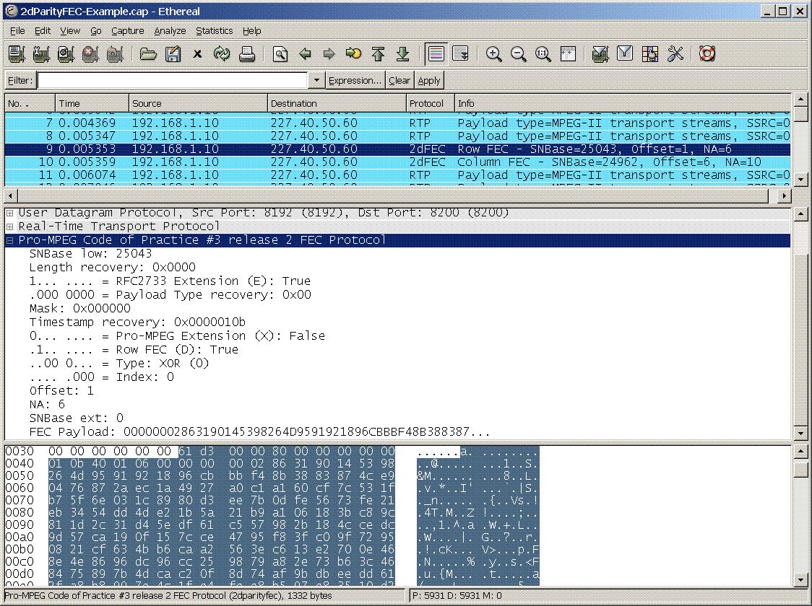

# Pro-MPEG Code of Practice \#3 release 2 FEC Protocol (2dParityFEC)

This code of practice defines a scheme for the transmission of professional quality video using [RTP](/RTP). A protocol for the transmission of two-dimensional XOR Forward Error Correction (FEC) data within RTP is defined.

## Protocol dependencies

  - [RTP](/RTP): 2dParityFEC data is transported over RTP. As systems using this protocol are usually closed networks, and there is no control protocol defined, all FEC traffic uses RTP dynamic payload type 96.

## Example traffic

Here is a screenshot of the [SampleCaptures](/SampleCaptures) file 2dParityFEC-Example.cap.gz



## Wireshark

The PROTO dissector is (fully functional, partially functional, not existing, ... whatever the current state is). Also add info of additional Wireshark features where appropriate, like special statistics of this protocol.

## Preference Settings

Pro-MPEG FEC data is transmitted within RTP packets using the dynamic payload type 96. This RTP payload type is also used for other protocols. Therefore, you must tell Wireshark that you are expecting FEC data on this payload type. Open Edit-\>Preferences and select 2dparityfec from the Protocols list. Enable the use of payload type 96 by setting the checkbox. If you like, click save so that this remains set next time that you run Wireshark.

## Example capture file

  - [SampleCaptures/2dParityFEC-Example.cap.gz](uploads/__moin_import__/attachments/SampleCaptures/2dParityFEC-Example.cap.gz)

## Display Filter

  - Show only the Pro-MPEG FEC based traffic:
    
    ``` 
     2dparityfec 
    ```

  - Show only row FEC traffic:
    
    ``` 
     2dparityfec.d == 1 
    ```

  - Show only column FEC traffic:
    
    ``` 
     2dparityfec.d == 0 
    ```

## Capture Filter

You cannot directly filter Pro-MPEG FEC data while capturing. However, if you know the [UDP](/UDP) port used, you can filter on that one.

## External links

  - [Pro-MPEG Code of Practice 3 release 2](http://www.magellan-itea.org/docs/publications/Vid-on-IP-CoP3-r2.pdf): Transmission of Professional MPEG-2 Transport Streams over IP Networks

## Discussion

---

Imported from https://wiki.wireshark.org/2dParityFEC on 2020-08-11 23:10:59 UTC
