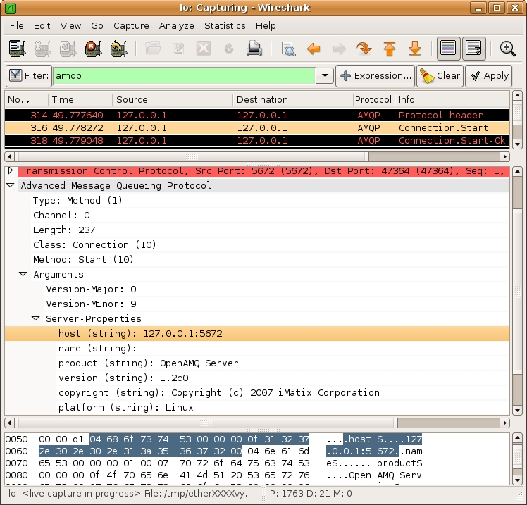

# Advanced Message Queueing Protocol (AMQP)

## Overview of AMQP

AMQP is a new open standard for messaging middleware. It solves the problem of how to connect applications, across LANs and WANs. Before AMQP, there was no standard for interconnecting applications, and this was one of the more expensive parts of a largescale software architecture. AMQP is a wire-level protocol plus a model for routing and queueing messages. It covers both very high performance pub-sub (with speeds of up to 150k messages/second through a single broker) and high-reliability messaging (with guaranteed delivery no matter what). There are several open source AMQP implementations including iMatix's OpenAMQ. The original AMQP design was made by iMatix Corporation for JPMorganChase Bank, and is now in the hands of an industry workgroup.

## This dissector

The AMQP dissector was written by iMatix Corporation, lead developer is Martin Sustrik (sustrik.at.imatix.com). The AMQP dissector is in pre-alpha phase. Your comments and requests are welcome.

## Protocol dependencies

  - Protocol is currently defined to use [TCP](/TCP) as its transport protocol.

  - In the future [SCTP](/SCTP) is going to be supported as transport protocol as well.

  - IANA-assigned port number for AMQP is 5672 ([TCP](/TCP), [UDP](/UDP), [SCTP](/SCTP)).

## Example traffic

## Wireshark

## Preference Settings

There are no preference settings so far.

## External links

  - <http://www.openamq.org> - iMatix's OpenAMQ product

  - <http://www.amqp.org> - AMQP Working Group / AMQP specification

  - <http://www.imatix.com> - authors of this dissector

## Discussion

What version(s) of AMQP does this support?

---

Imported from https://wiki.wireshark.org/AMQP on 2020-08-11 23:11:09 UTC
