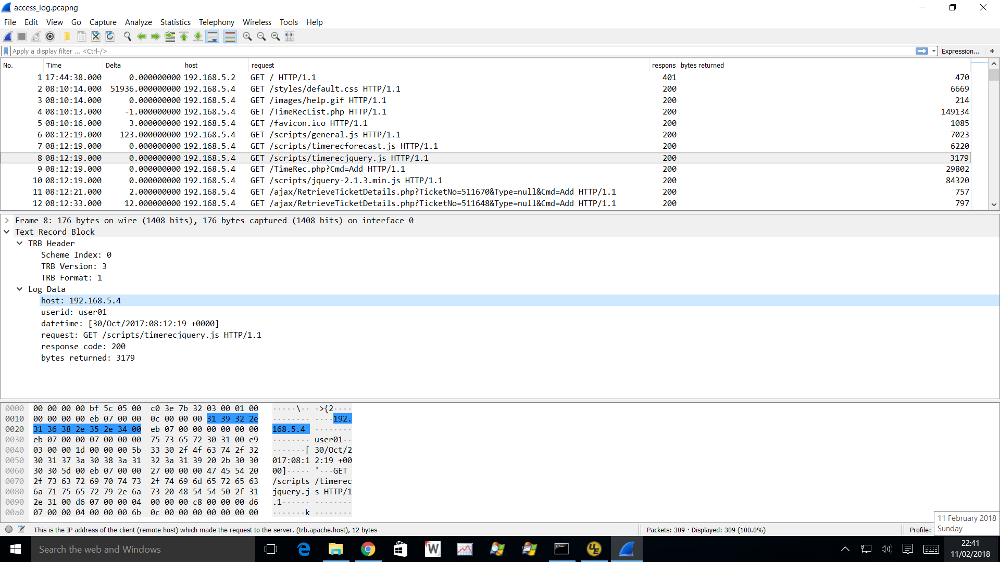

# Introduction

I have a project to add support for two new block types to Wireshark. This doesn't seem to be documented anywhere and so I'm hoping that my notes here may help someone in the future.

[](uploads/__moin_import__/attachments/Adding-Support-for-a-New-Block-Type/trb_screenshot.png "{{attachment:trb_screenshot.png||width=900}}")

**This is work in progress** and so the notes here are not complete. I'm developing this alongside a dissector that adds support to Wireshark for text-base log data - see [https://wiki.wireshark.org/TRB%20Protocol](/TRB-Protocol). Also, I'm using this as a notepad and I may make mistakes which I'll correct later. If you notice mistakes, please feel free to update this page.

# Pcapng Block Basics

A pcapng file contains blocks of data. Each block contains:

  - Block Type - a 32-bit unsigned integer value identifying the type of block
  - Block Length - a 32-bit unsigned integer that is set to the length of the block, including the Block Type field, both Block Length fields and the block content
  - Block Content - or payload
  - Block Length - a repeat of the earlier Block Length value

Block Types are grouped as follows:

  - Standard Block Types with native support in Wireshark
  - Standard Block Types recognised in Wireshark but with support added via a plugin
  - Custom Block which is not yet supported by Wireshark
  - Local Use Block Types that are locally managed by a developer and not guaranteed to be unique

I have requested two Standard Block Types for my project - see Appendix C below. A recent code change (25583) prevents us from using anything other than Local Use Block during development.

Within the groups of Block Types, there is a further sub-grouping:

  - Record Blocks - blocks that generate an entry in the Wireshark Packet List
  - Internal Blocks - blocks that don't generate a Packet List entry

## Encoding Note

Some values used within Wireshark are generated by an enumerated list. If you generate these values with another programme, you may want to avoid using the same enumerated values. The reason is that if the list changes, say between Wireshark releases, the enumerated values may change. Your external programme will then have to keep track of these changes and accomodate multiple Wireshark releases. A good example is the header field (hf) type value.

I dealt with this problem like this:

  - Use my own values for field types declared with \#define statements
  - In the Wireshark plugin write a function to convert my field types to Wireshark values

The Wireshark field types values can be found in epan/ftypes/ftype.h. See Appendix A of the [TRB Protocol definition](/TRB-Protocol) for the non-enumerated values used by TRB.

# Internal Block

This type of block carries information but doesn't generate an entry in the packet list; similar to the Interface Descriptor Block (IDB). This is the simplest kind of block to handle. There are two steps:

  - Define a function that processes the block data - referred to as read block function
  - Register the read block function with Wireshark

It looks something like this:

    /*
    INPUTS
    
    OUTPUTS
    wtapng_block
    */
    // (FILE_T, guint32, gboolean, wtapng_block_t *, int *, gchar **);
    gboolean tdb_read_block(FILE_T fh, guint32 block_data_len, gboolean c, wtapng_block_t *wtapng_block,
        int *err, gchar **err_info)
    {
        /* Use i as a general purpose index */
        size_t i;
    
        /* Signal that this isn't a "packet" block */
        wtapng_block->internal = TRUE;
    
        /*
        * Is the size of this block reasonable for a TDB?
        */
        if (block_data_len == 0 || block_data_len > wtapng_block->frame_buffer->allocated) {
            /* Not looking good. */
            *err = WTAP_ERR_BAD_FILE;
            *err_info = wmem_strdup_printf(wmem_file_scope(), "tdb_read_block: block data length of %u is invalid",
                block_data_len);
            return FALSE;
        }
    
        /* read block content */
        if (!wtap_read_bytes(fh, wtapng_block->frame_buffer->data, block_data_len, err, err_info)) {
            wmem_strdup_printf(wmem_file_scope(), "tdb_read_block: failed to read TDB");
            return FALSE;
        }
        .
        .
        Do more stuff
        .
        .
    
        return TRUE;
    }
    
    void
    proto_register_tsd(void)
    {
        .
        .
        Do stuff
        .
        .
        register_pcapng_block_type_handler(BLOCK_TYPE_TDB, tsdb_read_block, NULL);
    }

# Record Block

**NB:** Some of the following content is now obsolete after the merging of [change 25696](https://code.wireshark.org/review/#/c/25696/) into master. I'll update when I get a moment.

## Introduction

Within the Wireshark code, any block that generates an entry in the packet list is referred to as a *record block* although historically they have also been called *packet block* and some code comments still use this term.

## Encapsulation

A record block encapsulates payload in a "frame" format. The encapsulation is specified at three levels:

  - File level - used to populate the file\_encap field of a wth structure
  - Interface level - used to populate the wtap\_encap field of a wtapng\_if\_descr\_mandatory\_t structure
  - Per Packet - used to populate the pkt\_encap field of a wtap\_pkthdr structure

There are 16 available user values (WTAP\_ENCAP\_USER0 to WTAP\_ENCAP\_USER15) and I use WTAP\_ENCAP\_USER11 for the TRBs.

## Timestamp Precision

The timestamp precision can be specified at three levels:

  - File level - used to populate the file\_tsprec field of a wth structure
  - Interface level - used to populate the tsprecision field of a wtapng\_if\_descr\_mandatory\_t structure
  - Per Packet - used to populate the pkt\_tsprec field of a wtap\_pkthdr structure

## wtapng\_block structure and substructures

In the tsdb\_read\_block(...) function above, I don't populate any of the fields in the wtapng\_block structure. That's OK for an internal block but we need Wireshark to create a dissection chain (?) for the TRBs, i.e. a block that we wish to dissect.

What we need is for the content of the block to be treated as a new protocol, in the same way as the content of an EPB is becomes a Frame.

The wtapng\_block structure and substructure fields I believe have to be completed by a block read function are:

  - gboolean internal - indicates an internal block type; set in the TDB and not in the TRB
  - nstime\_t ts - the timestamp for the event you wish to be displayed in the packet list
  - guint32 caplen - the length of the payload in your block
  - guint32 len - the length of the original data - unless you are going to get very flash, this will be the same as the caplen
  - int pkt\_encap - this should be set to a value from the WTAP\_ENCAP\_xxxx list of definitions in wiretap/wtap.h - WTAP\_ENCAP\_USER11 in the case of the TRB
  - int pkt\_tsprec - this should be set to a value from the WTAP\_TSPREC\_xxxx list of definitions in wiretap/wtap.h - WTAP\_TSPREC\_USEC in the case of the TRB
  - presence\_flags - these indicate the inclusion of certain field values in the pkt\_hdr; values are:
      - WTAP\_HAS\_TS /\*\*\< time stamp \*/
    
      - WTAP\_HAS\_CAP\_LEN /\*\*\< captured length separate from on-the-network length \*/
    
      - WTAP\_HAS\_INTERFACE\_ID /\*\*\< interface ID \*/
    
      - WTAP\_HAS\_COMMENTS /\*\*\< comments \*/
    
      - WTAP\_HAS\_DROP\_COUNT /\*\*\< drop count \*/
    
      - WTAP\_HAS\_PACK\_FLAGS /\*\*\< packet flags \*/

The relevant code looks like this:

``` 
    /* Populate the wtapng_block */
    if (is_byte_swapped) {
        ts_high = GUINT32_SWAP_LE_BE(tr_hdr->timestamp_high);
        ts_low = GUINT32_SWAP_LE_BE(tr_hdr->timestamp_low);
        wtapng_block->rec->rec_header.packet_header.caplen = GUINT32_SWAP_LE_BE(block_data_len);
        wtapng_block->rec->rec_header.packet_header.len = GUINT32_SWAP_LE_BE(block_data_len);
    }
    else {
        ts_high = tr_hdr->timestamp_high;
        ts_low = tr_hdr->timestamp_low;
        wtapng_block->rec->rec_header.packet_header.caplen = block_data_len;
        wtapng_block->rec->rec_header.packet_header.len = block_data_len;
    }

    /* Combine the two 32-bit pieces of the timestamp into one 64-bit value */
    ts = (((guint64)ts_high) << 32) | ((guint64)ts_low);
    wtapng_block->rec->ts.secs = (time_t)(ts / iface_info.time_units_per_second);
    wtapng_block->rec->ts.nsecs = (int)(((ts % iface_info.time_units_per_second) * 1000000000) / iface_info.time_units_per_second);

    wtapng_block->internal = FALSE;
    wtapng_block->rec->rec_header.packet_header.interface_id = 0;
    wtapng_block->rec->rec_header.packet_header.drop_count = -1; /* invalid */
    wtapng_block->rec->rec_header.packet_header.caplen = block_data_len;
    wtapng_block->rec->rec_header.packet_header.len = block_data_len;
    wtapng_block->rec->rec_header.packet_header.pkt_encap = WTAP_ENCAP_USER11;
    wtapng_block->rec->presence_flags |= WTAP_HAS_TS;
    wtapng_block->rec->presence_flags |= WTAP_HAS_INTERFACE_ID;
    wtapng_block->rec->presence_flags |= WTAP_HAS_CAP_LEN;
    wtapng_block->rec->rec_type = REC_TYPE_PACKET;
    wtapng_block->rec->tsprec = 6;
```

# Related information

  - [https://wiki.wireshark.org/TRB%20Protocol](/TRB-Protocol)

  - [Wireshark Bugzilla Bug 8590](https://bugs.wireshark.org/bugzilla/show_bug.cgi?id=8590)

  - [Wireshark Bugzilla Bug 8807](https://bugs.wireshark.org/bugzilla/show_bug.cgi?id=8807)

  - [The code change that implemented register\_pcapng\_block\_type\_handler](https://code.wireshark.org/review/1775)

# Appendix A - XML Example

    <?xml version="1.0" encoding="utf-8" standalone="yes"?>
    <source>
            <header headerline="false" skipheaderlines="0">
                    <description>Descriptor file for Apache access log in common format</description>
                    <generator>Babel 3.0</generator>
                    <gendate>2017-10-20</gendate>
                    <gentime>19:18:22</gentime>
                    <genzoffset>+1</genzoffset>
                    <owner>Paul Offord</owner>
                    <nativeformat>LogFormat "%h %l %u %t \"%r\" %>s %b" common</nativeformat>
                    <example>192.168.1.87 - user01 [09/Jul/2012:08:25:35 +0100] "GET /Setup.php HTTP/1.1" 200 1824</example>
                    <wsnamespace>apache</wsnamespace>
                    <charencoding>ASCII</charencoding>
            </header>
            <records>
                    <record type="1">
                            <eols enforce="true">
                                    <eol>\n</eol>
                                    <eol>\r\n</eol>
                            </eols>
                            <delimiters>
                                    <delimiter>&nbsp;</delimiter>
                            </delimiters>
                            <missingvalues>
                                    <missingvalue>-</missingvalue>
                            </missingvalues>
                            <criteria>
                                    <criterium type="string" offset="*">*</criterium>
                            </criteria>
                            <columns>
                                    <column>
                                            <informat quoted="false">%i</informat>
                                            <name>host</name>
                                            <abbrev>bds.apache.host</abbrev>
                                            <blurb>This is the IP address of the client (remote host) which made the request to the server.</blurb>
                                            <type quoted="false">FT_IPvx</type>
                                            <display>BASE_NONE</display>
                                            <bitmask>0</bitmask>
                                    </column>
                                    <column>
                                            <informat quoted="false">%s</informat>
                                            <name>identid</name>
                                            <abbrev>bds.apache.identid</abbrev>
                                            <blurb>The identity of the client determined by a request to the identd server on the clients machine.</blurb>
                                            <type quoted="false">FT_STRINGZ</type>
                                            <display>BASE_NONE</display>
                                            <bitmask>0</bitmask>
                                    </column>
                                    <column>
                                            <informat quoted="false">%s</informat>
                                            <name>userid</name>
                                            <abbrev>bds.apache.userid</abbrev>
                                            <blurb>This is the userid of the person requesting the document as determined by HTTP authentication.</blurb>
                                            <type quoted="false">FT_STRINGZ</type>
                                            <display>BASE_NONE</display>
                                            <bitmask>0</bitmask>
                                    </column>
                                    <column>
                                            <informat quoted="false" start-bracket="[" end-bracket="]">[%d/%b/%Y:%H:%M:%S %z]</informat>
                                            <name>datetime</name>
                                            <abbrev>bds.apache.datetime</abbrev>
                                            <blurb>The time that the request was received.</blurb>
                                            <type>EVENT_DATETIME</type>
                                            <display>BASE_NONE</display>
                                            <bitmask>0</bitmask>
                                    </column>
                                    <column>
                                            <informat quoted="true">%s</informat>
                                            <name>request</name>
                                            <abbrev>bds.apache.request</abbrev>
                                            <blurb>The request line from the client is given in double quotes.</blurb>
                                            <type>FT_STRINGZ</type>
                                            <display>BASE_NONE</display>
                                            <bitmask>0</bitmask>
                                    </column>
                                    <column>
                                            <informat quoted="false">%d</informat>
                                            <name>response code</name>
                                            <abbrev>bds.apache.response-code</abbrev>
                                            <blurb>This is the status code that the server sends back to the client.</blurb>
                                            <type>FT_UINT32</type>
                                            <display>BASE_DEC</display>
                                            <bitmask>0</bitmask>
                                    </column>
                                    <column>
                                            <informat quoted="false">%d</informat>
                                            <name>bytes returned</name>
                                            <abbrev>bds.apache.sc-bytes</abbrev>
                                            <blurb>This indicates the size of the object returned to the client, not including the response headers.</blurb>
                                            <type>FT_UINT32</type>
                                            <display>BASE_DEC</display>
                                            <bitmask>0</bitmask>
                                    </column>
                            </columns>
                            <infofield>%4 - %5</infofield>
                    </record>
            </records>
    </source>

# Appendix B - Sample Code

Coming soon.

# Appendix C - Sample pcapng File

This sample is a converted Apache HTTPD access log.

Coming soon.

---

Imported from https://wiki.wireshark.org/Adding%20Support%20for%20a%20New%20Block%20Type on 2020-08-11 23:11:03 UTC
