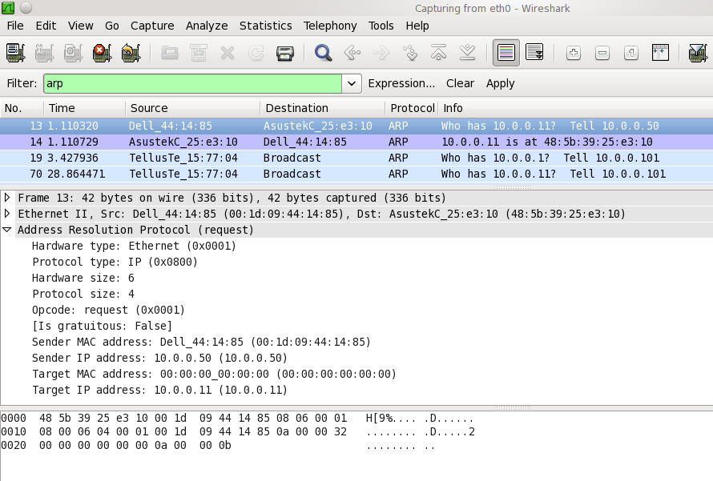

# Address Resolution Protocol (ARP)

The Address Resolution Protocol is used to dynamically discover the mapping between a layer 3 (protocol) and a layer 2 (hardware) address. A typical use is the mapping of an [IP](/IP) address (e.g. 192.168.0.10) to the underlying [Ethernet](/Ethernet) address (e.g. 01:02:03:04:05:06). You will often see ARP packets at the beginning of a conversation, as ARP is the way these addresses are discovered.

ARP can be used for Ethernet and other LANs, ATM, and a lot of other underlying physical addresses (the list of hardware types in the [ADDRESS RESOLUTION PROTOCOL PARAMETERS](http://www.iana.org/assignments/arp-parameters) document at the [IANA](/IANA) Web site includes at least 33 hardware types).

ARP is used to dynamically build and maintain a mapping database between link local layer 2 addresses and layer 3 addresses. In the common case this table is for mapping Ethernet to IP addresses. This database is called the [ARP\_Table](/ARP_Table). Dynamic entries in this table are often cached with a timeout of up to 15 minutes, which means that once a host has ARPed for an IP address it will remember this for the next 15 minutes before it gets time to ARP for that address again.

A peculiarity of ARP is that since it tries to reduce/limit the amount of network traffic used for ARP a host MUST use all available information in any ARP packet that is received to update its [ARP\_Table](/ARP_Table). Thus sometimes a host sends out ARP packets NOT in order to discover a mapping but to use this side effect of ARP and preload the ARP table of a different host with an entry. These special ARP packets are referred to as [Gratuitous\_ARP](/Gratuitous_ARP)s and Wireshark will detect and flag the most common versions of such ARPs in the packet summary pane.

[Gratuitous\_ARP](/Gratuitous_ARP)s are more important than one would normally suspect when analyzing captures. So don't just ignore them or filter out ARP from your capture immediately. Consider that a normal host will always send out a [Gratuitous\_ARP](/Gratuitous_ARP) the first thing it does after the link goes up or the interface gets enabled, which means that almost every time we see a [Gratuitous\_ARP](/Gratuitous_ARP) on the network, that host that sent it has just had a link bounce or had its interface disabled/enabled. This is very useful information when troubleshooting networks. Remember though that you can only see these [Gratuitous\_ARP](/Gratuitous_ARP)s (or any other ARPs for that matter) if your capture device is in the same [Broadcast Domain](/Broadcast-Domain) as the host that originates the ARP packet.

Several viruses send a lot of ARP traffic in an attempt to discover hosts to infect; see the [ArpFlooding](/ArpFlooding) page.

## History

[RFC 826](http://www.ietf.org/rfc/rfc826.txt) "An Ethernet Address Resolution Protocol" was released in November 1982.

## Protocol dependencies

Layer 2 protocols:

  - [ATM](/ATM): ARP can use [ATM](/ATM) as its transport mechanism.

  - [Ethernet](/Ethernet): ARP can use [Ethernet](/Ethernet) as its transport mechanism. The assigned Ethernet type for ARP traffic is 0x0806.

  - Other LANs: ARP can also be used on Token Ring, FDDI, and IEEE 802.11; the same assigned type is used.

  - ... and a lot more\!

Layer 3 protocols:

  - [IP](/IP): ARP can map [IP](/IP) addresses to layer 2 addresses.

## Example traffic



## Wireshark

The ARP dissector is fully functional.

## Preference Settings

  - [Detect ARP request storms.](/Detect-ARP-request-storms.) Default OFF

  - [Number of requests to detect during period.](/Number-of-requests-to-detect-during-period.) Default 30

  - [Detection period (in ms).](/Detection-period-\(in-ms\).) Default 100

  - [Detect duplicate IP address configuration.](/Detect-duplicate-IP-address-configuration.) Default TRUE

## Example capture file

[SampleCaptures/arp-storm.pcap](uploads/__moin_import__/attachments/SampleCaptures/arp-storm.pcap) Problem with example capture file. No responses were included.

## Display Filter

A complete list of ARP display filter fields can be found in the [display filter reference](http://www.wireshark.org/docs/dfref/a/arp.html)

Show only the ARP based traffic:

``` 
 arp 
```

Filtering only on ARP packets is rarely used, as you won't see any IP or other packets. However, it can be useful as part of a larger filter string.

## Capture Filter

You can filter ARP protocols while capturing.

Capture only the ARP based traffic:

``` 
 arp 
```

or:

``` 
 ether proto \arp 
```

Capturing only ARP packets is rarely used, as you won't capture any IP or other packets. However, it can be useful as part of a larger filter string.

## External links

  - [RFC 826](http://www.ietf.org/rfc/rfc826.txt) "An Ethernet Address Resolution Protocol"

## Discussion

At which event is an entry in the ARP table removed/replaced, if the host detects problems sending packets to the entries host? I would think it doesn't take 15 minutes in that case. - *Ulf Lamping*

Could someone explain ARP flooding and other attack's to the ARP layer to capture packets not dedicated to the capturing host? - *Ulf Lamping*

---

Imported from https://wiki.wireshark.org/AddressResolutionProtocol on 2020-08-11 23:11:04 UTC
