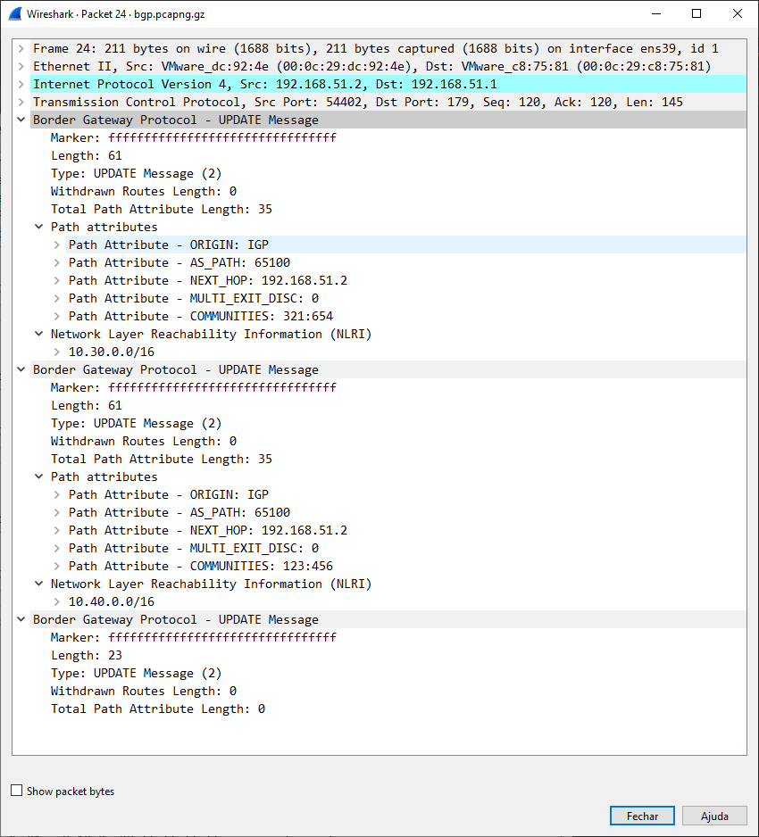

# Border Gateway Protocol (BGP)

XXX - add a brief BGP description here

## History

XXX - add a brief description of BGP history

## Protocol dependencies

  - [TCP](/TCP): Typically, BGP uses [TCP](/TCP) as its transport protocol. The well known TCP port for BGP traffic is 179.

## Example traffic

BGP sample update message.



## Wireshark

The BGP dissector is (fully functional, partially functional, not existing, ... whatever the current state is). Also add info of additional Wireshark features where appropriate, like special statistics of this protocol.

Using [Wireshark](http://www.youtube.com/watch?v=aNem_vNVp_U&list=PLrUFyg1unBb8B5iqIap4s3jDstej3wvJp) to decode BGP

## Preference Settings

(XXX add links to preference settings affecting how BGP is dissected).

## Example capture file

[bgp.pcapng.gz](uploads/__moin_import__/attachments/SampleCaptures/bgp.pcapng.gz) (pcapng) BGP packets between three peers using communities and announcing six networks. The BGP implementation is FRRouting.

## Display Filter

A complete list of BGP display filter fields can be found in the [display filter reference](http://www.wireshark.org/docs/dfref/b/bgp.html)

Show only BGP traffic:

``` 
 bgp
```

## Capture Filter

You cannot directly filter BGP protocols while capturing. However, if you know the [TCP](/TCP) port used (see above), you can filter on that one.

Capture BGP traffic over the default port (179):

``` 
 tcp port 179
```

## External links

  - [RFC 1771](http://www.ietf.org/rfc/rfc1771.txt) *A Border Gateway Protocol 4 (BGP-4)*

  - [RFC 1965](http://www.ietf.org/rfc/rfc1965.txt) *Autonomous System Confederations for BGP*

  - [RFC 1997](http://www.ietf.org/rfc/rfc1997.txt) *BGP Communities Attribute*

  - [RFC 2547](http://www.ietf.org/rfc/rfc2547.txt) *BGP/MPLS VPNs*

  - [RFC 2796](http://www.ietf.org/rfc/rfc2796.txt) *BGP Route Reflection - An Alternative to Full Mesh IBGP*

  - [RFC 2842](http://www.ietf.org/rfc/rfc2842.txt) *Capabilities Advertisement with BGP-4*

  - [RFC 2858](http://www.ietf.org/rfc/rfc2858.txt) *Multiprotocol Extensions for BGP-4*

  - [RFC 2918](http://www.ietf.org/rfc/rfc2918.txt) *Route Refresh Capability for BGP-4*

  - [RFC 3107](http://www.ietf.org/rfc/rfc3107.txt) *Carrying Label Information in BGP-4*

## Discussion

---

Imported from https://wiki.wireshark.org/BGP on 2020-08-11 23:11:31 UTC
