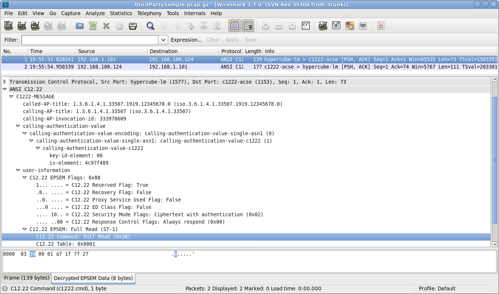

# ANSI C12.22 (c1222)

ANSI C12.22 (also known as IEEE Std 1703) is an application layer protocol designed for use on electric utility meter networks of the Smart Grid. Its official title is *Protocol Specification for Interfacing to Data Communication Networks* but this title is somewhat more generic than the protocol. The protocol is used to transport ANSI C12.19 tables which are metering specific data structures. The ANSI C12.22/IEEE 1703 protocol define the framework for transporting ANSI C12.22/IEEE 1703 Advanced Metering Infrastructure (AMI) Application Layer Messages on an IP network on the Smart Grid.

## History

The first two protocols in this series were ANSI C12.18 and ANSI C12.19 which are, respectively, an infrared close range point-to-point telephone communications protocol and standardized data structures for electric utility meters (watthour meters). Virtually all electronic utility watthour meters produced for the North American market implement these standards. ANSI C12.18 was first published in 1996 and revised in 2006. ANSI C12.19/IEEE 1377 was originally published in 1997. The latest version of ANSI C12.19 is IEEE Std 1377-2012/ANSI C12.19-2012.

ANSI C12.21 was an adaptation of the simple ANSI C12.18 optical protocol and was intended for use over dial-up modems. It was first published in 1999 and revised in 2006.

ANSI C12.22 was first published in 2008, and it has been revised as IEEE Std 1703-2012/ANSI C12.22-2012. ANSI C12.22 retains the same read table/write table application layer services and encoding as C12.18 and C12.21, but uses an ASN.1 wrapper and adds encryption capabilities.

## Protocol dependencies

  - ANSI C12.22 / IEEE Std 1703: Define the message formats and communication protocols at the application layer used over any network segment.

  - [IETF RFC 6142](http://tools.ietf.org/html/rfc6142): Defines the requirements for implementing ANSI C12.22 / IEEE Std 1703 over the Internet, using IPv4 and/or IPv6. The protocol uses TCP, UDP and IGMP to communicate C12.22 Messages, where UDP and IGMP are use in multicast messaging. TCP and UDP may also be used in unicast messages.

  - IGMP with UDP multicast: In support of a multicast message delivery service from the network. This is necessary in cases where C12.22 IP Nodes need to perform Native IP Address discovery (e.g., the discovery of the Native IP Address of C12.22 IP Relays that provide a route out of the C12.22 IP Network Segment, or the discovery of the Native IP Address of a C12.22 IP Master Relay on the C12.22 IP Network). In this case the C12.22 IP Nodes use IP multicast to send a C12.22 Message that contains an EPSEM Resolve Service request on the LAN. IP multicast is also desirable, for example, when a C12.22 Host needs to read a multitude of C12.22 Nodes (e.g., meters) that are configured with a common C12.22 multicast group [ApTitle](/ApTitle). All C12.22 IP Relays and Master Relays are expected to implement IP multicast and UDP. It is also recommnded that non C12.22 Relay Nodes also implement IP multicast and UDP. The following multicast addresses have been registered by IANA for use by the ANSI C12.22 / IEEE Std 1703 standard:
    
      - IPv4 -- "All C1222 Nodes" address 224.0.2.4
      - IPv6 -- "All C1222 Nodes" address FF0X::204
    
    on port 1153.

  - UDP: ANSI C12.22 can use [UDP](/UDP) as a transport protocol, this is the preferred mode of communication for connectionless-mode operations as described in [IETF RFC 6142](http://tools.ietf.org/html/rfc6142#section-5.1). The well known UDP port for C12.22 traffic is 1153.

  - TCP: ANSI C12.22 can use [TCP](/TCP) as a transport protocol, this is the preferred mode of communication for connection-mode operations as described in [IETF RFC 6142](http://tools.ietf.org/html/rfc6142#section-5.1). The well known TCP port for C12.22 traffic is 1153.

  - ASN.1: The C12.22 Message wrapper defined by [ISO/IEC 15955:1999 Information technology -- Open Systems Interconnection -- Connectionless protocol for the Application Service Object Association Control Service Element / ITU-T RECOMMENDATION X.237 bis](http://www.itu.int/rec/T-REC-X.237bis-199809-I/en), where the AP-title can be expressed both as OBJECT IDENTIFIER and RELATIVE-OID per detailed syntax of [Module Connectionless-ACSE-1 (X.237 bis:09/1998)](http://www.itu.int/ITU-T/formal-language/itu-t/x/x237bis/1998/Connectionless-ACSE-1.html).

  - OIDs: The C12.22 Object identifiers that are encapsulated in the [Module Connectionless-ACSE-1 (X.237 bis:09/1998)](http://www.itu.int/ITU-T/formal-language/itu-t/x/x237bis/1998/Connectionless-ACSE-1.html) message are managed via approved object management authorities (Registries), such as [The Energy Communications Management Exchange®](https://www.ecmx.org).

## Example traffic



## Wireshark

The C12.22 dissector has been included in the main code since version 1.8. The dissector implements all three C12.22 security modes (none, Authentication only and Ciphertext with Authentication) and TCP packet reassembly.

## Preference Settings

The following preference settings are associated with the C12.22 dissector:

  - Desegment all C12.22 messages spanning multiple TCP segments
  - Verify crypto for all applicable C12.22 messages
  - Decryption table

The decryption table is a list of cryptographic keys used with a specific instance of the C12.22 protocol. The table search mechanism is very simple: the dissector searches linearly from the top of the table to the bottom until it finds a matching key ID. This means that the table may contain multiple entries for a particular key ID. That is, one might have multiple different keys all labelled as key 0 within the table but the dissector will only use the first one listed. This is done as a convenience so that different captures can be analyzed simply by moving the relevant key(s) up to the top of the list. As per the protocol specification the key ID is a single byte and the keys are each sixteen bytes long. Both are specified in hexadecimal notation in this dissector.

## Example capture file

  - [SampleCaptures/c1222overIPv4.cap.gz](uploads/__moin_import__/attachments/SampleCaptures/c1222overIPv4.cap.gz) C12.22 read of Standard Table 1 with response. This communication was using *Ciphertext with Authentication* mode with key 0 = 6624C7E23034E4036FE5CB3A8B5DAB44

  - [SampleCaptures/c1222\_over\_ipv6.pcap](uploads/__moin_import__/attachments/SampleCaptures/c1222_over_ipv6.pcap) C12.22 read of Standard Tables 1 and 2 with response. This communication was using *Ciphertext with Authentication* mode with key 0 = 000102030405060708090A0B0C0D0E0F

## Display Filter

A complete list of C12.22 display filter fields can be found in the [display filter reference](http://www.wireshark.org/docs/dfref/c/c1222.html)

Show only the C12.22 based traffic:

``` 
 c1222
```

## Capture Filter

You cannot directly filter C12.22 protocols while capturing. However, if you know the [TCP](/TCP) port used (see above), you can filter on that one.

Capture only the C12.22 traffic over the default port (1153):

``` 
 tcp port c1222-acse
```

## External links

  - [IEEE STANDARD 1703-2012](https://standards.ieee.org/findstds/standard/1703-2012.html)- IEEE Standard for Local Area Network/Wide Area Network (LAN/WAN) Node Communication Protocol to Complement the Utility Industry End Device Data Tables.

  - [NEMA](https://www.nema.org/Standards/Pages/American-National-Standard-for-Protocol-Specification-for-Interfacing-to-Data-Communication-Networks.aspx) *American National Standard for Protocol Specification for Interfacing to Data Communication Networks* - describes what the protocol is and how to get a copy

  - [IEEE STANDARD 1377-2012](https://standards.ieee.org/findstds/standard/1377-2012.html)- IEEE Standard for Utility Industry Metering Communication Protocol Application Layer (End Device Data Tables).

  - [An Overview of ANSI C12.22](https://electricenergyonline.com/energy/magazine/138/article/an-overview-of-ansi-c12-22.htm) trade magazine article gives an overview of the protocol.

  - [OSI Model vs. TCP/IP Model and use case of ANSI C12.22 / IEEE Std 1703™](https://ecmx.org/public/Resources/Documents/general/SmartGrid-TCP-vs-OSI-and-C1222-2012.pdf) Compares and contrasts the two main reference models, the Open System Interconnection Model (OSI) and Transport Control Protocol /Internet Protocol (TCP/IP). Explains how ANSI C12.22 / IEEE Std 1703 fit on top of the OSI transport layer (4) or the TCP/IP transport layer in accordance with IETF RFC 6142.

## Discussion

---

Imported from https://wiki.wireshark.org/C12.22 on 2020-08-11 23:11:44 UTC
