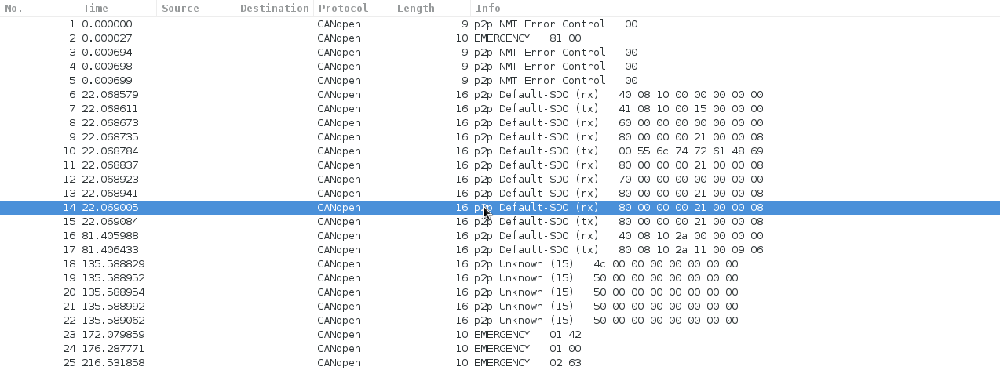

# CANopen

CANopen is a communication protocol and device specification based on [CAN](/CAN). It is manily designed for use in automation and interconnection in embedded systems.

## History

CANopen has its origin in the ESPRIT-Project ASPIC. A first protoype was developed from 1993 to 1995. Since 1995 it is maintained and standardized by CAN in Automation (CiA).

## Protocol dependencies

  - [CAN](/CAN): Typically, CANopen uses the [CAN](/CAN) bus protocol.

## Example traffic



## Wireshark

The CANopen dissector is partly functional.

## Preference Settings

No preference settings so far.

## Example capture file

  - [SampleCaptures/CANopen.pcap](uploads/__moin_import__/attachments/SampleCaptures/CANopen.pcap)

## Display Filter

Show only the CANopen based traffic:

``` 
 canopen 
```

## Capture Filter

## External links

  - [www.can-cia.org](http://www.can-cia.org/) CAN in Automation

  - [CANopen specifications (members only)](http://www.can-cia.org/index.php?id=specifications&no_cache=1)

## Discussion

---

Imported from https://wiki.wireshark.org/CANopen on 2020-08-11 23:11:46 UTC
