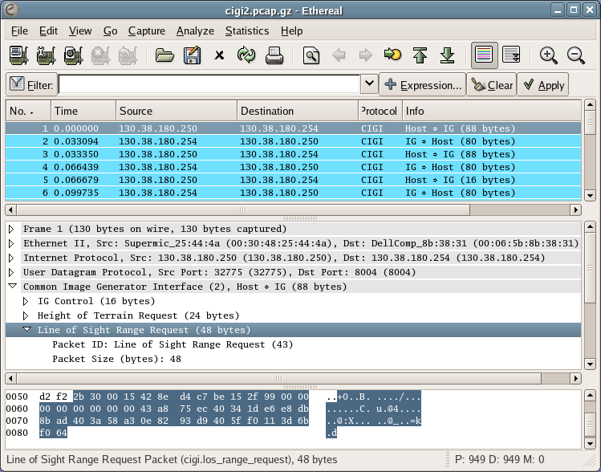

# Common Image Generator Interface (CIGI)

The Common Image Generator Interface (CIGI), pronounced \[sɪgi\] or *sig ee*, is an interface designed to promote a standard way for a host device to communicate with an image generator (IG) in the simulation industry.

## History

In the past most image generators provided their own proprietary interface so that every host had to implement this interface. Changing image generators was a costly ordeal; CIGI was created to standardize the interface between the host and the image generator so that little modification would be needed to switch image generators. The CIGI initiative is largely lead by [The Boeing Company](http://www.boeing.com/).

## Protocol dependencies

  - [UDP](/UDP): Typically, CIGI uses [UDP](/UDP) as its transport protocol. CIGI traffic does not have a well known port; however, many implementations use 8004-8005.

## Example traffic



## Wireshark

The CIGI dissector is fully functional for CIGI version 2 and 3. Version 1 is not yet implemented.

## Preference Settings

The CIGI dissector in Wireshark allows CIGI packets to be dissected differently based on the following settings.

  - CIGI Version - Set the version of CIGI to dissect packets with.

  - Byte Order - Set the byte order for CIGI 3 packets.

  - Host IP - Set the hostname of the host computer; used to display *Host* in the Info field.

  - Image Generator IP - Set the hostname of the image generator; used to display *IG* in the Info field

## Example capture files

  - [SampleCaptures/cigi2.pcap.gz](uploads/__moin_import__/attachments/SampleCaptures/cigi2.pcap.gz)

  - [SampleCaptures/cigi3.pcap.gz](uploads/__moin_import__/attachments/SampleCaptures/cigi3.pcap.gz)

## Display Filter

A complete list of CIGI display filter fields can be found in the [display filter reference](http://www.wireshark.org/docs/dfref/c/cigi.html)

Show only the CIGI based traffic:

``` 
 cigi 
```

## Capture Filter

You cannot directly filter CIGI protocols while capturing. However, if you know the [UDP](/UDP) port used (see above), you can filter on that one.

Capture only the CIGI traffic over the port 8004:

``` 
 udp port 8004 
```

## External links

  - <http://cigi.sourceforge.net/> *CIGI Homepage* - CIGI specification documents and additional tools used in CIGI implementations.

## Discussion

---

Imported from https://wiki.wireshark.org/CIGI on 2020-08-11 23:12:15 UTC
