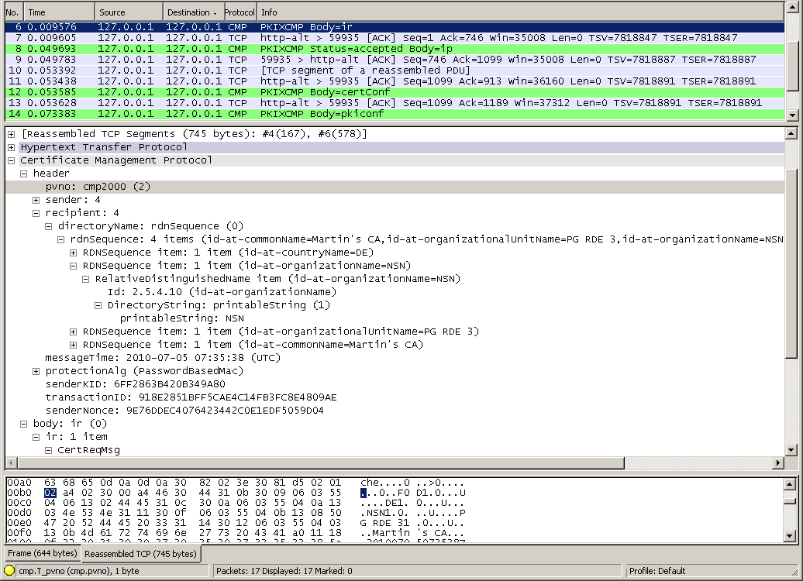
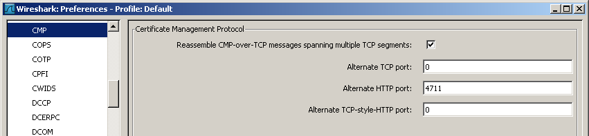

# Certificate Management Protocol (CMP)

CMP is a protocol for managing Public Key Infrastructures (PKI) based on X.509v3 certificates. Protocol messages are defined for certificate creation and management. CMP is used by commercial PKI products as *Nexus Certificate Manager*, *Entrust Security Manager*, *Unicert*, *Insta Certifier* and *Cryptlib*. An OpenSSL client side implementation is work in progress.

## Protocol dependencies

  - CMP used its own "TCP-Messaging" protocol on top of [TCP](/TCP) in the RFC 2510 version and also in some implementations of RFC 4210. The well known TCP port for CMP traffic is 829.

  - [HTTP](/HTTP) is nowadays commonly used for for RFC 4210 implementations as the transport protocol. The Content-Type set in the HTTP header is "application/pkixcmp"

  - Some implementations might use the above mentioned transport protocols in combination, i.e. TCP-Messaging-over-HTTP. In that case, the Content-Type set in the HTTP header should be the unofficial "application/pkixcmp-poll".

  - While there is no implementation known supporting it, transporting CMP over email ([SMTP](/SMTP), [POP](/POP) etc.) or file transfer ([FTP](/FTP)) is also mentioned in CMPtrans (see below).

## Example traffic



The depicted trace is available here: [cmp\_IR\_sequence\_OpenSSL-Cryptlib.pcap](uploads/__moin_import__/attachments/CMP/cmp_IR_sequence_OpenSSL-Cryptlib.pcap "Upload new attachment \"cmp_IR_sequence_OpenSSL-Cryptlib.pcap\"")

## Preference Settings



### Reassemble CMP-over-TCP message spanning multiple TCP segments:

When this preference is enabled and when using TCP-Messaging protocol for transport, the CMP dissector will reassemble a CMP message transmitted over more than one TCP segment.

### Alternate TCP port:

This preference can be used to set the TCP port for TCP-Messaging when it is different than the well-known TCP port (829) for transporting CMP, which is used by default. This default is used when the preference is set to 0.

### Alternate HTTP port:

This preference can be used to set an alternate TCP port in case of HTTP transport. This option should be set either when a TCP port is used which is not configured to be HTTP or when the Content-Type of the transmitted HTTP header is wrongfully not set to "application/pkixcmp". This preverence is disabled when the value is set to 0.

### Alternate TCP-style-HTTP port:

This preference can be used to set an alternate TCP port in case of TCP-messaging over HTTP transport. This option should be set either when a TCP port is used which is not configured to be HTTP or when the Content-Type of the transmitted HTTP header is wrongfully not set to (the unofficial) "application/pkixcmp-poll". This preference is disabled when the value is set to 0.

## Example capture file

  - [SampleCaptures/cmp\_IR\_sequence\_OpenSSL-Cryptlib.pcap](uploads/__moin_import__/attachments/SampleCaptures/cmp_IR_sequence_OpenSSL-Cryptlib.pcap) CMP version 2 encapsulated in HTTP on port 8080. Full "Initialization Request".

  - [SampleCaptures/cmp\_IR\_sequence\_ OpenSSL-EJBCA.pcap](uploads/__moin_import__/attachments/SampleCaptures/cmp_IR_sequence_-OpenSSL-EJBCA.pcap) CMP version 2 encapsulated in HTTP on port 880. Full IR, authentication with CRMF regToken.

  - [SampleCaptures/cmp-trace.pcap.gz](uploads/__moin_import__/attachments/SampleCaptures/cmp-trace.pcap.gz) CMP certificate requests

  - [SampleCaptures/cmp-in-http-with-errors-in-cmp-protocol.pcap.gz](uploads/__moin_import__/attachments/SampleCaptures/cmp-in-http-with-errors-in-cmp-protocol.pcap.gz) CMP version 2 encapsulated in HTTP on port 4711. Full "Initialization Request" and rejected "Key Update Request". There are some errors in the CMP packages.

  - [SampleCaptures/cmp\_in\_http\_with\_pkixcmp-poll\_content\_type.pcap.gz](uploads/__moin_import__/attachments/SampleCaptures/cmp_in_http_with_pkixcmp-poll_content_type.pcap.gz) CMP version 2 encapsulated in HTTP. The CMP messages are of the deprecated but used content-type "pkixcmp-poll", so they are using the TCP transport style. In two of the four CMP messages, the content type is not explicitly set, thus they cannot be dissected correctly.

## Display Filter

A complete list of CMP display filter fields can be found in the [display filter reference](http://www.wireshark.org/docs/dfref/c/cmp.html)

Show only the CMP based traffic:

``` 
 cmp 
```

## Capture Filter

You cannot directly filter CMP while capturing. However, if you know the [TCP](/TCP) port used (see above), you can filter on that one.

Capture only the TCP-Messaging CMP traffic over the default port (829):

``` 
 tcp port 829 
```

## External links

  - [RFC 4210](http://www.ietf.org/rfc/rfc4210.txt) *Internet X.509 Public Key Infrastructure Certificate Management Protocols*. This version obsoletes [RFC 2510](http://www.ietf.org/rfc/rfc2510.txt). According to the new RFC, the CMP transport protocol issues are handled in the separate CMPtrans document.

  - [RFC 4211](http://www.ietf.org/rfc/rfc4211.txt) *Certificate Request Message Format* is more or less bound to CMP. This Version obsoletes [RFC 2511](http://www.ietf.org/rfc/rfc2511.txt) and is used by RFC 4210

  - [Last IETF CMPtrans draft](http://tools.ietf.org/html/draft-ietf-pkix-cmp-transport-protocols) This draft for *CMPtrans* is expired, hence there is **no obligatory transport protocols spec available**. There are obvious mistakes in it which may cause confusion. Implementations more or less adhere to it.

---

Imported from https://wiki.wireshark.org/CMP on 2020-08-11 23:12:18 UTC
