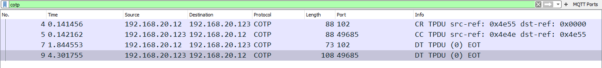

# Connection Oriented Transport Protocol (COTP, ISO 8073)

This is the connection transport protocol of the [IsoProtocolFamily](/IsoProtocolFamily).

As most readers nowadays will be more familiar with [TCP](/TCP), COTP is explained comparing both protocols as they are both used to transport users's data reliably over a network.

Packet-based vs. stream-based: COTP transports *packets of data* from one user to the other, so the receiver will get exactly the same data boundaries as the sender transmitted. [TCP](/TCP) transports a *continuous stream* of data to the receiver, so the protocol on top of TCP often has to add such boundaries itself (see the [TPKT](/TPKT) protocol for such a protocol).

TSAP's vs. ports: To multiplex several conversations between two hosts, COTP uses TSAP's which are variable length binary blobs (often a meaningful string is used). These TSAP's are matched at connection establishing phase, and replaced by the 2 byte (destination/source) references at data transfer. TCP uses ports for this. One notable difference is that TSAP's are singletons - if a TSAP is used for a connection it cannot be used by another. XXX - Needs clarification. A single TSAP (Transport Service Access Point) may be used by multiple connections.

## History

This protocol has been replaced by [TCP](/TCP) in most applications. Applications that used COTP before, will often use the [TPKT](/TPKT) protocol on top of [TCP](/TCP) now.

## Protocol dependencies

  - [CLNP](/CLNP): COTP uses [CLNP](/CLNP) as its underlying network protocol.

## Example traffic


## Wireshark

The COTP dissector is fully functional.

## Preference Settings

  - Reassemble segmented COTP datagrams: XXX - add info here
  - Display TSAPs as string or bytes: The TSAP's can be any binary data. Often applications chooses textual representation, so the default setting "As strings if printable" might be a good idea in many cases.

## Example capture file

[COTP_Example.pcapng.gz](uploads/fce52472307ec7a4538651186f0b05ca/COTP_Example.pcapng.gz)

S7comm uses COTP.  [S7comm captures](https://wiki.wireshark.org/SampleCaptures#s7comm-s7-communication)


## Display Filter

A complete list of COTP display filter fields can be found in the [display filter reference](http://www.wireshark.org/docs/dfref/c/cotp.html)

Show only the COTP based traffic:

``` 
 cotp 
```

Show only the COTP based traffic, except for the COTP Data (cotp.type == 0x06) and Acknowledge (cotp.type == 0x0f) TPDU's. This way you will only see special packets like connection establishing or expedited data:

``` 
 cotp && !(cotp.type == 0x06 || cotp.type == 0x0f) 
```

## Capture Filter

You cannot directly filter COTP protocols while capturing. XXX - add information about capturing of lengths smaller than 1450? bytes or even better ways to capture only COTP. COTP uses well known port 102, so it is often possible to capture COTP/TPKT data by using the capture filter

Port 102

## External links

  - ISO 8072 transport service specification is not available for a free download

  - ISO 8073 transport protocol specification is available as [RFC905](http://www.ietf.org/rfc/rfc0905.txt)

## Discussion

---

Imported from https://wiki.wireshark.org/COTP on 2020-08-11 23:12:23 UTC
