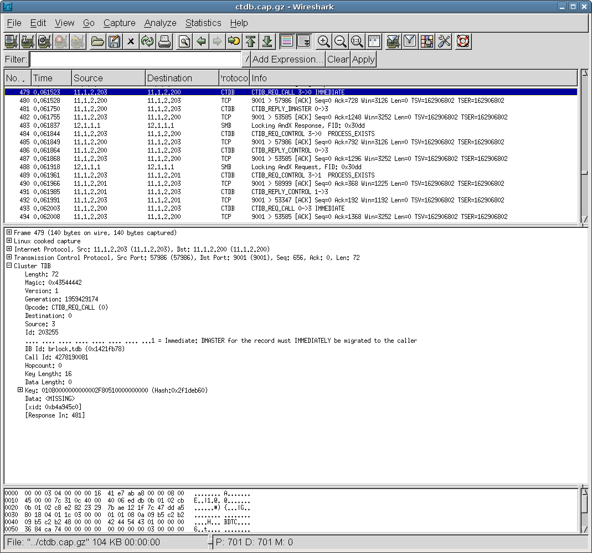

# CTDB

CTDB is a protocol to implement a fast HA version of a clustered TDB database. It is primarily designed to be used as a scalable HA solution for Samba but has been successfully been demonstrated to provide read-write clustering of [NFS](/NFS) and other services as well.

CTDB is the main component to provide a fast and scalable load-sharing read-write CIFS cluster when combined with a specially modified version of Samba.

## History

CTDB was primarily developed as an initial production version in 2007, although there had been other works done on CTDB prior.

## Protocol dependencies

CTDB uses [TCP](/TCP) or [Infiniband](/Infiniband) as its cluster interconnect protocol.

CTDB normally runs on [TCP](/TCP) port 4379.

## Example traffic



## Wireshark

The CTDB dissector is fully functional.

## Preference Settings

There are no preference settings for CTDB.

## Example capture files

  - [ctdb.cap.gz](uploads/__moin_import__/attachments/CTDB/ctdb.cap.gz) Sample output when running Samba4 RAW-BENCH-LOCK torture test doing file byte range locking against a 4 node cluster.

## Display Filter

A complete list of CTDB display filter fields can be found in the [display filter reference](http://www.wireshark.org/docs/dfref/c/ctdb.html)

Show only the CTDB based traffic :

``` 
 ctdb 
```

## Capture Filter

You cannot directly filter on CTDB while capturing but you can capture for TCP port 9001

## External links

The [main ctdb webpage](http://ctdb.samba.org/)

## Discussion

---

Imported from https://wiki.wireshark.org/CTDB on 2020-08-11 23:12:25 UTC
