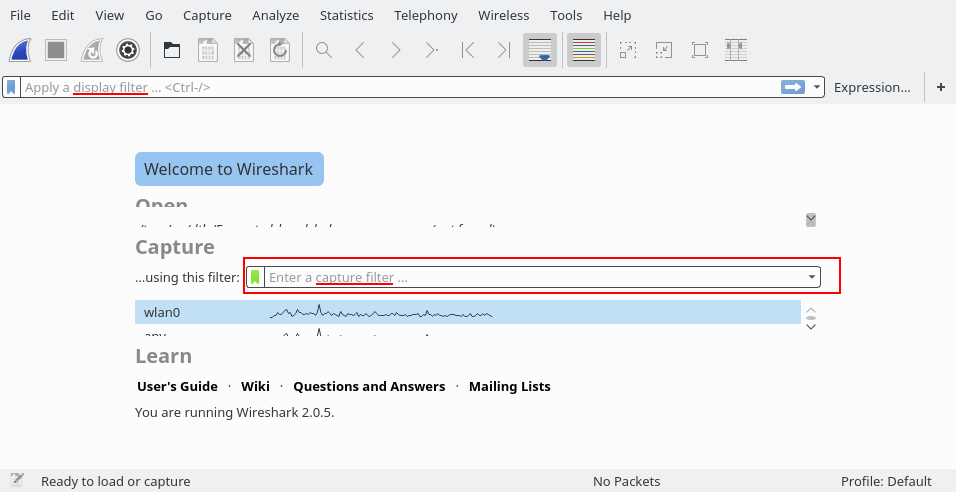

# CaptureFilters

An overview of the capture filter syntax can be found in the [User's Guide](http://www.wireshark.org/docs/wsug_html_chunked/ChCapCaptureFilterSection.html). A complete reference can be found in the expression section of the [pcap-filter(7) manual page](http://www.tcpdump.org/manpages/pcap-filter.7.html).

Wireshark uses the same syntax for capture filters as [tcpdump](http://www.tcpdump.org/), [WinDump](/WinDump), [Analyzer](http://analyzer.polito.it/), and any other program that uses the libpcap/WinPcap library.

If you need a capture filter for a specific protocol, have a look for it at the [ProtocolReference](/ProtocolReference).

[[_TOC_]]

## Capture filter is not a display filter

Capture filters (like `tcp port 80`) are not to be confused with display filters (like `tcp.port == 80`). The former are much more limited and are used to reduce the size of a raw packet capture. The latter are used to hide some packets from the packet list.

Capture filters are set before starting a packet capture and cannot be modified during the capture. Display filters on the other hand do not have this limitation and you can change them on the fly.

In the main window, one can find the capture filter just above the interfaces list and in the interfaces dialog. The display filter can be changed above the packet list as can be seen in this picture:



## Examples

Capture only traffic to or from IP address 172.18.5.4:

    host 172.18.5.4

Capture traffic to or from a range of IP addresses:

    net 192.168.0.0/24

or

    net 192.168.0.0 mask 255.255.255.0

Capture traffic from a range of IP addresses:

    src net 192.168.0.0/24

or

    src net 192.168.0.0 mask 255.255.255.0

Capture traffic to a range of IP addresses:

    dst net 192.168.0.0/24

or

    dst net 192.168.0.0 mask 255.255.255.0

Capture only DNS (port 53) traffic:

    port 53

Capture non-HTTP and non-SMTP traffic on your server (both are equivalent):

    host www.example.com and not (port 80 or port 25)

    host www.example.com and not port 80 and not port 25

Capture except all ARP and DNS traffic:

    port not 53 and not arp

Capture traffic within a range of ports

    (tcp[0:2] > 1500 and tcp[0:2] < 1550) or (tcp[2:2] > 1500 and tcp[2:2] < 1550)

or, with newer versions of libpcap (0.9.1 and later):

    tcp portrange 1501-1549

Capture only Ethernet type EAPOL:

    ether proto 0x888e

Reject ethernet frames towards the Link Layer Discovery Protocol Multicast group:

    not ether dst 01:80:c2:00:00:0e

Capture only IPv4 traffic - the shortest filter, but sometimes very useful to get rid of lower layer protocols like ARP and STP:

``` 
ip
```

Capture only unicast traffic - useful to get rid of noise on the network if you only want to see traffic to and from your machine, not, for example, broadcast and multicast announcements:

    not broadcast and not multicast

Capture IPv6 "all nodes" (router and neighbor advertisement) traffic. Can be used to find rogue RAs:

    dst host ff02::1

Capture HTTP GET requests. This looks for the bytes 'G', 'E', 'T', and ' ' (hex values 47, 45, 54, and 20) just after the TCP header. "tcp\[12:1\] & 0xf0) \>\> 2" figures out the TCP header length. From Jefferson Ogata via the [tcpdump-workers mailing list](http://seclists.org/tcpdump/2004/q4/95).

    port 80 and tcp[((tcp[12:1] & 0xf0) >> 2):4] = 0x47455420

## Useful Filters

Blaster and Welchia are RPC worms. (Does anyone have better links, i.e. ones that describe or show the actual payload?)

[Blaster worm](http://www.sans.org/security-resources/malwarefaq/w32_blasterworm.php):

    dst port 135 and tcp port 135 and ip[2:2]==48

[Welchia worm](http://securityresponse.symantec.com/avcenter/venc/data/detecting.traffic.due.to.rpc.worms.html):

    icmp[icmptype]==icmp-echo and ip[2:2]==92 and icmp[8:4]==0xAAAAAAAA

The filter looks for an icmp echo request that is 92 bytes long and has an icmp payload that begins with 4 bytes of A's (hex). It is the signature of the welchia worm just before it tries to compromise a system.

Many worms try to spread by contacting other hosts on ports 135, 445, or 1433. This filter is independent of the specific worm instead it looks for SYN packets originating from a local network on those specific ports. Please change the network filter to reflect your own network.

    dst port 135 or dst port 445 or dst port 1433  and tcp[tcpflags] & (tcp-syn) != 0 and tcp[tcpflags] & (tcp-ack) = 0 and src net 192.168.0.0/24

[Heartbleed Exploit](https://web.archive.org/web/20140419183909/http://www.riverbed.com/blogs/Retroactively-detecting-a-prior-Heartbleed-exploitation-from-stored-packets-using-a-BPF-expression.html):

    tcp src port 443 and (tcp[((tcp[12] & 0xF0) >> 4 ) * 4] = 0x18) and (tcp[((tcp[12] & 0xF0) >> 4 ) * 4 + 1] = 0x03) and (tcp[((tcp[12] & 0xF0) >> 4 ) * 4 + 2] < 0x04) and ((ip[2:2] - 4 * (ip[0] & 0x0F)  - 4 * ((tcp[12] & 0xF0) >> 4) > 69))

## Default Capture Filters

Wireshark tries to determine if it's running remotely (e.g. via SSH or Remote Desktop), and if so sets a default capture filter that should block out the remote session traffic. It does this by checking environment variables in the following order:

| Environment Variable | Resultant Filter                                                                                                    |
| -------------------- | ------------------------------------------------------------------------------------------------------------------- |
| `SSH_CONNECTION`     | not (tcp port *srcport* and *addr\_family* host *srchost* and tcp port *dstport* and *addr\_family* host *dsthost*) |
| `SSH_CLIENT`         | not (tcp port *srcport* and *addr\_family* host *srchost* and tcp port *dstport*)                                   |
| `REMOTEHOST`         | not *addr\_family* host *host*                                                                                      |
| `DISPLAY`            | not *addr\_family* host *host*                                                                                      |
| `CLIENTNAME`         | not tcp port 3389                                                                                                   |

(*addr\_family* will either be `ip` or `ip6`)

## Further Information

  - [Filtering while capturing](http://www.wireshark.org/docs/wsug_html_chunked/ChCapCaptureFilterSection.html) from the [Wireshark User's Guide](http://www.wireshark.org/docs/wsug_html_chunked/).

  - For the current version of Wireshark, 1.8.6, and for earlier 1.8.x releases, the capture filter dialog box is no longer available in the capture options window. Instead, you need to double-click on the interface listed in the capture options window in order to bring up the "Edit Interface Settings" window. At the bottom of this window you can enter your capture filter string or select a saved capture filter from the list, by clicking on the "Capture Filter" button.

  - The [pcap-filter man page](http://www.wireshark.org/docs/man-pages/pcap-filter.html) includes a comprehensive capture filter reference

  - The [Mike Horn Tutorial](https://web.archive.org/web/20151215011526/http://procana.asuscomm.com/) gives a good introduction to capture filters

  - Capture and display filter [Cheat sheets](http://packetlife.net/blog/2008/oct/18/cheat-sheets-tcpdump-and-wireshark/)

  - packetlevel.ch [Filter examples](http://www.packetlevel.ch/html/tcpdumpf.html)

## See Also

[DisplayFilters](/DisplayFilters): more info on filters while displaying, not while capturing

The [String-Matching Capture Filter Generator](http://www.wireshark.org/tools/string-cf.html)

## Discussion

BTW, the Symantec page says that Blaster probes 135/tcp, 4444/tcp, and 69/udp. Would

     (tcp dst port 135 or tcp dst port 4444 or udp dst port 69) and ip[2:2]==48

be a better filter? - *Gerald Combs*

Q: What is a good filter for just capturing SIP and RTP packets?

A: On most systems, for SIP traffic to the standard SIP port 5060,

    tcp port sip

should capture TCP traffic to and from that port,

    udp port sip

should capture UDP traffic to and from that port, and

    port sip

should capture both TCP and UDP traffic to and from that port (if one of those filters gets "parse error", try using `5060` instead of `sip`). For SIP traffic to and from other ports, use that port number rather than `sip`.

In most cases RTP port numbers are dynamically assigned. You can use something like the following which limits the capture to UDP, even source and destination ports, a valid RTP version, and small packets. It will capture any non-RTP traffic that happens to match the filter (such as DNS) but it will capture all RTP packets in many environments.

    udp[1] & 1 != 1 && udp[3] & 1 != 1 && udp[8] & 0x80 == 0x80 && length < 250

Capture WLAN traffic without Beacons:

    link[0] != 0x80

Capture all traffic originating (source) in the IP range 192.168.XXX.XXX:

    src net 192.168

Capture PPPoE traffic:

```
pppoes
```

```
pppoes and (host 192.168.0.0 and port 80)
```

Capture VLAN traffic:

```
vlan
```

```
vlan and (host 192.168.0.0 and port 80)
```

Imported from https://wiki.wireshark.org/CaptureFilters on 2020-08-11 23:11:47 UTC
