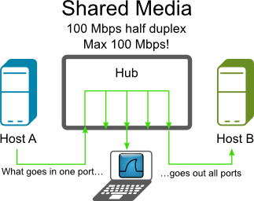
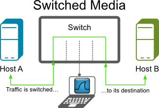
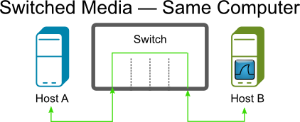
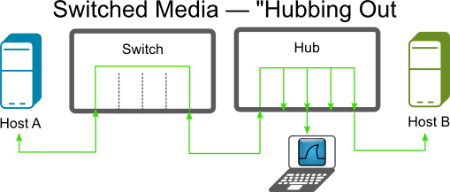
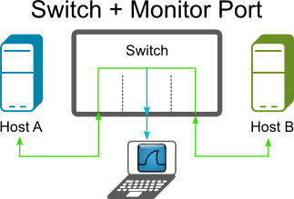
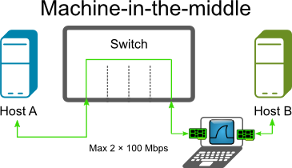
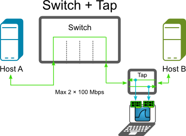
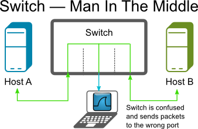
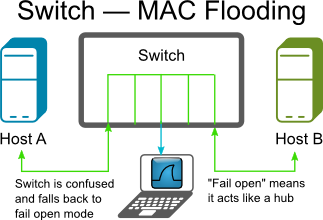

# Ethernet capture setup

This page will explain points to think about when capturing packets from [Ethernet](/Ethernet) networks.

If you are only trying to capture network traffic between the machine running Wireshark or TShark and other machines on the network, you should be able to do this by capturing on the network interface through which the packets will be transmitted and received; no special setup should be necessary. (If you're trying to capture network traffic between processes running on the machine running Wireshark or TShark, i.e. network traffic from that machine to itself, you will need to capture on a loopback interface, if that's possible; see [CaptureSetup/Loopback](/CaptureSetup/Loopback).)

If you're trying to capture network traffic that's *not* being sent to or from the machine running Wireshark or TShark, i.e. traffic between two or more other machines on an Ethernet segment, you will have to capture in "promiscuous mode", and, on a switched Ethernet network, you will have to set up the machine specially in order to capture that traffic. This is discussed below.

See also Jasper Bongertz's [Network Packet Capture Playbook](https://blog.packet-foo.com/the-network-packet-capture-playbook/), which gives more details about Ethernet capture.

## Table of contents

[[_TOC_]]

## Packet Types

The Ethernet hardware on the network adapter filters all packets received, and delivers to the host

  - all [Unicast](/Unicast) packets that are being sent to one of the addresses for that adapter, i.e. packets sent to that host on that network;

  - all [Multicast](/Multicast) packets that are being sent to a [Multicast](/Multicast) address for that adapter, or all [Multicast](/Multicast) packets regardless of the address to which they're being sent (some network adapters can be configured to accept packets for specific [Multicast](/Multicast) addresses, others deliver all multicast packets to the host for it to filter);

  - all [Broadcast](/Broadcast) packets.

The driver for the adapter will also send copies of transmitted packets to the packet capture mechanism, so that they will be seen by a capture program as well.

In order to capture Ethernet traffic other than [Unicast](/Unicast) traffic to and from the host on which you're running Wireshark, [Multicast](/Multicast) traffic, and [Broadcast](/Broadcast) traffic, the adapter will have to be put into promiscuous mode, so that the filter mentioned above is switched off and all packets received are delivered to the host.

In addition, if you are on a switched Ethernet, rather than a shared Ethernet, you will also have to take action to ensure that all traffic in which you're interested is sent to the Ethernet adapter on the machine running the packet capture program; that is not, by default, the case on switched networks, so attempts to capture on a switched network will, by default, see only traffic that the capturing machine would see when not in promiscuous mode. Details on shared and switched Ethernet can be found below.

## Shared Ethernet

In the old days, Ethernet networks were shared networks, using shared media or hubs to connect the Ethernet nodes together, meaning all packets could be received by all nodes on that network. Therefore, if an Ethernet adapter on such a network is put into promiscuous mode, all packets on the network will be seen by that adapter and thus can be captured with that adapter.

Today, shared networks are becoming popular again, as WLAN's are using this technique. You might have a look at [CaptureSetup/WLAN](/CaptureSetup/WLAN) for details.

## Switched Ethernet

Today, a typical Ethernet network will use switches to connect the Ethernet nodes together. This can increase network performance a lot, but makes life much harder when capturing packets.

An Ethernet switch will do a similar thing to the Ethernet adapter hardware mentioned above, but inside the switch. It can infer, from traffic seen on a switch port, what [Unicast](/Unicast) address or addresses are used by the adapter connected to that port, and will forward to that port only [Unicast](/Unicast) traffic sent to that address or addresses, as well as all [Multicast](/Multicast) and [Broadcast](/Broadcast) packets on the network.

As [Unicast](/Unicast) packets not sent to that host will not be put on the switch port to which that host's adapter is connected, that adapter will not have those packets, so putting the adapter into promiscuous mode can't cause it to deliver packets to that host, and you won't see those packets even if you capture in promiscuous mode.

The following will describe some methods to circumvent this problem.

### Capture on the machine you're interested in

If you only need the capture data from a specific host, try to capture on that machine.

  - Advantage: Easy to use
  - Disadvantage: Other traffic not available

### Capture using an Ethernet hub

If you have an "old" Ethernet hub available, put it inside the Ethernet line you want to capture from. This could be the line between a switch and a node or between two switches.

Beware that this will interrupt network traffic while you plug the cables\!

This method can/will affect network performance, if you are using [EthernetFullDuplex](/EthernetFullDuplex) mode. This is not optimal for network troubleshooting.

Note that some "hubs" are actually "switching hubs", which are switches rather than "old" hubs, and won't help in this case, and that "dual-speed" (10/100Mb) hubs don't forward unicast traffic between 10Mb/s and 100 Mb/s ports, requiring the capturing machine to run its Ethernet at the same speed as the machines whose traffic it's trying to capture.

  - Advantage: Often such a hub is available

  - Disadvantage: Those hubs can be hard to find (so often they're *not* available), will affect [EthernetFullDuplex](/EthernetFullDuplex) traffic

See the [HubReference](/HubReference) for information on "real" hubs.

### Capture using a monitor mode of the switch

Some Ethernet switches (usually called "managed switches") have a monitor mode. Managed switches have been expensive in the past, but some models can now be found for less than $100. This monitor mode can dedicate a port to connect your (Wireshark) capturing device. It's sometimes called 'port mirroring', 'port monitoring', 'Roving Analysis' (3Com), or 'Switched Port Analyzer' or 'SPAN' (Cisco). Using the switch management, you can select both the monitoring port and assign a specific port you wish to monitor. Actual procedures vary between switch models; you may need to use a terminal emulator, specialized SNMP client software or (more recently) a Web browser. Caution: the monitoring port must be at least as fast as the monitored port, or you will certainly lose packets.

Note that some switches might not support monitoring *all* traffic passing through the switch, only traffic on a particular port. On those switches, you might not be able to capture all traffic on the network, only traffic sent to or from some particular machine on the switch.

While high-end managed switches (like e.g. Cisco Catalyst) usually fully dedicate a monitoring port to the task, i.e. such port can only be used to deliver the monitored traffic to a capturing device and its ingress direction is muted (or only enabled for injection of TCP reset packets by a security device, so it is not learning the source MAC addresses of the received frames), some low-end models keep the monitoring port fully operational and just add the frames mirrored from the monitored port(s) to its egress direction, making the behaviour similar to one of a hub except that the link speed may be up to 1 Gbit/s and the device is actively sold. An example of this kind of monitoring switches is Netgear's GS105E, currently available for less than $50.

Rumor has it that some switches can monitor the whole throughput of the switch. As a switch can transfer more traffic than a single line can transmit, you will be unlikely to see all traffic.

  - Advantage: Easy to use if such a switch available
  - Disadvantage: More expensive switch needed (though not as expensive as they once were), capture packet loss at high traffic

See the [SwitchReference](/SwitchReference) for details about specific switch models.

### Capture using a machine-in-the-middle

A machine with two network interface cards (NICs) can be used as a transparent bridge, capturing all the traffic to and from a single machine or a network segment. Under Linux, brctl (brcfg on older systems) can be used; under the BSD family, brconfig. Apparently, Windows XP and Server 2003 also allow bridging configurations to be built; it may well prove harder to make a Windows installation 'quiet' in network traffic terms than Unix.

Running Wireshark on just one of the NICs is enough to capture all the traffic.

Many laptops have one network adapter built-in; a second can be added using a PC card. Desktop machines are easily fitted with additional NICs.

The bridge is 'transparent' at the level of IP and similar protocols, and 'almost' transparent at the Ethernet level - it creates a small delay in packet transmission, and the Ethernet addresses of the two NICs may respond to some broadcast messages.

  - Advantage: requires no changes to monitored host, uses only generally available hardware
  - Disadvantage: dedicated machine configuration required

### Capture using a network tap

Several vendors offer network taps, which can be plugged into a line. There are different types of taps, such as breakout taps, aggregation taps, replicating taps, bypass taps and media changing taps. For a nice explanation of each type, see [The 101 Series: A Primer On Network TAPs](https://www.garlandtechnology.com/2014/01/17/a-test-access-point-tap-primer).

Breakout taps will have four connectors: two for the existing line and two outputs for both directions of the [EthernetFullDuplex](/EthernetFullDuplex) traffic.

To use breakout taps, you have to capture both outputs. Prior to version 1.8 Wireshark cannot capture from two interfaces at once, so for those versions you have to start two Wireshark instances for capturing and merge the resulting capture files together.

On most Unix systems, including Red Hat, two Ethernet ports can be bonded, and Wireshark can use the bonded interface. This prevents having to run two instances of Wireshark and merging them together. For more information, check on "bonding", "trunking", or (less desirably) "bridging" for your OS type.

  - Advantage: All packets of [EthernetFullDuplex](/EthernetFullDuplex) traffic can be captured, won't affect Ethernet traffic

  - Disadvantage: Costly, uncomfortable to work with (unless your version of Wireshark is able to capture from multiple interfaces)

See [Construction and Use of a Passive Ethernet Tap](http://www.winsnort.com/tutorials/article/12-how-to-create-and-install-a-passive-ethernet-tap/) from the Snort webpage how to build a DIY tap. You can purchase network taps from simple passive ones at the size of a cigarette packet to 19" rack mounted multiple line taps which support SNMP monitoring and redundant power supply.

See the [TapReference](/TapReference) for information about various tap hardware.

Be sure to test the power up and power down of taps. Some taps are completely transparent when they power down, but can take up to (approx) two seconds for it to power up (so for two seconds, no packets make it through).

Some other links on how to build a DIY network tap:

  - [Create a passive network tap for your home network](http://writequit.org/blog/?p=149)

  - [Building an Ethernet Tap](http://www.enigmacurry.com/category/diy/)

  - [Building a Passive Hub](http://www.muratscscorner.com/2011/05/building-passive-hub.html)

  - [DIY "Throwing star" Network Tap](http://ossmann.blogspot.com/2011/02/throwing-star-lan-tap.html)

  - [Make a Passive Network Tap](https://www.instructables.com/id/Make-a-Passive-Network-Tap/)

Concerning the DIY taps compared to the expensive professional taps for sale, it has been argued that...

The differing number of twists per inch in each pair of wires (which is why each pair always reads different lengths when you apply something like a Fluke meter to the 4-pair cable) is what gives data- grade cables its basic resistance to RF interference for unshielded twisted pair (the shield provides additional protection for shielded twisted pair). If you untwist them beyond the 0.5" at the ends allowed by specifications, you're basically removing all such resistance to RF interference and introducing additional issues such as retransmissions, etc., that would skew your readings.

### Capture using a MITM (Man-In-The-Middle) software

To capture packets going between two computers on a switched network, you can use a MITM attack (ARP Poisoning). This type of attack will fool the two computers into thinking that your MAC address is the MAC address of the other machine. This will in turn make the switch route all of their traffic to your computer where you can sniff it and then send the traffic along as if nothing ever happened. This type of attack can cause havoc on some switches and LANs so use it carefully.

:warning: **Please do not try this on any LAN other than your own\!**

  - Advantage: Cheap
  - Disadvantage: Can confuse switches, capture packet loss at high traffic

See [What is ARP Poisoning ?](http://thevega.blogspot.com/2008_06_01_archive.html) for more info.

### MAC Flooding

Switches keep a translation table that maps various MAC addresses to the physical ports on the switch. As a result of this, a switch can intelligently route packets from one host to another, but it has a limited memory for this work. MAC flooding makes use of this limitation to bombard the switch with fake MAC addresses until the switch can't keep up. The switch then enters into what is known as a \`failopen mode', wherein it starts acting as a hub by broadcasting packets to all the machines on the network. Once that happens sniffing can be performed easily. MAC flooding can be performed by using macof, a utility which comes with the [dsniff](http://www.monkey.org/~dugsong/dsniff/) suite.

:warning: **Please do not try this on any LAN other than your own\!**

  - Advantage: Cheap

  - Disadvantage: Will affect [EthernetFullDuplex](/EthernetFullDuplex) traffic, capture packet loss at high traffic

## Monitor port versus network tap

Some arguments for using a passive network tap rather than a monitor port (port mirroring, SPAN, etc.) (see sections above) to do the sniffing:

1.  Monitor ports do not pass bad frames, long or short frames or any malformed packets – Thus no baseline studies

2.  Monitor ports do not pass VLAN tags – Result you do not know which VLAN a frame came from and also can result in the same packet being presented twice or more.

3.  Monitor ports change timing – thus if you are doing any RTP studies, or timing studies, no jitter and differentiated timing.

4.  Maybe a switch can handle switching, which it was made for but monitor ports are not the priority of a switch and thus issues.

5.  All your math is great and proves that switches can handle their job but replication is the lowest priority.

6.  Myself and others have tested several switches (to 10G) cheap to the best and found much variation…even the Mfr’s support the findings.

7.  I do not even want to discuss RSPAN another whole can of issues.

8.  Monitor ports are acceptable for connection studies.

9.  Monitor ports are **not** acceptable for [CALEA](http://en.wikipedia.org/wiki/Communications_Assistance_for_Law_Enforcement_Act) access and possibly for similar forms of law enforcement surveillance.

10. Monitor ports are **not** acceptable for Compliance or Audit studies.

11. Monitor port capture files can cause issues in court cases, reasonable doubt issues.

See also:

  - [SPAN Port or TAP? CSO Beware](http://www.lovemytool.com/blog/2007/08/span-ports-or-t.html) (by Tim O’Neill)

On the other hand, it has been argued that...

Point 2:

  - Monitor ports do not pass VLAN tags

is not generally true, since on many existing switches, it can be configured to mirror also the VLAN tags. (E.g. Cisco: configure the span port as a trunk).

All port-mirroring (or VLAN mirroring for that matter) these days is built into the switch ASICs. It will be either a hardware assisted copy of the packet buffer or even better just a copy of the pointer to the same buffer. Latency will be in measured in micro-seconds - and if fact be no different from the standard switching/routing operation.

Obviously if you are mirroring a duplex link you effectively are converting to a half-duplex stream. So if you are mirroring a port say with 500Mbps outbound (TX) and 500Mbps inbound (RX) that is going to become a 1Gbps outbound (TX only) stream on the monitoring port. So I agree there will be some shifting of packets as they are being interleaved. But for the most part is going to only a single packet delay. For a full sized 9000 byte jumbo frame at 1Gbps this interleaving delay is only going to be 72 microseconds (9000\*8/10^9). I don't believe there is any one that is going to require a analyze jitter or delay at any thing better than 1 millisecond, which is 10 times this packet delay. (I know there are some stock trading floor applications that are pretty time critical but I doubt delays less than a millisecond are going to be important).

So I would say for the 99% of people and applications port-mirroring is going to be better. You have a lot of a flexibility in being able to turn it on and off with no disruption to the production traffic. You can often mirror 1 or many ports and even whole or multiple VLANs, as well as allowing remote monitoring in some circumstances. Taps either need to be installed during an outage and left in-situ until a further outage can be arranged. Also the taps that I have used require two Ethernet ports for monitoring as a tap separates out RX and TX traffic. This probably has the same potential interleaving issues in the Wireshark or other sniffer that the port-mirroring will have.

## Sniffing 802.1Q VLAN tags

When Wireshark does not display 802.1Q VLAN tags...

It might be that the network switch is stripping off the tags on the mirroring port. Check the switch configuration.

In addition, many network adapters strip off the VLAN tag by default after receiving a packet. See [CaptureSetup/VLAN](/CaptureSetup/VLAN) for information on configuring network adapters not to do so.

## External Links

  - [SwitchSniff](http://www.linuxjournal.com/article.php?sid=5869) article on [Linux Journal](http://www.linuxjournal.com)

  - [Sniffing On Ethernet Undetected](http://www.askapache.com/security/sniffing-on-ethernet-undetected.html) article on [askApache](http://www.askapache.com)

  - [Stealthful Sniffing, Intrusion Detection and Logging](http://www.linuxjournal.com/node/6222) article on [Linux Journal](http://www.linuxjournal.com)

  - [Stealthful Sniffing, Intrusion Detection and Logging Discussion](http://antionline.com/showthread.php?t=233915)

  - [In Search of a Sniffer](http://www.linuxjournal.com/article/5201) article on [Linux Journal](http://www.linuxjournal.com)

## See Also

  - [Capturing on 802.11 Wireless Networks](/CaptureSetup/WLAN)

  - [Capturing on Token Ring Networks](/CaptureSetup/TokenRing)

  - [Capturing on VLAN Protected Networks](/CaptureSetup/VLAN)

  - [Capturing on PPP Networks](/CaptureSetup/PPP)

  - [Capturing on the Loopback Device](/CaptureSetup/Loopback)

  - [Capturing on Frame Relay Networks](/CaptureSetup/FrameRelay)

  - [Capturing DOCSIS Traffic](/CaptureSetup/DOCSIS)

  - [Capturing Bluetooth Traffic](/CaptureSetup/Bluetooth)

  - [Capturing on ATM Networks](/CaptureSetup/ATM)

  - [Capturing USB Traffic](/CaptureSetup/USB)

  - [Capturing IrDA Traffic](/CaptureSetup/IrDA)

  - [Capturing on Cisco HDLC Networks](/CaptureSetup/CiscoHDLC)

  - [Capturing SS7 Traffic](/CaptureSetup/SS7)

-----

---

Imported from https://wiki.wireshark.org/CaptureSetup/Ethernet on 2020-08-11 23:11:53 UTC
