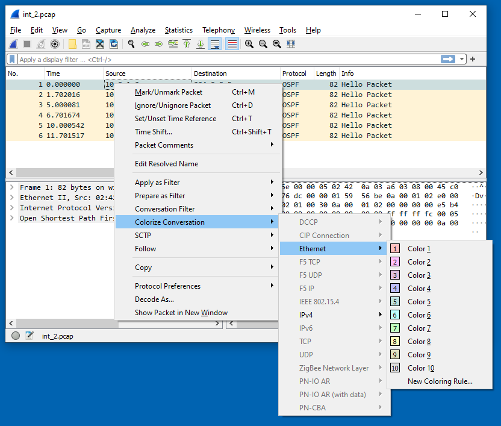

[[_TOC_]]

# Introduction

This page contains a set of sample coloring rules that people have shared with the Wireshark community. You can learn more about coloring rules and packet colorization in the [User's Guide](http://www.wireshark.org/docs/wsug_html_chunked/ChCustColorizationSection.html).

As both coloring rules and display filters share the same syntax, you might have a look at the [DisplayFilters](/DisplayFilters) page.

The coloring rules were previously called **color filters** and a file named colorfilters is still used to store them, as a result you will often see both terms used the same way.

# Loading and Saving Rule Sets

To use one of the coloring rules files listed here, download it to your local machine, select **View→Coloring Rules** in Wireshark, and click the **Import…** button.

If you'd like to add an entry to this page you can export a rule set by clicking on the **Export…** button in the Coloring Rules dialog. (It helps if you save the file with a ".txt" extension.) To upload the exported file, drag and drop the file in the edit pane. If you wish to include a screen shot, please create a separate page for your filter and put the screen shot and filter on that page.

# Sample Coloring Rules

**Page:** [TCP\_Retransmissions\_ColorFilter](/TCP_Retransmissions_ColorFilter)  
**Contributor:** Ronnie Sahlberg

-----

**File:** [Sample\_color\_filter.txt](uploads/__moin_import__/attachments/ColoringRules/Sample_color_filter.txt)  
**Description:** Sample color filter file.  
**Contributor:** Gerald Combs

-----

**Page:** [General\_use\_ColorFilter](/General_use_ColorFilter)  
**File:** [Another\_Color\_Filter](uploads/__moin_import__/attachments/ColoringRules/Another_Color_Filter)  
**Description:** More Protocols color filtered for general use.  
**Contributor:** John Prudente

-----

**File:** [Yet\_Another\_Color\_Filter3.txt](uploads/__moin_import__/attachments/ColoringRules/Yet_Another_Color_Filter3.txt)  
**Description:** Another general purpose filter. Includes highlighting of home style routers (D-Link, Netgear & Linksys); [AppleTalk](/AppleTalk) & IPX/SPX protocols; OSPF, STP & HRSP events. Useful for the corporate LAN. \*\*Modified after stealing ideas from some of the other submissions.  
**Contributor:** Peter Bruno

-----

**Page:** [Jay's\_Coloring\_Rules](/Jay's_Coloring_Rules)  
**Updated:** 7/17/06  
**Description:** General use coloring rules. Easy on the eyes colors.  
**Contributor:** [JayMoran](/JayMoran)

-----

**File:** [Arv\_Coloring\_Rules.txt](uploads/__moin_import__/attachments/ColoringRules/Arv_Coloring_Rules.txt)  
**Description:** Example emphasized on detecting errors and coloring client/server. It doesn't highlight particular protocols (as I usually filter interesting one). Edit Your MAC address before import ('from my PC' and 'to my PC' rules)  
Thanks to Peter Bruno for some rules.  
**Contributor:** Arv

-----

**File:** [iscsicolor.txt](uploads/__moin_import__/attachments/ColoringRules/iscsicolor.txt)  
**Description:** Highlights SCSI check conditions in red and highlights iSCSI packets with no associated commands or no associated responses in purple. Note: logins and logouts do not have responses so they are also purple.  
**Contributor:** proggoddess

-----

**File:** [DCE\_RPC\_Coloring\_Rules.txt](uploads/__moin_import__/attachments/ColoringRules/DCE_RPC_Coloring_Rules.txt)  
**Description:** Coloring of DCE/RPC and related protocols and grouping various windows network based protocols.  
**Contributor:** [UlfLamping](/UlfLamping)

-----

  - **File:** [Wireless\_Wiresharkcolor\_Pedrick](uploads/__moin_import__/attachments/ColoringRules/Wireless_Wiresharkcolor_Pedrick)  
    **Description:** Coloring of Wireless Authentication Packets for 802.11, WPA, and 11i protocols. Supports Preauth as well.  
    **Contributor:** perccapt

  - **File:** [Wireshark-Wlan-ColouringRules](uploads/__moin_import__/attachments/ColoringRules/Wireshark-Wlan-ColouringRules.txt "Wireshark-Wlan-ColouringRules")  
    **Description:** Coloring of Wireless Lan Packets for 802.11, WPA, 11i and EAP protocols.  
    **Contributor:** muteX

---
# Temporary Coloring Rules

The colors for the temporary rules can be modified on Wireshark startup. From the [WSDG](https://www.wireshark.org/docs/wsdg_html/#global_functions_Gui):  

> The color list can be set from the command line using two unofficial preferences: `gui.colorized_frame.bg` and `gui.colorized_frame.fg`, which require 10 hex RGB codes (6 hex digits each), e.g.

`wireshark -o gui.colorized_frame.bg:${RGB0},${RGB1},${RGB2},${RGB3},${RGB4},${RGB5},${RGB6},${RGB7},${RGB8},${RGB9}`

> For example, this command yields the same results as the table above (and with all foregrounds set to black):

```
wireshark \
-o gui.colorized_frame.bg:ffc0c0,ffc0ff,e0c0e0,c0c0ff,c0e0e0,c0ffff,c0ffc0,ffffc0,e0e0c0,e0e0e0 \
-o gui.colorized_frame.fg:000000,000000,000000,000000,000000,000000,000000,000000,,000000,000000
```

Lua functions are available to query (`get_color_filter_slot(row)`) and set (`set_color_filter_slot(row, text)`) the temporary coloring rules.

**Table 11.1. Default background colors**

| Index | RGB (hex) | Color |
| --- | --- | --- |
| 1 | ffc0c0 | pink 1 |
| 2 | ffc0ff | pink 2 |
| 3 | e0c0e0 | purple 1 |
| 4 | c0c0ff | purple 2 |
| 5 | c0e0e0 | green 1 |
| 6 | c0ffff | green 2 |
| 7 | c0ffc0 | green 3 |
| 8 | ffffc0 | yellow 1 |
| 9 | e0e0c0 | yellow 2 |
| 10 | e0e0e0 | gray |




---

Imported from https://wiki.wireshark.org/ColoringRules on 2020-08-11 23:12:18 UTC
