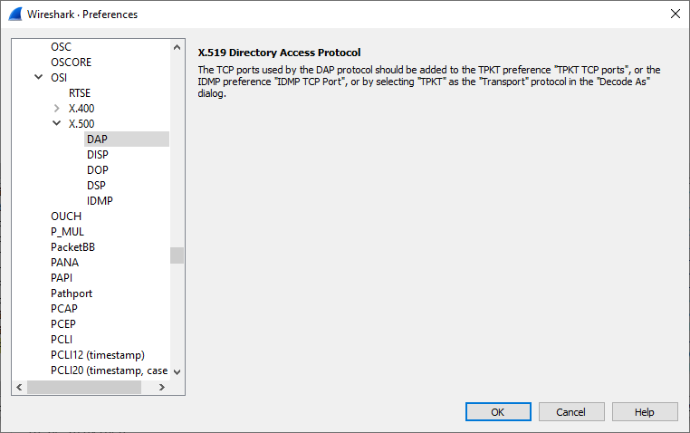

# Directory Access Protocol (DAP)

The Directory Access Protocol (DAP) is used by Directory User Agemts (DUAs) to retrieve information from a Directory System Agent (DSA). The information in the DSA is stored in entries in a hierarchical form, with each entry containing attributes that are specific to one of more object classes. DAP allows a client to list, search, add, delete, modify and rename the entries within the DSA.

If a DSA does not hold the information being searched for, it may chain the DAP operation to another DSA using [DSP](/DSP).

## History

## Protocol dependencies

  - [ROS](/ROS): Typically, DAP uses [ROS](/ROS) during connection establishment (abstract syntax [2.5.3.1](http://oid.elibel.tm.fr/2.5.3.1)).

  - [ACSE](/ACSE): Typically, DAP uses [ACSE](/ACSE) for association control (association context [2.5.9.1](http://oid.elibel.tm.fr/2.5.9.1))

  - [COTP](/COTP): Typically, DAP uses [COTP](/COTP) as its transport protocol. The well known TCP port for DAP traffic is 102, though some DSAs will often listen on other ports e.g. 19970.

## Example traffic

XXX - Add example traffic here (as plain text or Wireshark screenshot).

## Wireshark

The DAP dissector is fully functional, including support for signed operations.  
  
From the source file [packet-dap.c](https://gitlab.com/wireshark/wireshark/-/blob/master/epan/dissectors/packet-dap.c) (fodder for Wiki searches)    
```c
/* packet-dap.c
 * Routines for X.511 (X.500 Directory Asbtract Service) and X.519 DAP  packet dissection
 * Graeme Lunt 2005
```
```
/* we don't have a separate dissector for X519 -
   most of DAP is defined in X511 */
#define PNAME  "X.519 Directory Access Protocol"
```


## Preference Settings

There is a single preference field for the DAP dissector, the DAP TCP Port - the port to which DAP associations are made. The default value is 102.  
  
NOTE: moved in [31205360](https://gitlab.com/wireshark/wireshark/-/commit/3120536012bc85361e2e5cd204bd4aa91fb67ff6) :
"Have TPKT support a TCP port range preference instead of having "subdissectors?" register their own."


## Example capture file

To be provided.  
  
Attached to issue #5507 : "X.519 - BER: Dissector for OID:1.3.12.2.1011.5.4.1.1 and OID:1.3.12.2.1011.5.4.1.2 not implemented. Contact Wireshark developers if you want this supported"  
  
TSTI11_DSA.TRC: example trace file highlighting the missing dissector

## Display Filter

A complete list of DAP display filter fields can be found in the [display filter reference](http://www.wireshark.org/docs/dfref/d/dap.html)

Show only the DAP based traffic:

``` 
 dap
```

## Capture Filter

You cannot directly filter DAP protocols while capturing. However, if you know the [TCP](/TCP) port used (see above), you can filter on that one.

Capture only the DAP traffic over a non-standard port (19970):

``` 
 tcp port 19970 
```

## External links

  - [ASN.1 Specification from ITU](http://www.itu.int/ITU-T/asn1/database/itu-t/x/x511/2005/DirectoryAbstractService.html)

  - [X.511 Recommendation](http://www.itu.int/rec/T-REC-X.511-200508-I/en)

  - [Understanding X.500 - The Directory](http://www.cs.kent.ac.uk/pubs/1996/2051/) David Chadwick's book

## Discussion

---

Imported from https://wiki.wireshark.org/DAP on 2020-08-11 23:12:26 UTC
