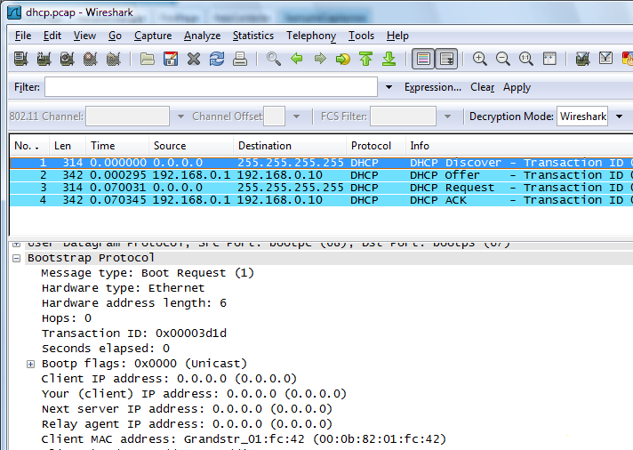
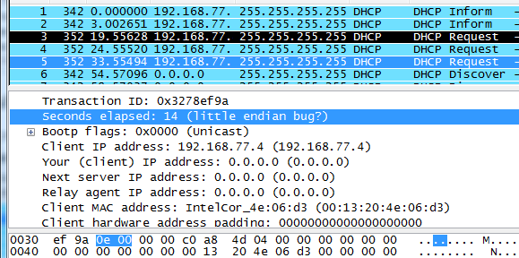

# Dynamic Host Configuration Protocol (DHCP)

DHCP is a client/server protocol used to dynamically assign [IP-address](/IP-address) parameters (and other things) to a DHCP client. It is implemented as an option of [BOOTP](/BOOTP).

Some operating systems (including Windows 98 and later and Mac OS 8.5 and later) use [APIPA](/APIPA) to locally assign an [IP-address](/IP-address) if no DHCP server is available.

## History

  - [RFC1531](http://www.ietf.org/rfc/rfc1531.txt) "Dynamic Host Configuration Protocol" October 1993, obsoleted by RFC1541

  - [RFC1541](http://www.ietf.org/rfc/rfc1541.txt) "Dynamic Host Configuration Protocol" October 1993, obsoleted by RFC2131

  - [RFC2131](http://www.ietf.org/rfc/rfc2131.txt) "Dynamic Host Configuration Protocol" March 1997, updated by RFC3396

  - [RFC3396](http://www.ietf.org/rfc/rfc3396.txt) "Encoding Long Options in the Dynamic Host Configuration Protocol (DHCPv4)" November 2002

## Protocol dependencies

  - [BOOTP](/BOOTP): DHCP uses [BOOTP](/BOOTP) as its transport protocol.

## Example traffic



## Wireshark

The DHCP dissector is fully functional.

### Windows Endian Bug Detection

Most versions of Microsoft Windows improperly encode the *secs* field on the wire as little-endian. Wireshark will attempt to detect this and display the message "little endian bug?" in the packet detail. In the example below, the *secs* value 0x0e00 (3584, or nearly an hour) was sent by a Windows XP client, even though the client hadn't been retrying that long. Interpreting the value as 0x000e (14) matches the time elapsed since the first request (packet \#3).



## Preference Settings

  - Decode Option 85 as String: Novell Servers option 85 can be configured as a string instead of address.

  - Packet`  `Cable CCC protocol version: The Packet`  `Cable CCC protocol version.

  - Packet`  `Cable CCC option: Option Number for Packet`  `Cable Cable`  `Labs Client Configuration.

  - Custom BootP/DHCP Options (Excl. suboptions): Define custom interpretation of options

## Example capture files

  - [SampleCaptures/dhcp.pcap](uploads/__moin_import__/attachments/SampleCaptures/dhcp.pcap)

  - [SampleCaptures/dhcp-auth.pcap.gz](uploads/__moin_import__/attachments/SampleCaptures/dhcp-auth.pcap.gz)

  - [SampleCaptures/PRIV\_bootp-both\_overload.pcap](uploads/__moin_import__/attachments/SampleCaptures/PRIV_bootp-both_overload.pcap)

  - [SampleCaptures/PRIV\_bootp-both\_overload\_empty-no\_end.pcap](uploads/__moin_import__/attachments/SampleCaptures/PRIV_bootp-both_overload_empty-no_end.pcap)

## Display Filter

As DHCP is implemented as an option of BOOTP, you can only filter on BOOTP messages. A complete list of BOOTP display filter fields can be found in the [display filter reference](http://www.wireshark.org/docs/dfref/b/bootp.html)

Show only the BOOTP based traffic:

``` 
 bootp
```

## Capture Filter

As DHCP is implemented as an option of BOOTP, you can only filter on BOOTP messages. You cannot directly filter BOOTP protocols while capturing if they are going to or from arbitrary ports. However, BOOTP traffic normally goes to or from ports 67 and 68, and traffic to and from those ports is normally BOOTP traffic, so you can filter on those port numbers.

Capture only traffic to and from ports 67 and 68:

``` 
 port 67 or port 68
```

On many systems, you can say "port bootps" rather than "port 67" and "port bootpc" rather than "port 68".

## External links

  - in the [RFC search](http://www.rfc-editor.org/rfcsearch.html) you could search for DHCP, as there are a lot of DHCP options spread over several RFC's

## Discussion

What about little endian bug ? There is some errors in "seconds elasped" field, but nothing about an issue about this. (I've got this error on DHCPInform request, the request is loaded twice, with 3 seconds intervals and one of the two request contains this error) - [CortoGueguen](/CortoGueguen)

If you think there's a bug in Wireshark's DHCP dissector, either file the bug on the Wireshark Bugzilla or send mail to the wireshark-users mailing list; this is not the place for reporting Wireshark bugs. -*Guy Harris*

I think *[CortoGueguen](/CortoGueguen)* might be referring to an error message that Wireshark displays. I've added an explanation along with a screenshot. - *[GeraldCombs](/GeraldCombs)*

Yes this is it, [GeraldCombs](/GeraldCombs), thanks a lot - [CortoGueguen](/CortoGueguen) **

---

Imported from https://wiki.wireshark.org/DHCP on 2020-08-11 23:13:29 UTC
