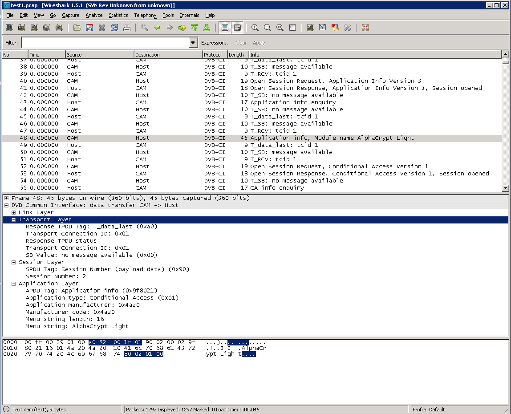

# DVB Common-Interface (DVB-CI)

DVB-CI defines an interface between a DVB receiver (TV set, Set-Top-Box, Bluray recorder etc.) and a PC-Card module (Conditional Access Module, CAM). It consists of a *transport stream interface* and a *command interface*.

On the transport stream interface, a DVB Transport Stream can be routed through the module and optionally be descrambled. The command interface transfers commands like *start descrambling*. The DVB-CI dissector processes command interface traffic and some hardware events such as *module inserted/extracted*

## History

DVB-CI was defined by DVB in 1997. An extension document followed in 1999, but the extensions defined there were never implemented in practice.

*CI+* added content security and other features on top of DVB-CI. CI+ version 1.2 was published in May 2009, version 1.3 followed in January 2011 and version 1.3.1 in October 2011.

### standards documents

* [DVB-CI standard EN50221](http://www.dvb.org/technology/standards/En50221.V1.pdf)
* [DVB-CI extensions TS 101 699](http://broadcasting.ru/pdf-standard-specifications/interfacing/dvb-ci/ts101699-v1-1-1.pdf)
* [CI+ version 1.2](http://www.ci-plus.com/data/ci-plus_specification_v1.2.pdf)
* [CI+ version 1.3](http://www.ci-plus.com/data/ci-plus_specification_v1.3.pdf)
* [CI+ version 1.3.1](http://www.ci-plus.com/data/ci-plus_specification_v1.3.1.pdf)

## Example traffic

The screenshot shows dissection of the application\_info() APDU. The capture contains no timestamps. If timestamps are available, the dissector can handle them. ** 

## Wireshark

The DVB-CI dissector was written by Martin Kaiser ( <wireshark@kaiser.cx> ). It is fully functional and has been tested with many capture files.

The following features of the DVB-CI standard EN50221 are supported

* hardware events (module inserted/removed, power on/off, ...)
* Card Information Structure (CIS)
* link, transport, session layer
* reassembly of fragmented TPDUs and SPDUs ** The table below summarizes the supported resources on the application layer

|                              | DVB-CI      | CI+ 1.2     | CI+ 1.3.1 |
| ---------------------------- | ----------- | ----------- | --------- |
| Resource Manager             | ok          | ok          | ok        |
| Application Info             | ok          | ok          | ok        |
| Conditional Access           | ok          | ok          | ok        |
| Date-Time                    | ok          | ok          | ok        |
| MMI (high level)             | ok          | ok          | ok        |
| Host Control                 | ok          | ok          | ok        |
| Low-Speed Communication      | partly      | ok          | ok        |
| Host Language and Country    | not defined | ok          | ok        |
| CAM upgrade                  | not defined | ok          | ok        |
| Content Control              | not defined | ok          | ok        |
| Application MMI              | not defined | ok          | ok        |
| Specific Application Support | not defined | ok          | ok        |
| Operator Profile             | not defined | not defined | ok        |

There's no plans to support the DVB-CI extensions (TS 101 699) or low-level MMI. For low-speed communication, only IP connections are supported.

The dissector uses pcap files with datalink type 235. The corresponding format is documented at <http://www.kaiser.cx/pcap-dvbci.html>

## Preference Settings

### SAC encryption key, SAC init vector

If you provide these two values for your capture file, wireshark is able to decrypt SAC messages sent on the CC resource. This requires libgrypt. Both values consist of 32 hex digits (16 hex bytes). They must be typed in without leading 0x.

### Dissect LSC messages

When this setting is enabled, wireshark tries to dissect the payload of LSC APDUs. It calls the dissector that's registered for the protocol and port number given in the connect\_on\_channel command.

DVB-CI uses length fields in ASN.1 BER format in many messages. To dissect these length fields, the DVB-CI dissector uses the existing BER code. To display details of each length field, select *Show internal BER encapsulation tokens* from the *Edit / Preferences / Protocols / BER preferences* menu.

## Example capture files

[SampleCaptures/dvb-ci\_1.pcap](uploads/__moin_import__/attachments/SampleCaptures/dvb-ci_1.pcap) startup, requests for descrambling, removal ** [SampleCaptures/dvb-ci\_2.pcap](uploads/__moin_import__/attachments/SampleCaptures/dvb-ci_2.pcap) fragmentation and reassembly on the link layer

## Display Filter

## Capture Filter

## External links

  - 
[http://www.kaiser.cx/wireshark.html: Info page about the wireshark DVB-CI dissector (obsolete)](http://www.kaiser.cx/wireshark.html)

## Discussion

---

Imported from https://wiki.wireshark.org/DVB-CI on 2020-08-11 23:13:40 UTC
