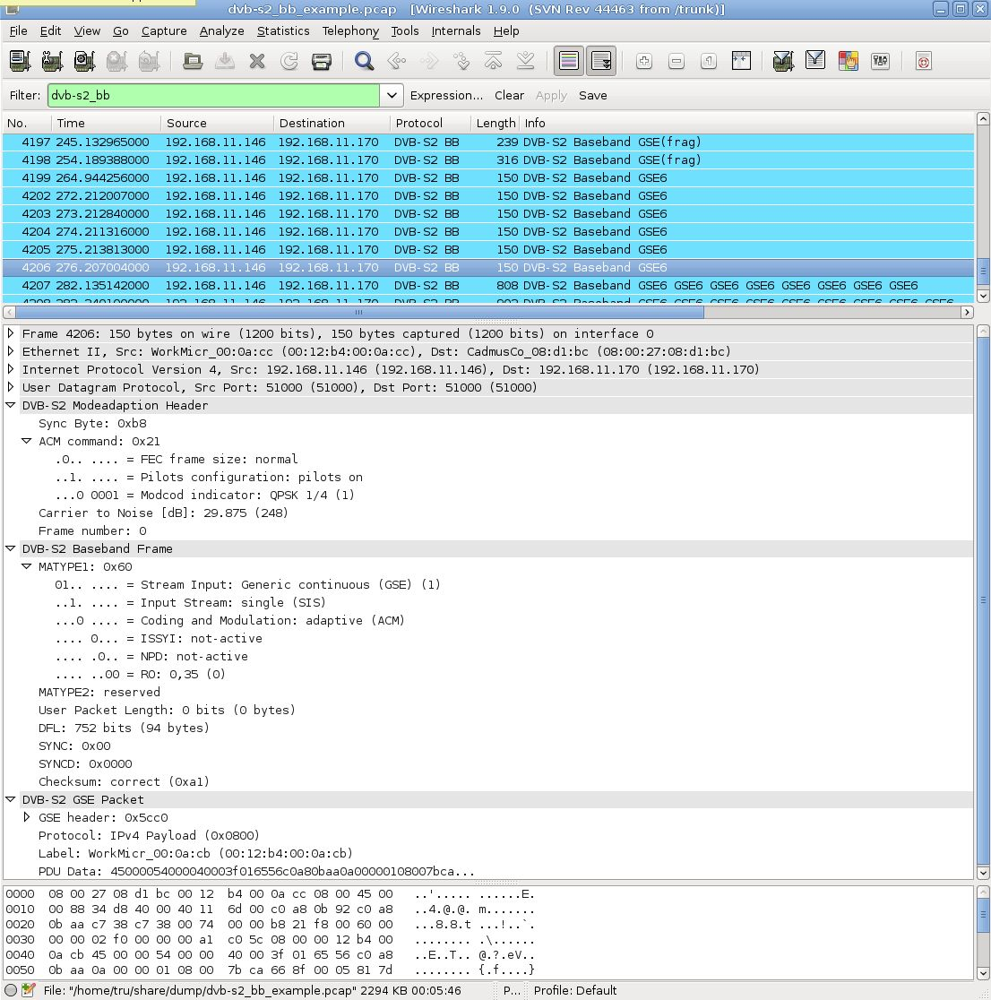

# DVB-S2 Baseband Frame (DVB-S2-BB)

This dissector is able to show the output of satellite receiving equipment. The dissector consists of three "layers".

First, the ***DVB-S2 Modeadaption Header*** shows details about receiver specific information and signal quality \[1\].

The ***DVB-S2 Baseband Frame*** is the data header for the transmission over satellite \[2\].

The payload within one baseband frame is encapsulated in ***DVB-S2 GSE Packets*** \[3\]. The GSE packets can be segmented and carry the user data.

## Protocol dependencies

  - [UDP](/UDP): Typically, DVB-S2-BB uses [UDP](/UDP) as its transport protocol. The port is not specified.

  - [RTP](/RTP): Alternatively the output can be sent within [RTP](/RTP) messages. This dissector currently only supports UDP dissection.

## Example traffic

The screenshot shows dissection of the baseband frames with several segmented and unsegmented GSE frames inside. The data is also available in the *example capture file* (below).

**

## Wireshark

The DVB-S2 dissector is fully functional. There are some missing features which might be implemented in future (this list is sorted with descending priority, highest priority is on the first bullet):

  - display other baseband payload then GSE (e.g. MPE)
  - label re-use (display last used label)
  - RTP support
  - Header extensions

## Preference Settings

  - Enable dissection of USER DATA
  - Enable dissection of GSE data

The default setting of both preferences is "disabled", i.e. payload is displayed as hex data rather than dissected.

The first preference setting must be enabled in order to dissect any protocol layers above the BBHeader, e.g. the GSE packet header. (In the future this could be extended to TS packets.)

The second preference setting must be enabled (along with the first) in order to dissect the payload of the captured GSE frame. (One potential use case is to avoid complicated filter expressions when GSE frames contain tunneled Ethernet and IP packets that might be confused with the outer layer Ethernet and IP.)

There is a heuristic dissector for detecting DVB-S2-BB (more specifically, beginning at the mode adaptation layer) over UDP. By default it is disabled, and it must be enabled in 
"Analyze->Enabled Protocols". (As the DVB-S2-BB dissector is not registered by name, does not have a libpcap link-layer type, and does not have registered well-known ports, there is no way to dissect packets without the heuristic dissector being enabled.)

## Example capture file

The example capture file shows several pings with different sizes encapsulated in baseband frames. The data was sent over satellite with different modulations, fec's and frame lengths (different modeadaption headers).

  - [SampleCaptures/dvb-s2\_bb\_example.pcap](uploads/__moin_import__/attachments/SampleCaptures/dvb-s2_bb_example.pcap)

## Display Filter

Show only the protocol based traffic:

``` 
 dvb-s2_modeadapt or dvb-s2_bb or dvb-s2_gse 
```

## External links and Standards reference

1.  *[Mode Adaption Input and Output Interface](https://web.archive.org/web/20170226064346/http://satlabs.org/pdf/sl_561_Mode_Adaptation_Input_and_Output_Interfaces_for_DVB-S2_Equipment_v1.3.pdf)*

2.  *[DVB Framing Structure](https://www.etsi.org/deliver/etsi_en/302300_302399/30230701/01.04.01_20/en_30230701v010401a.pdf)*

3.  *[DVB Generic Stream Encapsulation](https://www.etsi.org/deliver/etsi_ts/102600_102699/10260601/01.02.01_60/ts_10260601v010201p.pdf)*

## Discussion

---

Imported from https://wiki.wireshark.org/DVB-S2 on 2020-08-11 23:13:41 UTC