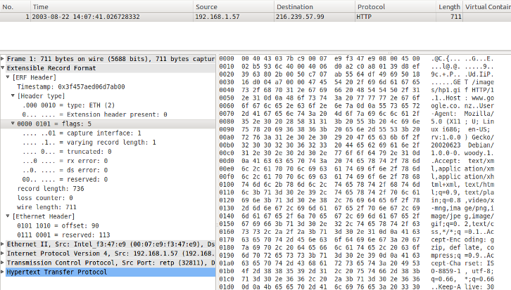

# Extensible Record Format (ERF)

[[_TOC_]]

## Overview

[Endace](http://www.endace.com/) DAG monitoring interface cards produce trace files in their own native format, know as the Extensible Record Format (ERF).

The ERF file consists of a series of records. Each record describes one packet. An ERF file consists only of ERF records; there is no special file header. This allows concatenation and splitting to be preformed arbitrarily on ERF record boundaries.

## Packet Format

Generic ERF header

<div>

<table>

<tbody>

<tr>

<td style="background-color: #D1C9CB">

Byte 3

</div>

</td>

<td style="background-color: #D1C9CB">

Byte 2

</td>

<td style="background-color: #D1C9CB">

Byte 1

</td>

<td style="background-color: #D1C9CB">

Byte 0

</td>

</tr>

<tr>

<td colspan="4" style="&amp;quot; text-align:center&amp;quot;">

timestamp

</td>

</tr>

<tr>

<td colspan="4" style="&amp;quot; text-align:center&amp;quot;">

timestamp

</td>

</tr>

<tr>

<td style="&amp;quot; text-align:center&amp;quot;">

type

</td>

<td style="&amp;quot; text-align:center&amp;quot;">

flags

</td>

<td colspan="2" style="&amp;quot; text-align:center&amp;quot;">

rlen

</td>

</tr>

<tr>

<td colspan="2" style="&amp;quot; text-align:center&amp;quot;">

lctr/color

</td>

<td colspan="2" style="&amp;quot; text-align:center&amp;quot;">

wlen

</td>

</tr>

<tr>

<td colspan="4" style="&amp;quot; text-align:center&amp;quot; ; background-color: #19912F">

extension headers (optional)

</td>

</tr>

<tr>

<td colspan="4" style="&amp;quot; text-align:center&amp;quot; ; background-color: #F0F71E">

payload

</td>

</tr>

</tbody>

</table>

</div>

### Timestamp

The time of arrival of the cell, a ERF 64-bit timestamp. Single little-endian 64-bit fixed point number. The high 32-bits contain the integer number of seconds since the start of time (unix epoch time). The lower 32-bits contain the binary fraction of the second allowing an ultimate resolution of approximately 233 picoseconds.

### Type

<div>

<table>
<tbody>
<tr class="odd">
<td><p>Bits</p></td>
<td><p>Description</p></td>
</tr>
<tr class="even">
<td><p>7</p></td>
<td><p>Extension header present.</p></td>
</tr>
<tr class="odd">
<td><p>6:0</p></td>
<td><p>Extension header type.</p></td>
</tr>
</tbody>
</table>

</div>

### Flags

<div>

<table>
<tbody>
<tr class="odd">
<td><p>Bits</p></td>
<td><p>Description</p></td>
</tr>
<tr class="even">
<td><p>7</p></td>
<td><p>Reserved</p></td>
</tr>
<tr class="odd">
<td><p>6</p></td>
<td><p>Reserved</p></td>
</tr>
<tr class="even">
<td><p>5</p></td>
<td><p>DS error. An internal error generated inside the card annotator. Not present on the wire.</p></td>
</tr>
<tr class="odd">
<td><p>4</p></td>
<td><p>RX error. An error in the received data. Present on the wire</p></td>
</tr>
<tr class="even">
<td><p>3</p></td>
<td><p>Truncated record (depreciated)</p></td>
</tr>
<tr class="odd">
<td><p>2</p></td>
<td><p>Varying length record... just leave this on, otherwise packets should be padded</p></td>
</tr>
<tr class="even">
<td><p>1:0</p></td>
<td><p>Binary enumeration of capture interface. 11, interface 3/D 10 interface 2/C 01 interface 1/B 00 interface 0/A</p></td>
</tr>
</tbody>
</table>

</div>

### rlen

Record length in bytes. Total length of the record transferred over the PCI bus to storage. The timestamp of the next ERF record starts exactly rlen bytes after the start of the timestamp of the current ERF record.

### lctr

Depending upon the ERF type this is either a loss counter or color field. The loss counter records the number of packets lost between the DAG card and the stream buffer due to overloading on the PCI bus. The loss is recorded between the current record and the previous record captured on the same stream/interface.

### wlen

Wire length. Packet length "on the wire" including some protocol overhead. The exact interpretation of this quantity depends on the physical medium. This may contain padding.

### Extension Headers

Extension headers in the ERF record allow extra data relating to each packet to be transported to the host. Extension header(s) are present if bit 7 of the type field is 1.

### Payload

Payload is the actual data in the record. It can be calculated by: payload = rlen - ERF header - Extension headers (optional) - Protocol header - padding.

## Example traffic



## Wireshark

The dissector works for all ERF files. It also supports saving of pcap or other generic data from within wireshark of Ethernet or HDLC types. In the Ethernet type, if there is no existing checksum then one will be generated and added because some tools expect ERF files to have one. There is expert info for ERF, HDLC, and if there are more extension headers that are not loaded (maximum of 8 are loaded).

## Preference Settings

(XXX add links to preference settings affecting how PROTO is dissected).

## Example capture file

  - [SampleCaptures/erf-ethernet-example.erf](uploads/__moin_import__/attachments/SampleCaptures/erf-ethernet-example.erf)

## Display Filter

Show only the ERF based traffic:

``` 
 erf
```

## External links

<https://www.endace.com/erf-extensible-record-format-types.pdf>

## Discussion

Christopher: Rather than completely removing ERF types for End of Life DAG Cards, I think it would be nicer if they remained in the reference document somewhere, after all, Wireshark will still offer dissection support for those types and users may desire to reference the types.

Stephen: Wireshark will retain the dissection of old/unused ERF record types and headers. We removed them from the reference document to reduce clutter for people actively using supported cards. I'm happy to include notes here on obsolete formats if people have questions.

Guy: I have saved copies of versions 6, 10, and 19 of the manual, which should document at least some of those record types and headers. Should I upload them to the Wiki and point to them from here, for reference purposes?

Stephen: Could do, although not all older versions may have distribution licences. Alternatively we are building a public page for the format document and could also archive relevant historical versions.

Guy: If "we" means "Endace", I'd vote for the latter solution.

---

Imported from https://wiki.wireshark.org/ERF on 2020-08-11 23:13:49 UTC
