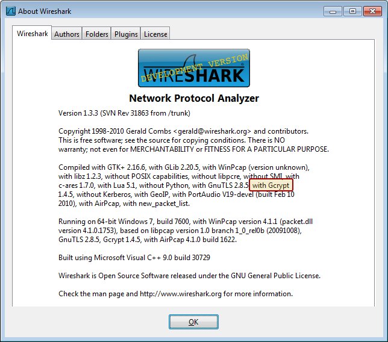
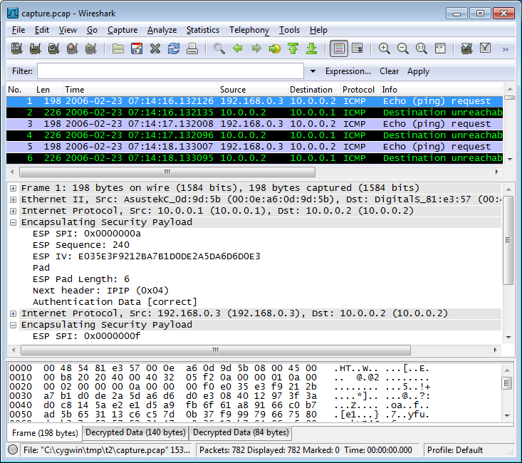
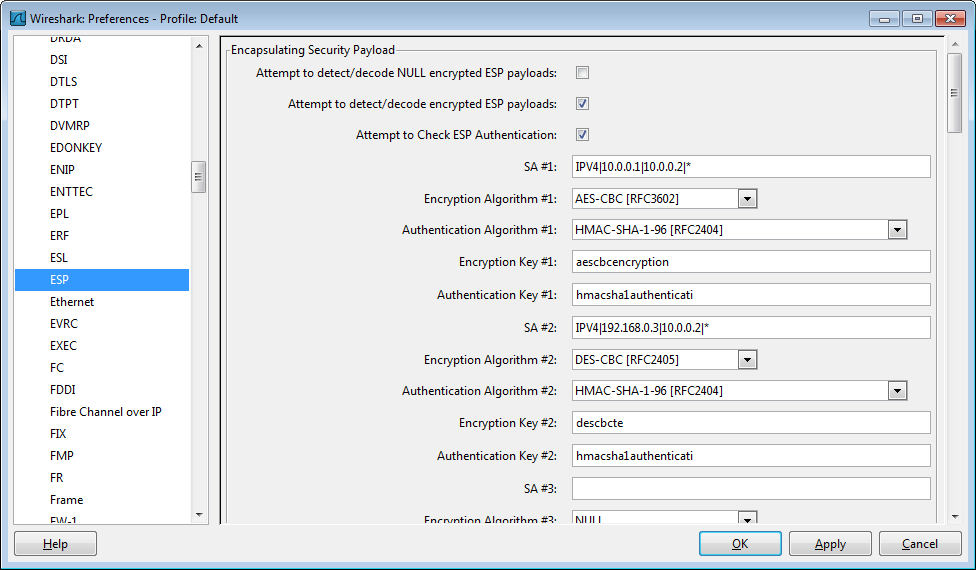

# ESP Payload Decryption / ESP Authentication Checking

If Libgcrypt is linked with Wireshark you can decrypt ESP Payloads and/or Authentication Checking. You can see if your version of Wireshark supports ESP decryption by looking for "with Gcrypt" in the about box.



The following encryption algorithms are supported:

  - NULL Encryption.

  - TripleDES-CBC [RFC2451](http://www.ietf.org/rfc/rfc2451.txt) with key length of 192 bits.

  - AES-CBC with 128-bit keys [RFC3602](http://www.ietf.org/rfc/rfc3602.txt) with key length of 128/192/256 bits.

  - AES-CTR [RFC3686](http://www.ietf.org/rfc/rfc3686.txt) with key length of 160/224/288 bits. The remaining 32 bits will be used as nonce.

  - DES-CBC [RFC2405](http://www.ietf.org/rfc/rfc2405.txt) with key length of 64 bits.

  - BLOWFISH-CBC [RFC2451](http://www.ietf.org/rfc/rfc2451.txt) with key length of only 128 bits.

  - TWOFISH-CBC with key of 128/256 bits.

The following authentication algorithms are supported:

  - NULL Authentication.

  - HMAC-SHA1-96 [RFC2404](http://www.ietf.org/rfc/rfc2404.txt) : any keylen

  - HMAC-MD5-96 [RFC2403](http://www.ietf.org/rfc/rfc2403.txt) : any keylen

  - HMAC-SHA256 : any keylen

## IPsec Modes

IPsec may be used in two Modes : tunnel or transport and concerns two kinds of nodes : End Nodes and Secure Gateways. Each kind of node may use IPsec using these two Modes. This dissector aim is to decrypt the whole packet if you have enough information concerning the different Security Associations.

Here is one of the more complex topology (if you have ESP in tunnel Mode in ESP in tunnel Mode ... it should work the same).

``` 
                                              DUMP
                                               |
    N1                         SGW1            |        N2
[192.168.0.3] -------[192.168.0.2][10.0.0.1]--------[10.0.0.2]

default route for 192.168.0.3 is 192.168.0.2
default route for 10.0.0.2 is 10.0.0.1
We define the following policies with the setkey syntax :

<SA1>
########## For 192.168.0.2 (SGW1)
spdadd  192.168.0.3 10.0.0.2 any -P out ipsec
esp/tunnel/10.0.0.1-10.0.0.2/use;
add 10.0.0.1 10.0.0.2 esp 10
-m tunnel
-E aes-cbc "aescbcencryption"
-A hmac-sha1 "hmacsha1authenticati";

<SA2>
########## For 192.168.0.3 (N1)
spdadd  192.168.0.3 10.0.0.2 any -P out ipsec esp/transport//require;
add 192.168.0.3 10.0.0.2 esp 15
-E des-cbc "descbte"
-A hmac-sha1 "hmacsha1authenticati";
```

It means that packets coming from N1 to N2 will be encrypted with des-cbc and tunneled from SGW1 with ESP encryption aes-cbc to N2. If we have a look at the DUMP host, we have only two SAs to decrypt the entire packet. If we have a look at the different Layers it will be :

    [IP1][ESP1][ENCRYPTION1]
    
    with [ENCRYPTION1]=[IP2][ESP2][ENCRYPTION2]
    and [ENCRYPTION2]=ICMP
    
    IP1 is IP header from SGW1 to N2
    ENCRYPTION2 is aes-cbc
    IP2 is IP header from N1 to N2
    ENCRYPTION2 is des-cbc

Thus, the IPsec dissector knowing these two SAs, will decrypt first ENCRYPTION1 using SA1, will dissect it, will get ENCRYPTION2, will decrypt it using SA2 and will dissect it getting the full decrypted packet.

If you look at the Authentication field, you will notice that 2 fields are available. The inner one is available only if ENCRYPTION1 is decrypted.

Here's what a packet looks like after decryption:



## ESP Preferences

In order to decrypt ESP Payload or to check ESP Authenticator, you need to give some elements of the known Security Associations (SA). I.e :

  - The Source Address of the SA. Either IPv6, either IPv4.
  - The Destination Address of the SA. Either IPv6, either IPv4.
  - The SPI (Security Parameter Index).
  - The Encryption algorithm and the associated key.
  - The Authentication algorithm; even if you do not want to check Authentication, it has some impact on the bytes alignment.

We do not need to indicate the operation Mode (transport, tunnel), the decryption will be done iteratively.

These differents elements have to be indicated in The ESP Preferences Menu of Wireshark. Indeed, it would perhaps have been better to set it in a separate file, but it is quite convenient to have at least a few rules in the Preferences Box. Moreover the parsing is quite basic, without the use of any library/tool such as Lex/yacc for example.

If you need to modify the number of Security Associations, you have to do it in the dissector by modifying the value of "IPSEC\_NB\_SA".

Here are the preferences used to decrypt the previous screen:



### Attempt to detect/decode NULL encrypted ESP payloads

This field is an heuristic in order to decrypt packet. It assumes that packet are encrypted using the NULL algorithm and the Authentication uses 12 bytes as with hmac-sha1-96/hmac-sha256/hmac-md5-96. This field Should be the only one available if Wireshark is not linked with libgcrypt. Otherwise, if set, all packets that are not catched by the Security Associations are decrypted using this heuristic. No authentication Checking will be done on these packets.

### Attempt to detect/decode encrypted ESP payloads

This field Should be available only if Wireshark is linked with libgcrypt. It is used to activate the Security Associations. When an IPsec ESP packet will be catched by a Security Assciation (Source/Destination/SPI) it will be decrypted using the specified Encryption/Authentication Algorithm and the associated Encryption Key. This checking will be done iteratively.

### Attempt to check ESP Authentication

This field Should be available only if Wireshark is linked with libgcrypt. When an IPsec ESP packet will be catched by a Security Assciation (Source/Destination/SPI) the Authentication will be checked using the specified Authentication Algorithm and the associated Authentication Key. This checking will be done iteratively.

### Security Associations And SA Filters

This field uses the following syntax (with spaces or not):

    Protocol|Source Address|Destination Adress|SPI

Where :

  - Protocol: either IPv4, IPv6 (upper and/or lowercase letters)
  - SPI : the Security Parameter Index of the Security Association. You may indicate it in decimal (ex: 123) or in hexadecimal (ex: 0x45). The special keywords '\*' may be used to match any SPI. Nevertheless, if you use more than one '\*', it will restrict the length of the SPI in decimal to as many '\*' as indicated. For example '\*\*' will match 23 but not 234. 234 will be match by '\*\*\*'. No checking will be done on the SPI value. Thus you have to take into account that the SPI is 4 bytes length.
  - Addresses : In this field we may have IPv6 or IPv4 address. Any address is a combination of an address or a prefix and a Prefixlen/Netmask separated by '/'. You may omit the Prefixlen/Netmask, assuming that the Adress is 128 bits length for IPv6 and 32 bits length for IPv4. The character '\*' used at the Prefixlen/Netmask position will be as if you had omit it.
      - IPv6 Addresses : Any valid IPv6 address is accepted. ex: `3FFE::1/128, 3FFE:4:5:6666::/64, ::1/128, 3FFE:4::5`. If your address is incorrect and longer than 16 bytes, only the last 16 bytes will be taken into account. You also may use the special character '\*' to indicate any 4 bits block. ie : `3ffe::45*6`. If you use only one '\*' in the Address field it will accept any IPv6 address.
    
      - IPv4 Addresses : Any valid IPv4 address is accepted. ex : `190.0.0.1/24, 10.0.0.2`. You also may use the special character '\*' to indicate any 8 bits block. ie `190.*.*.3`. If you use only one '\*' in the Address field it will accept any IPv4 address. No checking of correct IPv4 address will be done. For example `456.345.567.890` will be accepted. Thus you have to take care about what you write. Nevertheless only 3 characters will be taken into account for one byte. Ex : `190.0.0.0184` will not be considered correct. (Instead a kind of LRU Mechanism will be used and the address taken into account will be `190.0.0.418`). Moreover only the four first values will be used (Ie `190.0.0.12.13` will be considered as `190.0.0.12`).

### Encryption, Authentication Algorithms & Keys

In these fields you have to describe the Authentication, Encryption Algorithms and the Authentication, Encryption Keys for the SAs. The key sizes should be conformant with what is specified in the Algorithms otherwise it will not work. Keys may be written in Decimal or in Hexadecimal (beginning with 0x).

We may notice that if we only care about decryption, choosing one of hmac-sha1-96/aes-xcbc-mac-96/hmac-md5-96 for Authentication will have no impact on the decryption since all this algorithm will give a 12-bytes authenticator field. Thus either we choose one of it without the "FIELD: Attempt to check ESP Authentication" set or we may use the Authentication algorithm "Any 12 Byte Of authentication \[No checking\]". In this case, the "FIELD: Attempt to check ESP Authentication" has no impact on the decision. The algorithms explicitly taken into account are the followings :

  - TripleDES-CBC [RFC2451](http://www.ietf.org/rfc/rfc2451.txt) :

According to RFC 2451, 3DES CBC uses a key of 192 bits. The first 3DES key is taken from the first 64 bits, the second from the next 64 bits, and the third from the last 64 bits. Implementations MUST take into consideration the parity bits when initially accepting a new set of keys. Each of the three keys is really 56 bits in length with the extra 8 bits used for parity. 3DES CBC uses an IV of 8 octets.

  - AES-CBC with 128-bit keys [RFC3602](http://www.ietf.org/rfc/rfc3602.txt) :

According to RFC 3602, AES supports three key sizes: 128 bits, 192 bits, and 256 bits. The default key size is 128 bits, and all implementations MUST support this key size. Implementations MAY also support key sizes of 192 bits and 256 bits. AES-CBC uses an IV of 16 octets.

  - AES-CTR [RFC3686](http://www.ietf.org/rfc/rfc3686.txt) :

According to RFC 3686, AES supports three key sizes: 128 bits, 192 bits, and 256 bits. The default key size is 128 bits, and all implementations MUST support this key size. Implementations MAY also support key sizes of 192 bits and 256 bits. AES-CTR uses an IV of 8 octets.

  - DES-CBC [RFC2405](http://www.ietf.org/rfc/rfc2405.txt) :

According to RFC 2405, DES-CBC is a symmetric secret key algorithm. The key size is 64-bits. It is commonly known as a 56-bit key as the key has 56 significant bits; the least significant bit in every byte is the parity bit. DES-CBC uses an IV of 8 octets.

  - BLOWFISH-CBC [RFC2451](http://www.ietf.org/rfc/rfc2451.txt) :

Bruce Schneier of Counterpane Systems developed the Blowfish cipher algorithm. RFC 2451 shows that Blowfish uses key sizes from 40 to 448 bits. The Default size is 128 bits. We will only accept key sizes of 128 bits, because libgrypt only accept this key size. Have a look to <http://www.schneier.com> for more information. BLOWFISH-CBC uses an IV of 8 octets.

  - TWOFISH-CBC :

Twofish is a 128-bit block cipher developed by Counterpane Labs that accepts a variable-length key up to 256 bits. We will only accept key sizes of 128 and 256 bits. Have a look to <http://www.schneier.com> for more information. TWOFISH-CBC uses an IV of 16 octets.

  - HMAC-MD5-96 [RFC2403](http://www.ietf.org/rfc/rfc2403.txt) :

HMAC with MD5 provides data origin Authentication and integrity protection. HMAC-MD5-96 produces a 128-bit authenticator value. For use with either ESP or AH, a truncated value using the first 96 bits MUST be supported. Upon sending, the truncated value is stored within the authenticator field. Upon receipt, the entire 128-bit value is computed and the first 96 bits are compared to the value stored in the authenticator field. No other authenticator value lengths are supported by HMAC-MD5-96.

  - HMAC-SHA1-96 [RFC2404](http://www.ietf.org/rfc/rfc2404.txt) :

SHA-1 combined with HMAC \[RFC2104\] provides a keyed Authentication mechanism. HMAC-SHA-1-96 produces a 160-bit authenticator value. For use with either ESP or AH, a truncated value using the first 96 bits MUST be supported. Upon sending, the truncated value is stored within the authenticator field. Upon receipt, the entire 160-bit value is computed and the first 96 bits are compared to the value stored in the authenticator field. No other authenticator value lengths are supported by HMAC-SHA-1-96.

  - HMAC-SHA256

This is the SHA-256 algorithm which yields a message digest of 32 bytes. For use with either ESP or AH, a truncated value using the first 96 bits MUST be supported. Upon sending, the truncated value is stored within the authenticator field. Upon receipt, the entire 128-bit value is computed and the first 96 bits are compared to the value stored in the authenticator field. Our implementation will support any key length.

## Possible Extensions

For sure, you may use some others ESP Encryption/Authentication algorithms. and it should not be very difficult to add some other ones. It also should be possible to adapt this to check AH Authenticator and why not to do things for IPComp. If the maximum number of Security Associations fixed is a problem for you, you may modify this value in the dissector "IPSEC\_NB\_SA". It could also be interesting to keep a few SAs in the Preferences Box and have a way to add some more in a separate file.

---

Imported from https://wiki.wireshark.org/ESP_Preferences on 2020-08-11 23:13:51 UTC
