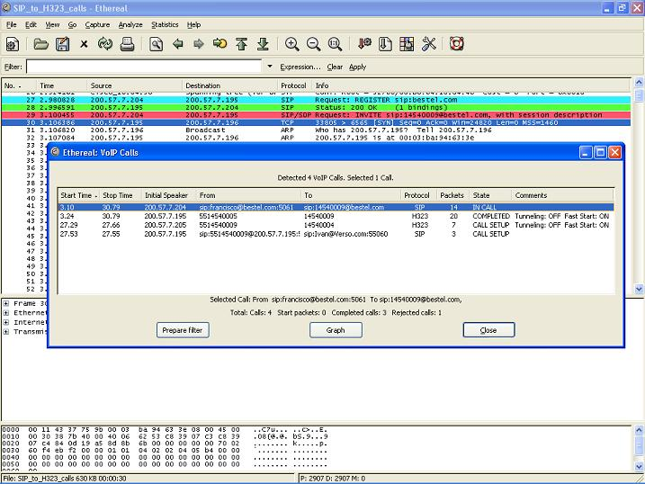

# VoIP Calls

Read in english at [http://wiki.wireshark.org/VoIP\_calls](/VoIP_calls)

Para acceder al análisis de llamadas VoIP haga click en "Statistics-\>VoIP Calls...". Actualmente, es posible analizar los protocolos [SIP](/SIP), [H323](/H323), [ISUP](/ISUP) y [MGCP](/MGCP) con el correspondiente stream [RTP](/RTP).

Vea [VOIPProtocolFamily](/VOIPProtocolFamily) para una introducción a los protocolos de VoIP.

## List VoIP calls

La lista de llamadas VoIP muestra la siguiente información por cada llamada: The VoIP calls list shows the following information per call:

  - Start Time: Tiempo de inicio de la llamada.

  - Stop Time: Tiempo de término de la llamada.

  - Initial Speaker: La IP origen del paquete que inició la llamada.

  - From: Para las llamadas [H323](/H323) e [ISUP](/ISUP) corresponde al número que inicó la llamada. Para llamadas [SIP](/SIP) corresponde al campo "From" del INVITE. Para llamadas [MGCP](/MGCP) corresponde al EndpointID o numero llamante

  - To: Para las llamadas [H323](/H323) e [ISUP](/ISUP) corresponde al número que recibe la llamada. Para llamadas [SIP](/SIP) corresponde al campo "To" del INVITE. Para llamadas [MGCP](/MGCP) corresponde al EndpointID o numero discado.

  - Protocol: [SIP](/SIP), [H323](/H323), [ISUP](/ISUP) o [MGCP](/MGCP)

  - Packets: Número de paquetes involucrados en la llamada.

  - State: El estado actual de la llamada. Los posibles valores son:
    
      - CALL SETUP: Llamada en estado setup (Setup, Proceeding, Progress o Alerting)
    
      - RINGING: llamada ringueando (solo para llamadas [MGCP](/MGCP))
    
      - IN CALL: llamada está aun conectada
    
      - CANCELLED: llamada fue liberada antes de conectar desde quien inició la llamada
    
      - COMPLETED: llamada fue completada y luego liberada
    
      - REJECTED: llamada fue liberada antes de conectar por el destinatario
    
      - UNKNOWN: se desconoce el estado de la llamada

  - Comment: un comentario adicional, el cual depende de cada protocolo. Para llamadas [H323](/H323) se muestra si la llamada ocupa Fast Start y/o [H245](/H245) Tunneling.

### Filtrando una llamada

Para crear un filtro para una llamada en particula, solo selecciona la llamada deseada (puede seleccionar más de una) y presione en el botón "Prepare Filter". Esto creará un filtro en la ventana principal de Wireshark para filtrar los paquetes relacionados con esta llamada.

Esto es útil por ejemplo cuando en [ISUP](/ISUP) se desea conectar llamadas con algún CIC en particular.

## Análisis gráfico de llamadas VoIP

Para hacer un análisis gráfico de una o más llamadas desde la lista VoIP, seleccionelas desde la lista y luego presiona el botón "Graph".

El gráfico mostrará la siguiente información:

  - Hasta diez columnas, cada una representando una dirección IP

  - Todos los paquetes que pertenecen a la misma llamada se colorean con el mismo color.

  - Una flecha mostrando la dirección de cada paquete en la llamada.

  - Un label sobre cada flecha muestra el tipo de mensaje. Cuando esté disponible, también muestra el codec del medio.

  - El tráfico [RTP](/RTP) está resumido en una flecha más ancha con el correspondiente Codec.

  - Muestra el puerto origen y destino [UDP](/UDP)/[TCP](/TCP) por paquete.

  - La columna "comment" contiene información dependiente de cada protocolo:
    
      - [H323](/H323):
        
          - Fast Start y [H245](/H245) Tunneling ON/OFF por cada paquete.
        
          - El mensaje SETUP muestra el numero que llama y el llamado.
        
          - El mensaje RELEASE muestra el código de Cause de acuerdo a [Q.931](/Q.931)
    
      - [SIP](/SIP):
        
          - Muestra si el paquete es un mensaje "Request" o "Status" .
          - El mensaje INVITE también muestra los campos "From" y "To".
    
      - [ISUP](/ISUP):
        
          - El formato es como sigue:

NetworkID-Originating Point Code -\> NetworkID-Destination Point Code, CIC

  - [MGCP](/MGCP):
    
      - El Endpoint ID MGCP, y si el paquete es un mensaje "Request" o "Response".

  - [RTP](/RTP):
    
      - Número de paquetes RTP en el stream, la duración en segundos del campo SSRC.

Cuando se hace click en un paquete del gráfico, el frame seleccionado se seleccionará también en la ventana principal de Wireshark.

## Discussion

I'm very unsure if adding *some* pages in different languages is a good idea. This might soon get out of date and have other serious problems. And I don't think that keeping the whole Wireshark wiki in several languages up to date is possible at all. - *[UlfLamping](/UlfLamping)*

Make the English version authoritative and leave people the option to provide other languages (not everybody is as familiar with English). I'd however mandate a link to the authoritative English version in any non English page. We could foresee this in a separate template maybe? - *Olivier Biot*

---

Imported from https://wiki.wireshark.org/Ejemplo_VoIP_calls_spanish on 2020-08-11 23:13:45 UTC
