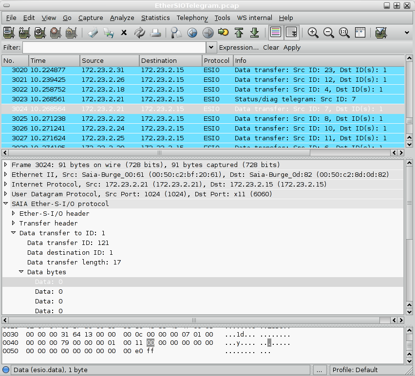

# Ether-S-I/O (esio)

The Ether-S-I/O protocol is used for data transfer between PLCs (Programmable Logic Controller) and remote input/output devices (RIOs) manufactured by Saia-Burgess Controls Ltd. A "Smart remote input/output station (Smart RIO)" features physical inputs and outputs and contains a CPU on which a small application can be run. The inputs from these RIO stations can be read and written by the master station (a PLC) using the Ether-S-I/O protocol. The application which can be run on the RIO station is uploaded to the RIO station using the [EtherSBus](/EtherSBus) protocol.

## History

The Ether-S-I/O protocol has been developed together with a new hardware of RIO devices. The advantages of this new protocol are to following:

  - A telegram can contain data for several remote I/O stations (it can be sent as IP broadcast and contains several sections, each of them for a destination station.
  - The full length of the datagram can be used (while Ether-S-Bus telegrams are limited in the size)

## Protocol dependencies

Ether-S-I/O uses [UDP](/UDP) as its transport protocol. The port used by Ether-S-I/O is 6060.

## Example traffic



## Wireshark

The Ether-S-I/O dissector is in preparation.

## Preference Settings

There are no preference settings for the esio dissector.

## Example capture file

  - [SampleCaptures/Ether-S-IO\_traffic\_01.pcap.gz](uploads/__moin_import__/attachments/SampleCaptures/Ether-S-IO_traffic_01.pcap.gz)

## Display Filter

A complete list of Ether-S-I/O display filter fields can be found in the [display filter reference](http://www.wireshark.org/docs/dfref/e/esio.html)

Show only the Ether-S-I/O based traffic:

``` 
 esio 
```

## Capture Filter

You cannot directly filter Ether-S-Bus protocols while capturing. However, you can filter on the [UDP](/UDP) port used.

Capture only the Ether-S-I/O traffic over the default port (6060):

``` 
 udp port 6060 
```

## External links

  - <http://www.sbc-support.ch> *Support site from Saia-Burgess Controls AG*.

## Discussion

---

Imported from https://wiki.wireshark.org/EtherSIO on 2020-08-11 23:13:54 UTC
