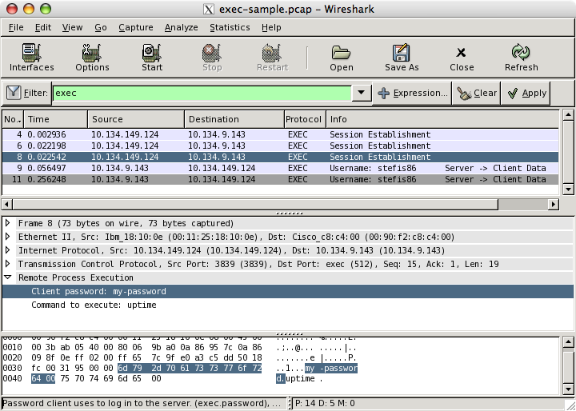

# Remote Execution Protocol (exec)

The exec protocol (sometimes known as rexec) is used to run a program on a remote server as if it was being run on the local machine. This is acomplished by redirecting standard in/out and standard error through the connection. The server running exec receives a connection from a client by opening a socket. The server waits for four null terminated strings (that may come in 2, 3 or 4 packets):

1.  Standard error stream port
2.  Username
3.  Password
4.  Command to run on server

After these strings have been received, control is passed to the program specified in the command to run on server string.

## History

The exec protocol was first added to 4.2BSD and was later determined to be insecure. The main security issue for the protocol is that it does not encrypt data, which allows usernames and passwords to be viewed with a packet sniffer.

## Protocol dependencies

  - [TCP](/TCP): The exec protocol is typically run over TCP port 512, as assigned by the IANA.

## Example traffic



## Wireshark

The exec dissector is fully functional. In some instances, such as when packets are lost, the state of the connection cannot be tracked properly. If the state is lost, the fields may show in the wrong order (for example, the password showing up as the username field).

## Preference Settings

The exec protocol has two preference settings in Wireshark:

  - **Show username in info column?** Controls the display of the session's username in the info column. This is only displayed if the packet containing it was seen during this capture session.

  - **Show command in info column?** Controls the display of the command being run on the server by this session in the info column. This is only displayed if the packet containing it was seen during this capture session.

## Example capture file

[exec-sample.pcap](uploads/__moin_import__/attachments/Exec/exec-sample.pcap)

## Display Filter

A complete list of exec display filter fields can be found in the [display filter reference](http://www.wireshark.org/docs/dfref/protofirstletter/proto.html)

Show only the exec traffic:

``` 
 exec
```

## Capture Filter

You cannot directly filter the exec protocol while capturing. However, if you know the [TCP](/TCP) port used (see above), you can filter on that one.

Capture only the exec traffic over the default port (512):

``` 
 tcp port 512
```

## External links

  - [FreeBSD rexecd source code](http://www.freebsd.org/cgi/cvsweb.cgi/~checkout~/src/libexec/rexecd/Attic/rexecd.c?rev=1.42&content-type=text/plain)

  - [FreeBSD rexecd man page](http://www.freebsd.org/cgi/man.cgi?apropos=0&sektion=8&query=rexecd&manpath=FreeBSD+7.0-current&format=html)

## Discussion

---

Imported from https://wiki.wireshark.org/Exec on 2020-08-11 23:13:56 UTC
