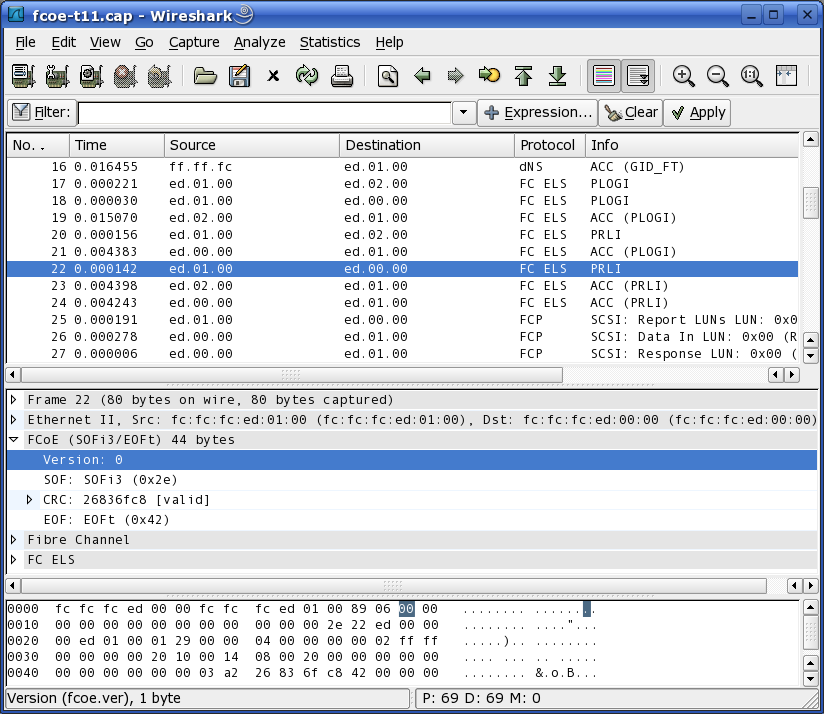

# Fibre Channel Over Ethernet (FCoE)

Fibre Channel over Ethernet (FCoE) is a proposed mapping of Fibre Channel over selected full duplex IEEE 802.3 networks.

## History

This protocol proposal is led by Cisco and is under discussion in the T11 FC-BB Working group.

## Protocol dependencies

  - [Ethernet](/Ethernet): FCoE uses [Ethernet](/Ethernet) as its transport protocol. The IEEE-assigned Ethertype for FCoE traffic is 0x8906.

## Example traffic



## Wireshark

The FCoE dissector is fully functional.

## Preference Settings

None.

## Example capture files

  - [SampleCaptures/fcoe-t11.pcap](uploads/__moin_import__/attachments/SampleCaptures/fcoe-t11.pcap)

  - [SampleCaptures/fcoe-t11-short.cap](uploads/__moin_import__/attachments/SampleCaptures/fcoe-t11-short.cap)

  - [SampleCaptures/fcoe1.cap](uploads/__moin_import__/attachments/SampleCaptures/fcoe1.cap)

## Display Filter

Show only the FCoE based traffic:

``` 
 fcoe 
```

Show only FCoE traffic with start-of-frame value SOFn3:

``` 
 fcoe.sof == SOFn3 
```

Show only FCoE traffic with bad CRCs:

``` 
 fcoe.crc_bad == True 
```

## Capture Filter

Capture only the FCoE traffic over the standard Ethertype (0x8906):

``` 
 eth.type == 0x8906 
```

## External links

  - <http://fcoe.com> - Primary site for FCoE information.

  - <http://www.t11.org/ftp/t11/pub/fc/bb-5/07-479v0.pdf> - presentation describing frame format.

## Discussion

---

Imported from https://wiki.wireshark.org/FCoE on 2020-08-11 23:13:59 UTC
