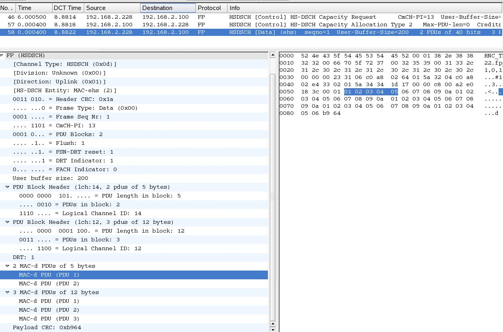

# Frame Protocol (FP)

The Frame Protocol is the lowest-layer user plane protocol used in UTRAN IuB and IuR interfaces. It is described in [3GPP TS 25.427](http://www.3gpp.org/ftp/Specs/html-info/25427.htm) (Dedicated transport channels) and [3GPP TS 25.435](http://www.3gpp.org/ftp/Specs/html-info/25435.htm) (Common transport channels).

## History

These transport channel formats are described in R99, R4, R5, R6 and R7 releases of the above documents. There is no FP layer in LTE (Long Term Evolution) because the MAC/RLC/PDCP entities now terminate in the eNodeB (see [Evolved UTRA aspects](http://www.3gpp.org/ftp/Specs/html-info/36-series.htm)). There is what looks like a place-holder specification for the dedicated channels shown for R8.

## Protocol dependencies

  - FP can be transported over AAL2, AAL0 or [UDP](/UDP)

## Example traffic

Here is an example of HSDPA (type 2, introduced in R7) traffic.



## Wireshark

The FP dissector is mostly functional, but can currently only be invoked while reading Catapult [DCT2000](/DCT2000) or Tektronix [K12](/K12) format traces (these contain the additional information needed in order to properly decode the frames). It would be possible, but challenging, to decode the RRC messages describing the configuration of the lower layers, and use this information to infer how each FP frame should be decoded.

## Preference Settings

There are currently no preference settings.

## Example capture file

XXX - Add a simple example capture file to the [SampleCaptures](/SampleCaptures) page and link from here (see below). Keep this file short, it's also a good idea to gzip it to make it even smaller, as Wireshark can open gzipped files automatically.

  - [SampleCaptures/PROTO.pcap](uploads/__moin_import__/attachments/SampleCaptures/PROTO.pcap)

## Display Filter

A complete list of FP display filter fields can be found in the [display filter reference](http://www.wireshark.org/docs/dfref/f/fp.html)

Show only the FP based traffic:

``` 
 fp
```

## Capture Filter

Because FP traces can currently only be read from existing trace files, there is no way to filter for FP frames while capturing.

## External links

  - [3GPP TS 25.427](http://www.3gpp.org/ftp/Specs/html-info/25427.htm) *3rd Generation Partnership Project; Technical Specification Group Radio Access Network; UTRAN Iub/Iur interface user plane protocol for DCH data streams*

  - [3GPP TS 25.435](http://www.3gpp.org/ftp/Specs/html-info/25435.htm) *3rd Generation Partnership Project; Technical Specification Group Radio Access Network; UTRAN Iub Interface User Plane Protocols for Common Transport Channel data streams*

## Discussion

---

Imported from https://wiki.wireshark.org/FP on 2020-08-11 23:14:08 UTC
