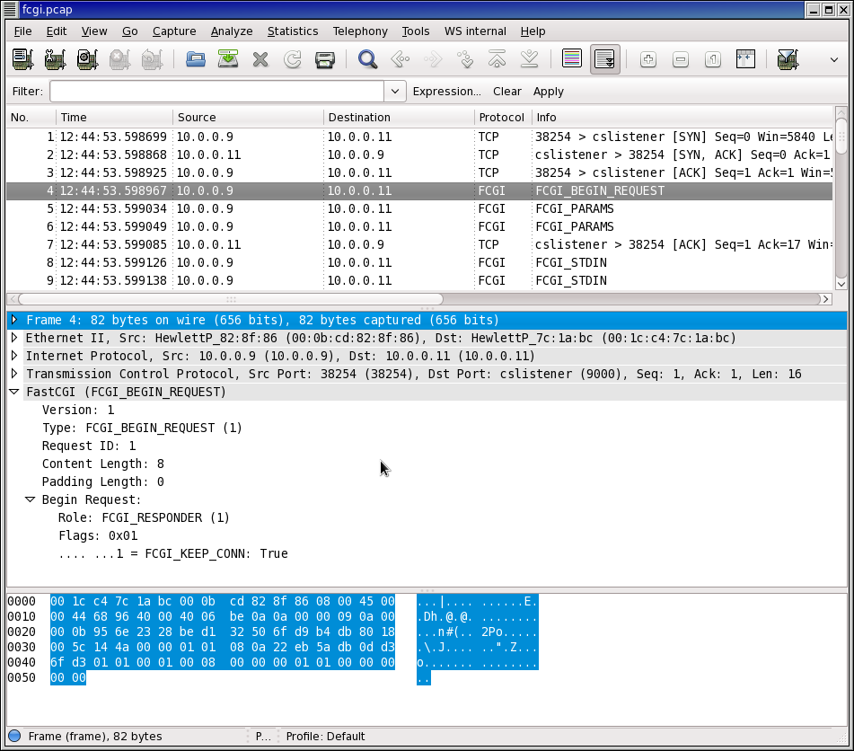

# FastCGI (FCGI)

FastCGI is a protocol for interfacing interactive programs with a web server. FastCGI is a variation on the earlier Common Gateway Interface (CGI); FastCGI's main aim is to reduce the overhead associated with interfacing the web server and CGI programs, allowing a server to handle more web page requests at once.

## History

To address the scalability shortcomings of CGI, Open Market developed FastCGI and first introduced it in their webserver product in the mid-1990s. Open Market originally developed FastCGI in part as a competitive response to Netscape's proprietary, in-process API (NSAPI) for developing Web applications.

Although initially developed by Open Market, FastCGI was implemented by a number of other webserver makers. The FastCGI approach, however, competed against other techniques which also aimed to speed and simplify server-subprogram communications, but which didn't follow the CGI paradigm. Apache modules such as mod\_perl and mod\_php appeared around the same time and seemed to be even better replacements for CGI, allowing closer integration with the core webserver.

## Protocol dependencies

  - [TCP](/TCP): Typically, FastCGI uses either local unix domain sockets or network connections using [TCP](/TCP) as its transport protocol. There is no well known TCP port for FastCGI traffic.

## Example traffic

Screen shot of an FCGI record from [SampleCaptures](/SampleCaptures) file: fcgi.pcap.gz



## Wireshark

The FCGI dissector is functional and most record types are decoded.

## Preference Settings

The FCGI dissector has one preference, to set the port number for FCGI traffic.

## Example capture file

A capture of apache sending a single HTTP request to an FCGI application server and getting a response back:

  - [SampleCaptures/fcgi.pcap.gz](uploads/__moin_import__/attachments/SampleCaptures/fcgi.pcap.gz)

## Display Filter

A complete list of FastCGI display filter fields can be found in the [display filter reference](http://www.wireshark.org/docs/dfref/f/fcgi.html)

Show only the FastCGI based traffic:

``` 
 fcgi 
```

## Capture Filter

You cannot directly filter FastCGI protocols while capturing. However, if you know the [TCP](/TCP) port used (see above), you can filter on that one.

Capture only the FastCGI traffic over port 8000:

``` 
 tcp port 8000 
```

## External links

  - [FastCGI Specification](http://www.fastcgi.com/devkit/doc/fcgi-spec.html)

## Discussion

---

Imported from https://wiki.wireshark.org/FastCGI on 2020-08-11 23:13:58 UTC
