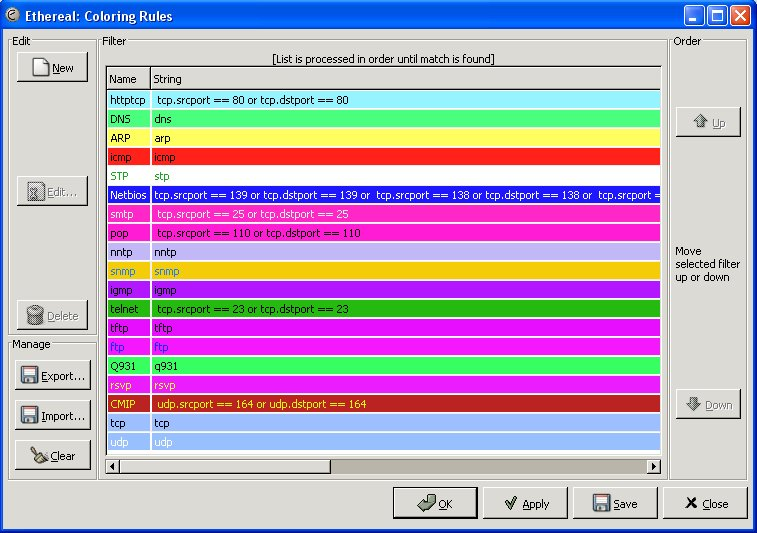

This is a General use Color Filter. I use it to distinguish some of the most used protocols on my network and my customers networks.

**File:** [Another\_color\_filter](uploads/__moin_import__/attachments/General_use_ColorFilter/Another_color_filter)  
**Description:** A general use color filter used to distiguish some of the most used protocols on many networks.  
**Contributor:** John Prudente

-----

Is there a reason not to use tcp.port == 23 instead of tcp.dstport == 23 or tcp.srcport == 23 ? - *Ulf Lamping*

None that I can think of - tcp.port == XXX should be equivalent to (tcp.dstport == XXX or tcp.srcport == XXX), and the same should be true of udp.{port,srcport,dstport}. -*Guy Harris*

---

Imported from https://wiki.wireshark.org/General_use_ColorFilter on 2020-08-11 23:14:16 UTC
