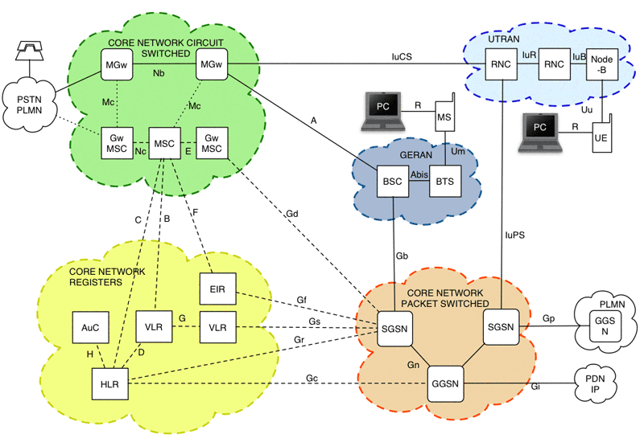

# Global System for Mobile communication (GSM) protocol family

GSM is a technology for digital wireless telecommunications, represented by a decent number of specifications. Parts of GSM are based on the fixed-line [ISDN](/ISDN) technology.

The original "air interface" for GSM handsets, for second-generation (2G) wireless telephony, was a TDMA interface; the third-generation interface, W-CDMA, is a CDMA interface. GSM, however, refers to more than just the "air interface"; it refers to the complete set of protocols.

The 3rd Generation Partnership Project ([3GPP](/3GPP)) maintains the GSM standards; most of the specifications for GSM can now be found at [the 3GPP Web site](http://www.3gpp.org/).

## History

Incidentally, the initial abbreviation of GSM was "Groupe Spécial Mobile" (Special Mobile Group). The acronym was preserved but a new, English meaning was given to it later, once the potential of the technology was understood.

## Protocols

The GSM protocol family consists of many protocols, and other protocols are conveyed on top of these.

  - [GSMMAP](/GSMMAP): GSM Mobile Application Part, [ETSI](/ETSI) TS 129 002

  - [GSM SMS](/GSM-SMS): The GSM Short Messaging Service.

  - [CAMEL](/CAMEL): Customized Applications for Mobile Enhanced Logic ETSI 300 374

  - [GSM A](/GSM-A): GSM A Interface (BSSMAP/DTAP)

  - [WapProtocolFamily](/WapProtocolFamily): The entire collection of [WAP](/WAP) protocols can be conveyed over GSM.

## Network Elements and Interfaces

### Network and Switching Subsystem

#### Circuit Switching Control Nodes ("Core Circuit")

##### MSC Mobile Switching Center

Controls Mobile Calls. Is in charge of the radio part. In Release 4 of UMTS, this function is split between a Media Gateway (MGw), which handles the bearer (user) traffic (voice, video, etc.) and an MSC Server, which handles the call control. In GSM and earlier releases of UMTS, the base stations communicate with the MSC, which handles both bearer traffic and call control. A Gateway MSC, or Gw MSC (or GMSC) connects to other networks, such as the PSTN or other mobile networks.

##### TSC Transit Switching Center

Transit Exchange for calls to be routed either between MSCs or towards other networks.

#### Registers

##### VLR Visitor Location Registry

Keeps track of the users of the network both resident and in roaming

##### HLR Home Location Registry

Keeps track of (a part of) the subscribers of the network and how they can use it. Each user is identified by the IMSI, a 15 digit number (Not the one printed in the SIM that is the ICCID); the first three digits are the country identifier (eg. 222 is Italy), the following two digits are the network (in Italy 01 is TIM, 02 is Vodafone), and the rest is the unique number of the SIM. The HLR contains such data as the current roaming, redirection, and special services settings.

##### EIR Equipment Information Registry

Keeps track of Mobile Phones; it could be used to find stolen equipment if operators were forced to use it (they make plenty of money out of calls made from stolen phones so they won't do it unless forced).

##### AuC Authentication Centre

Maintains information regarding the cryptographic keys that are in the SIM (Subscriber Information Module). It authenticates the user in the network.

##### FNR Flexible Number Registry

Keeps a Database of Numbers owned and exported by the network (Number Portability).

### GSM Radio Access Network (GERAN)

#### BSC Base Station Controller

Maintains and controls the radio part of the network.

#### BTS Base Tranceiver Station

The machine with the antennae. A slave of the BSC from which it takes its configuration.

#### MS Mobile Set

The phone or modem. "PC" refers to a personal computer with the MS as a modem.

### UMTS Radio Access Network (UTRAN)

#### RNC Radio Network Controller

Like the BSC but for UMTS.

#### Node-B (RBS) Radio Base Station

Like the BTS but for UMTS.

#### UE User Equipment

The phone or modem. "PC" refers to a personal computer with the UE as a modem.

### GPRS Nodes (Packet Core)

#### SGSN Serving GPRS Support Node

Does for the Packet part what the MSC does for the Circuit Switched Part

#### GGSN Gateway GPRS Support Node

A gateway between the SGSNs and the other networks

### GSM Interfaces

#### A Interface

Interface between the MSC and the BSC. Control Plane Protocols:

  - [GSM A](/GSM-A) DTAP (MS\<--\>MSC)

  - [GSM A](/GSM-A) BSSAP Base Station System Application Part

#### Abis (Ab) Interface

Interface between the BTS and the BSC:

  - Layer2: LAPD Link Access Procedure, Channel D
  - Layer3: RSL (Radio Signalling Link) as per GSM TS 08.58
  - Layer3: OML (Organization and Maintenance Link) as per GSM TS 12.21

#### B Interface

Interface between an MSC and a VLR.

  - [GSMMAP](/GSMMAP) MAP Mobile Application Protocol

#### C Interface

Interface between an MSC and a HLR.

  - [GSMMAP](/GSMMAP) MAP Mobile Application Protocol

#### D Interface

Interface between a VLR and a HLR.

  - [GSMMAP](/GSMMAP) MAP Mobile Application Protocol

#### E Interface

Interface between two MSCs or TSCs.

  - [GSMMAP](/GSMMAP) MAP Mobile Application Protocol

  - [ISUP](/ISUP) ISDN User Part

#### F Interface

Interface between an MSC and an EIR.

  - [GSMMAP](/GSMMAP) MAP Mobile Application Protocol

#### G Interface

Interface between VLRs.

  - [GSMMAP](/GSMMAP) MAP Mobile Application Protocol

#### H Interface

Interface Between an HLR and the AuC

  - [GSMMAP](/GSMMAP) MAP Mobile Application Protocol ???

  - [DIAMETER](/DIAMETER) Diameter ???

#### Um Interface

Interface between an MS and a BTS.

  - [BSSAP](/BSSAP) BSS Application Part

  - [GSMTAP](/GSMTAP) pseudo-header for encapsulating Um into IP

### UMTS Interfaces

UMTS uses packet networks, ATM and/or IP, instead of TDM to transport user data (Voice, Video, etc.) So two sets of protocols are used - Control Plane Protocols (that control the calls) and user plane protocols (that carry the user's data).

#### Nc

Interface between two MSCs or TSCs.

Control Plane Protocols:

  - [ISUP](/ISUP) ISDN User Part

  - [BICC](/BICC) Bearer Independent Call Control

#### Mc

Interface between an MSC or TSC and its controlled MGws.

Control Plane Protocol:

  - [H248/MEGACO](/H248/MEGACO) Media Gateway Control Protocol

#### Nb

Interface between two Media Gateways.

  - Control Protocols
  - IP
      - Q.1970 IPBCP IP Bearer Control Protocol (a dialect of SDP)
  - ATM (AAL2)
      - Q.2930 [ALCAP](/ALCAP) Access Link Control Application Part
    User Plane Transport Protocols
  - IP
      - [RTP](/RTP) Real Time Protocol
    
      - [RTCP](/RTCP) Real Time Control Protocol
  - ATM
      - AAL2

#### IuCS

Interface between the Circuit Switched Core Network (via MGw) and the UMTS Radio Network (UTRAN, via Anchor RNC).

  - IuCS-CP Control Plane

  - [RANAP](/RANAP) Radio Access Network Application Protocol

  - IuCS-UP User Plane

  - ATM
    
      - AAL2

#### IuR

Interface between the two RNCs (used for switching calls that had been handed over from one RNC to the other).

  - IuR-CP Control Plane

  - [RNSAP](/RNSAP) Radio Network Subsystem Application Protocol IuR-UP User Plane

  - CS circuit switched (calls)
    
      - ATM
          - AAL2

  - PS packet switched (IP)
    
      - IP over [GTP](/GTP) over IP over ATM

#### IuB

Interface between an RNC and a Node-B.

  - IuB-CP Control Plane
      - [NBAP](/NBAP) Node-B Application Protocol
    
      - Q.2930 [ALCAP](/ALCAP) Access Link Control Application Part, runs directly on top of [SSCOP](/SSCOP) while on the Iu and IuR it runs on top of MTP3b
    
      - [MAC](/MAC) Medium Access Control
    
      - [RLC](/RLC) Radio Link Control
    IuB-UP Control Plane
      - CS circuit switched (calls)
      - ATM
          - AAL2
  - PS packet switched (IP)
      - IP over [GTP](/GTP) over IP over ATM

#### IuBC

  - [SABP](/SABP) Service Area Broadcast Protocol (SABP) TS 25.419

#### IuPS

Interface between the UTRAN (RNC) and the Packet Switched Core Network (SGSN) .

#### Uu

Radio Resource Control ([RRC](/RRC)) 3G TS 25.331

### GPRS Interfaces

#### Gb

The Gb interface is the name given to the logical connection between a SGSN and a BSS (also referred to as a PCUSN or PCU). (The Um interface applies between the BSS and MS.) Even though the physical Gb interface is between the SGSN and the BSS, it includes the LLC and SNDCP protocol layers, which are used for logical communication directly between the SGSN and MS.

#### Gn

Used to carry signalling and data traffic between GSNs using [GTP](/GTP) protocol.

#### Gi

The interface between GGSN and external packet data networks such as the Internet.

#### Gf

#### Gs

This is an optional interface for PS/CS interoperability. Using the Gs interface it is possible to perform combined GPRS/IMSI attaches, combined location updates and paging the subscriber using PS facilities. The protocol is [BSSAP+](/BSSAP-) specified in [3GPP TS 29.016](http://www.3gpp.org/ftp/Specs/html-info/29016.htm) ( supported by Wireshark on ssn 98)

#### Gr

[GSMMAP](/GSMMAP) MAP-based interface between SGSN and HLR.

#### Gc

#### Gp

Same as Gn, but hadles [GTP](/GTP) traffic between GSNs in different PLMNs.

#### Ge

The Ge is an interface between gprsSSF entity in SGSN and gsmSCF entity in SCP. It is used to handle [CAMEL](/CAMEL) dialogues using the CAP protocol (supported by Wireshark).

## External links

  - [ETSI](http://www.etsi.org/)

  - [The GSM Association](http://www.gsmworld.com/index.shtml)

  - [3rd Generation Partnership Project (3GPP)](http://www.3gpp.org/)

## Discussion

  - Please feel free to complete - *Olivier Biot*

  - Should the "GSM" page be a page for the GSM Association, as the 3GPP page is a page for the Third Generation Partnership Project? -*Guy Harris*

---

Imported from https://wiki.wireshark.org/GsmProtocolFamily on 2020-08-11 23:14:24 UTC
