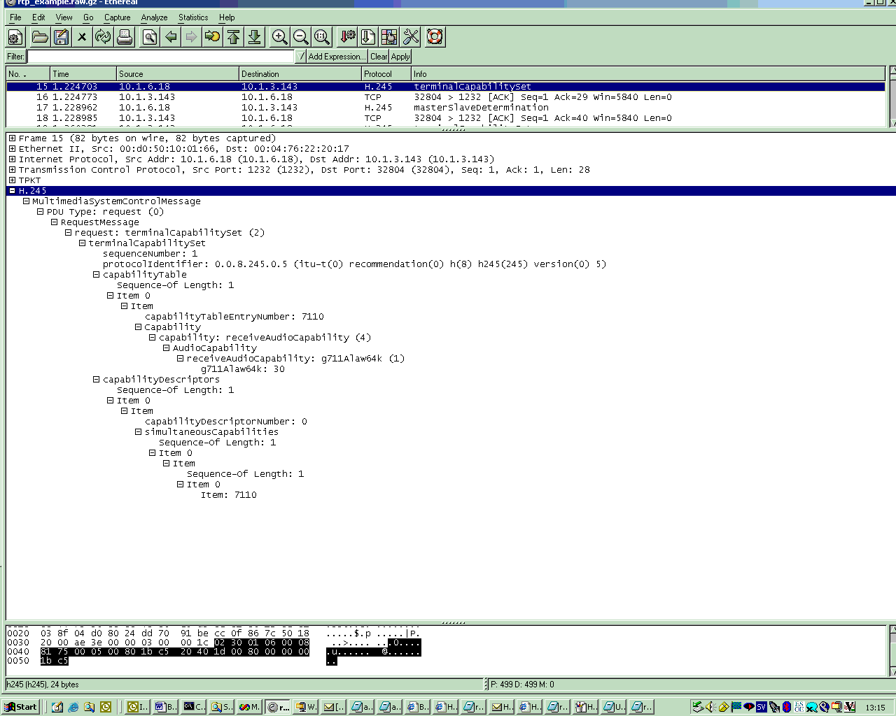

# ITU H.245

H.245 "media control protocol" is a VoIP protocol, see [VOIPProtocolFamily](/VOIPProtocolFamily) for an overview.

## History

H.245 was introduced by the [ITU-T](/ITU-T) in 1996?

## Protocol dependencies

  - H.245 is independent of the underlying transport protocol

## Example traffic



## Wireshark

The H.245 dissector is (fully functional, partially functional, not existing, ... whatever the current state is).

## Preference Settings

(XXX add links to preference settings affecting how H.245 is dissected).

## Example capture file

[SampleCaptures/rtp\_example.raw.gz](uploads/__moin_import__/attachments/SampleCaptures/rtp_example.raw.gz) (libpcap) A VoIP sample capture of a [H323](/H323) call (including [H225](/H225), "H245"\], [RTP](/RTP) and [RTCP](/RTCP)).

## Display Filter

A complete list of H.245 display filter fields can be found in the [display filter reference](http://www.wireshark.org/docs/dfref/h/h245.html)

Show only the H.245 based traffic:

``` 
 h245 
```

## Capture Filter

You cannot directly filter H.245 protocols while capturing.

## External links

## Discussion

---

Imported from https://wiki.wireshark.org/H245 on 2020-08-11 23:14:33 UTC
