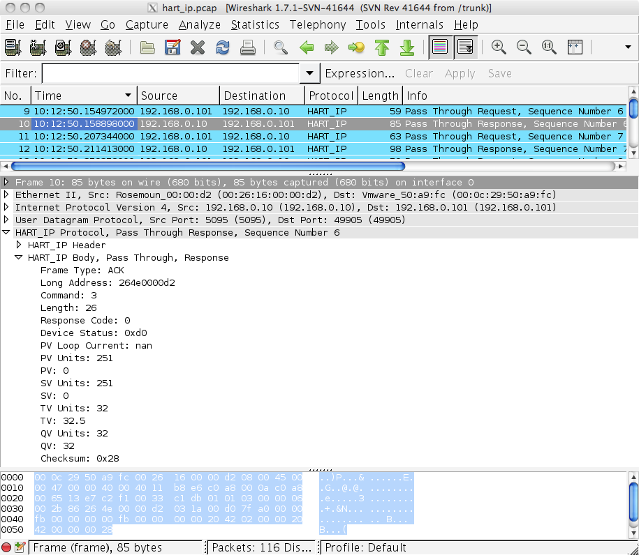

# Highway Addressable Remote Transducer over IP (HART-IP)

The HART protocol is a global standard for sending and receiving digital information across analog wires between smart devices and control or monitoring systems. More recently, this protocol standard has been extended to include communication across wireless mesh network (WirelessHART) as well as IP networks (HART-IP).

## History

The HART Protocol was developed in the mid-1980s by Rosemount Inc. In 1993, all rights in the protocol were transferred to the the HART Communication Foundation (HCF). The HART-IP extension of the protocol is not yet "official" and is in the balloting process (as of March 2012).

## Protocol dependencies

  - [TCP](/TCP): HART-IP can use [TCP](/TCP) as its transport protocol. The well known TCP port for HART-IP traffic is 5094.

  - [UDP](/UDP): HART-IP can also use [UDP](/UDP) as its transport protocol. The well known UDP port for HART-IP traffic is 5094. This port is used to initiate a session then traffic uses a different port selected by the server.

## Example traffic



## Wireshark

The HART-IP dissector is fully functional and includes support for protocol statistics.

## Preference Settings

None.

## Example capture file

  - [SampleCaptures/hart\_ip.pcap](uploads/__moin_import__/attachments/SampleCaptures/hart_ip.pcap)

## Display Filter

Show only the HART-IP based traffic:

``` 
 hart_ip 
```

## Capture Filter

You cannot directly filter HART-IP protocols while capturing. However, if you know the [TCP](/TCP) port used (see above), you can filter on that one.

Capture only the HART-IP traffic over the default port (5094):

``` 
 tcp port 5094 
```

Note that filtering similarly for UDP traffic is not very useful since port 5094 is only used for the first packet which is a session initiate.

## External links

  - <http://www.hartcomm.org/> HART Communication Foundation.

## Discussion

---

Imported from https://wiki.wireshark.org/HART-IP on 2020-08-11 23:14:38 UTC
