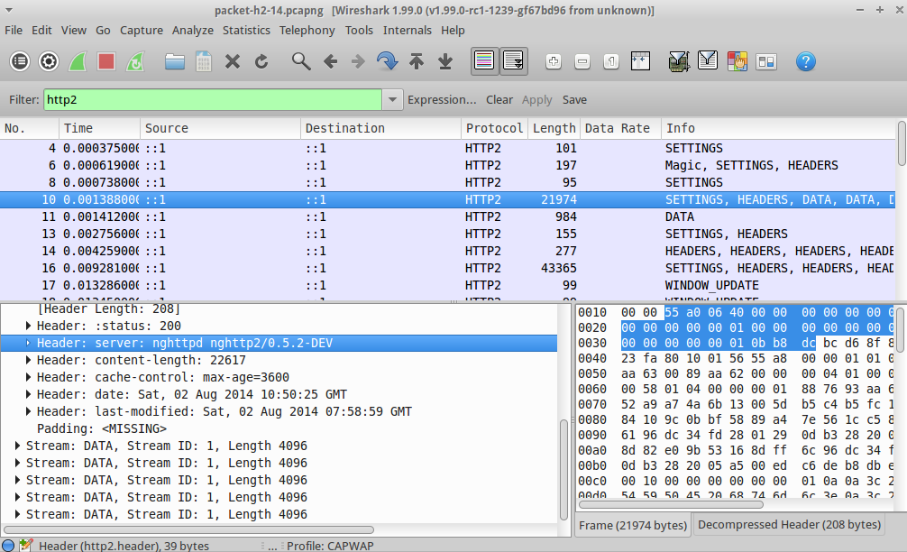

# Hypertext Transfer Protocol version 2 (HTTP2)

## Protocol dependencies

  - [TCP](/TCP): Typically, HTTP/2 uses [TCP](/TCP) as its transport protocol. The well known TCP port for HTTP/2 traffic is 443 (and 80).

## Wireshark

[ChangeLog](/ChangeLog):

  - Wireshark 1.12 - initial support
  - Wireshark 2.0 - initial HPACK support (header decompression)
  - Wireshark 2.4 - header decompression support now requires external nghttp2 package (true for official Windows/macOS builds).

## Example capture file

  - [http2-h2c.pcap](uploads/__moin_import__/attachments/HTTP2/http2-h2c.pcap) - HTTP/2 via Upgrade: h2 mechanism (`curl --http2 -v nghttp2.org/robots.txt nghttp2.org/humans.txt`)

  - [Sample of HTTP2 (draft-14)](uploads/__moin_import__/attachments/HTTP2/Sample-of-HTTP2-\(draft-14\)) - Created with [nghttp2](https://nghttp2.org), need to use Decode as HTTP2



On the [SampleCaptures](/SampleCaptures) page, there is also http2-16-ssl.pcapng containing a HTTP2 (draft 16) over SSL capture (with keys) and a link to a TLS 1.3 HTTP/2 capture.

## Display Filter

A complete list of HTTP2 display filter fields can be found in the [display filter reference](https://www.wireshark.org/docs/dfref/h/http2.html)

Show only the HTTP2 based traffic: `http2`

## Capture Filter

You cannot directly filter HTTP2 protocols while capturing. However, if you know the [TCP](/TCP) port used (see above), you can filter on that one.

Capture only the HTTP2 traffic over the default port (443):

``` 
 tcp port 443 
```

## External links

  - [RFC 7540](https://tools.ietf.org/html/rfc7540) *Hypertext Transfer Protocol version 2*

  - [RFC 7541](https://tools.ietf.org/html/rfc7541) *HPACK - Header Compression for HTTP/2*

  - [HTTP/2 Implementations](https://github.com/http2/http2-spec/wiki/Implementations) *Official page with all HTTP2 Implementations*

## Discussion

---

Imported from https://wiki.wireshark.org/HTTP2 on 2020-08-11 23:14:49 UTC
