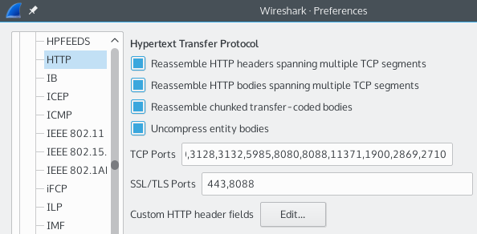

# Preferences/Protocols/HTTP

### Reassemble HTTP headers spanning multiple TCP segments

When this preference is enabled, then the HTTP dissector will reassemble the HTTP header if it has been transmitted over more than one TCP segment. Although it is unusual for headers span multiple segments, it's not impossible, and this should be checked if you expect to view the contents of the HTTP conversation.

### Reassemble HTTP bodies spanning multiple TCP segments

When this preference is enabled, then the HTTP dissector will reassemble the HTTP body if it has been transmitted over more than one TCP segment. All but the smallest of responses will span multiple segments, so this preference should be checked if you expect to view the contents of the HTTP conversation.  
See [TCP\_Reassembly](/TCP_Reassembly) for an example on how to use this to extract JPEG images from a capture.

### Reassemble chunked transfer-coded bodies

When this preference is enabled, any chunked transfer-coding response spanning multiple segments will be decoded and the payload (the body of the response) will be added to the protocol tree. This happens automatically for one segment responses.

### Uncompress entity bodies

Enable this preference if gzip or deflate encoded (compressed) HTTP entities should be decoded. This allows the visualisation of the compressed data, and possibly the dissection of it.

### TCP Ports

TCP port ranges that should also be decoded as HTTP. Starting with Wireshark 2.0, you can also use the persistent Decode As functionality instead. Example value: 80,8080-8088.

### SSL/TLS Ports

TCP port ranges that should be decoded as HTTP over SSL/TLS. Example value: 443,4433.

### Custom HTTP header fields

Here you can add additional HTTP headers which can be filtered through the display filter. Example: a custom Header name `X-Powered-By` will become filterable through the field name `http.header.X-Powered-By`.

---

Imported from https://wiki.wireshark.org/HTTP_Preferences on 2020-08-11 23:14:50 UTC
