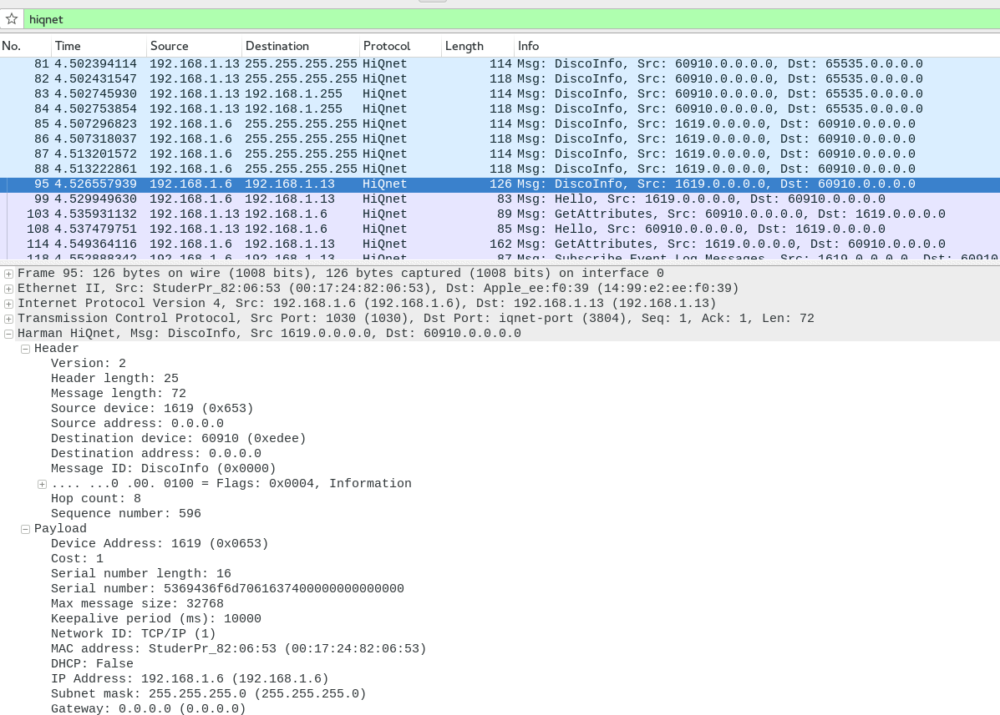

# HiQnet

HiQnet is a protocol developed by Harman Pro for pro-audio devices communication and operation.

## History

HiQnet was developed by the Harman Pro Group System Development & Integration Group (SDIG) during 2004, and announced in January 2005.

IANA declared in february 2004 by Bruce Vander Werf.

## Protocol dependencies

HiQnet was designed to be transport independant. As such, it can run on [USB](/USB), serial RS232 and RS485.

For Ethernet, HiQnet uses both [UDP](/UDP) and [TCP](/TCP) as its transport protocol.

The well known port for HiQnet traffic is 3804.

It is IANA registered under iqnet-port service name.

## Example traffic



## Wireshark

The HiQnet dissector is mostly functionnal for Ethernet and is available for testing since the 1.99.2 development release.

## Preference Settings

None for now.

## Example capture files

  - [hiqnet\_netsetter-soundcraft\_session.pcapng.gz](uploads/__moin_import__/attachments/HiQnet/hiqnet_netsetter-soundcraft_session.pcapng.gz "Upload new attachment \"hiqnet_netsetter-soundcraft_session.pcapng.gz\"") A session between Harman [NetSetter](/NetSetter) desktop application and a Soundcraft Si Compact 16 digital mixing console reading and writing very basic informations.

  - [hiqnet\_visiremote-soundcraft\_session.pcapng.gz](uploads/__moin_import__/attachments/HiQnet/hiqnet_visiremote-soundcraft_session.pcapng.gz "Upload new attachment \"hiqnet_visiremote-soundcraft_session.pcapng.gz\"") A session between Soundcraft's [ViSiRemote](/ViSiRemote) iPad application and a Soundcraft Si Compact 16 digital mixing console playing around with different values. The VU-meters stream is not part of this capture because it uses another protocol (UDP on port 3333).

## Display Filter

A complete list of HiQnet display filter fields will be available in the [display filter reference](http://www.wireshark.org/docs/dfref/h/hiqnet.html) as soon as a stable version is released.

Show only the HiQnet based traffic:

``` 
 hiqnet 
```

## Capture Filter

You cannot directly filter HiQnet protocols while capturing. However, if you know the [UDP](/UDP) and [TCP](/TCP) port used (see above), you can filter on that one.

Capture only the HiQnet traffic over the default port (3804):

``` 
 tcp port 3804 || udp port 3804 
```

## External links

  - <http://hiqnet.harmanpro.com> Harman Pro website promoting HiQnet

  - <http://adn.harmanpro.com/site_elements/resources/209_1367341522/HiQnet_Third_Party_Programmers_Guide_v2_original.pdf> The protocol's v2.0 third party programmers guide (Specification)

  - <http://adn.harmanpro.com/site_elements/resources/487_1411413911/HiQnet_third-party_programmers_quick-start_guide_original.pdf> A quick start guide for programmers

  - <http://hiqnet.harmanpro.com/content/images/misc/hiqnet_guide_to_audio_networking.pdf> A nice application guide showing protocol's intent

  - <http://en.wikipedia.org/wiki/User:Doctorgage/HiQnet> Wikipedia draft(?) entry

## Discussion

---

Imported from https://wiki.wireshark.org/HiQnet on 2020-08-11 23:14:40 UTC
