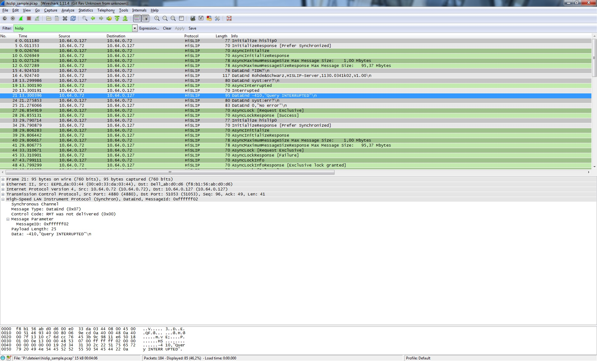

# High-Speed LAN Instrument Protocol (HiSLIP)

HiSLIP is a TCP-based protocol for remote control of Test & Measurement instruments (such as oscilloscopes, power supplies, multimeters, spectrum analyzers etc.). HiSLIP was developed by the IVI Foundation as a successor of the VXI-11 protocol. In comparison to VXI-11 HiSLIP improves performance, supports IPv6 and shared locking.

## History

The High-Speed LAN Instrument Protocol specification was published in 2010 by [IVI Foundation](http://ivifoundation.org/)

## Protocol dependencies

  - [TCP](/TCP): HiSLIP uses TCP as its transport protocol.

The TCP port 4880 was assigned by IANA for the default HiSLIP connection, even though HiSLIP can use other ports as well. A HiSLIP connection uses 2 TCP sockets: A synchronous channel to transfer data, and an asynchronous channel to transfer control commands.

## Example traffic

Screenshot of a HiSLIP message from [SampleCaptures](/SampleCaptures) file: [hislip\_sample.pcap](uploads/__moin_import__/attachments/SampleCaptures/hislip_sample.pcap "hislip_sample.pcap") 

## Wireshark

The HiSLIP dissector is fully functional

## Preference Settings

There are currently no preference settings specific to the HiSLIP dissector.

## Example capture file

  - [SampleCaptures/hislip\_sample.pcap](uploads/__moin_import__/attachments/SampleCaptures/hislip_sample.pcap)

## Display Filter

A complete list of HiSLIP display filter fields can be found in the [display filter reference](http://www.wireshark.org/docs/dfref/h/hislip.html)

Show only the HiSLIP based traffic:

``` 
 hislip 
```

## Capture Filter

You cannot directly filter HiSLIP protocols while capturing. However, if you know the [TCP](/TCP) port used (see above), you can filter on that one.

Capture only the HiSLIP traffic over the default port (4880):

``` 
 tcp port 4880
```

## External links

\* [High-Speed LAN Instrument Protocol Specifications](http://ivifoundation.org/downloads/Class%20Specifications/IVI-6.1_HiSLIP-1.1-2011-02-24.pdf)

## Discussion

---

Imported from https://wiki.wireshark.org/HiSLIP on 2020-08-11 23:14:41 UTC
