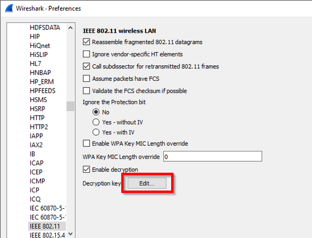
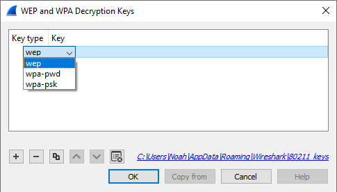
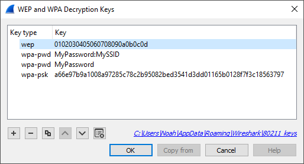
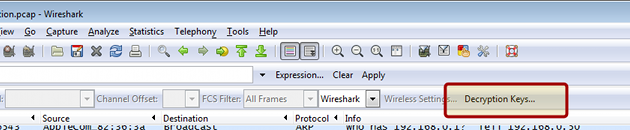
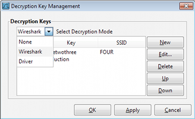

# How to Decrypt 802.11

Wireshark can decrypt WEP and WPA/WPA2/WPA3 in pre-shared (or personal) mode. WPA/WPA2 enterprise mode decryption works also since Wireshark 2.0, with some limitations.

You can add decryption keys using Wireshark's 802.11 preferences or by using the wireless toolbar. Up to 64 keys are supported.

## Adding Keys: IEEE 802.11 Preferences

Go to *Edit-\>Preferences-\>Protocols-\>IEEE 802.11*. You should see a window that looks like this:



Click on the "Edit..." button next to "Decryption Keys" to add keys. You should see a window that looks like this:



When you click the **+** button to add a new key, there are three key types you can choose from: **wep**, **wpa-pwd**, and **wpa-psk**:

  - **wep** The key must be provided as a string of hexadecimal numbers, with or without colons, and will be parsed as a WEP key.

<!-- end list -->

``` 
    a1:b2:c3:d4:e5
```

``` 
    0102030405060708090a0b0c0d
```

  - **wpa-pwd** The password and SSID are used to create a raw pre-shared WPA key.

<!-- end list -->

``` 
    MyPassword:MySSID
```

You can optionally omit the colon and SSID, and Wireshark will try to decrypt packets using the last-seen SSID. This may not work for captures taken in busy environments, since the last-seen SSID may not be correct.

``` 
    MyPassword
```

  - **wpa-psk** The key is parsed as a raw pre-shared WPA key.

<!-- end list -->

``` 
    0102030405060708091011...6061626364
```



## Adding Keys: Wireless Toolbar

If you are using the Windows version of Wireshark and you have an [AirPcap](/AirPcap) adapter you can add decryption keys using the wireless toolbar. If the toolbar isn't visible, you can show it by selecting *View-\>Wireless Toolbar*. Click on the *Decryption Keys...* button on the toolbar:



This will open the decryption key managment window. As shown in the window you can select between three decryption modes: **None**, **Wireshark**, and **Driver**:



Selecting **None** disables decryption. Selecting **Wireshark** uses Wireshark's built-in decryption features. **Driver** will pass the keys on to the [AirPcap](/AirPcap) adapter so that 802.11 traffic is decrypted before it's passed on to Wireshark. Driver mode only supports WEP keys.

## Gotchas

Along with decryption keys there are other preference settings that affect decryption.

  - Make sure *Enable decryption* is selected.

  - You may have to toggle *Assume Packets Have FCS* and *Ignore the Protection bit* depending on how your 802.11 driver delivers frames.

The WPA passphrase and SSID preferences let you encode non-printable or otherwise troublesome characters using URI-style percent escapes, e.g. %20 for a space. As a result you have to escape the percent characters themselves using %25. You also must escape colons in the passphrase or SSID, using %3a, in order to
distinguish them from a colon as a separator between the passphrase and SSID.

WPA and WPA2 use keys derived from an EAPOL handshake, which occurs when a machine joins a Wi-Fi network, to encrypt traffic. Unless **all four** handshake packets are present for the session you're trying to decrypt, Wireshark won't be able to decrypt the traffic. You can use the display filter **eapol** to locate EAPOL packets in your capture.

In order to capture the handshake for a machine, you will need to force the machine to (re-)join the network while the capture is in progress. One way to do this is to put the machine to sleep (for smartphones and tablets, "turning off" the machine puts it to sleep) before you start the capture, start the capture, and then wake the machine up. You will need to do this for all machines whose traffic you want to see.

WPA and WPA2 use individual keys for each device. Older versions of Wireshark may only be able to use the most recently calculated session key to decrypt all packets. Therefore, when several devices have attached to the network while the trace was running, the packet overview shows all packets decoded, but in the detailed packet view, only packets of the last device that activated ciphering are properly deciphered. Newer Wireshark versions are able to handle up to 256 associations and should be able to decode any packets all the time. Nevertheless, decoding can still fail if there are too many associations. Filtering out only the relevant packets (e.g. with "wlan.addr") and saving into a new file should get decryption working in all cases. Wireshark only frees used associations when editing keys or when it's closed. So you may try that when decoding fails for unknown reasons. This also allows you to decode files without any eapol packets in it, as long as Wireshark did see the eapol packets for this communication in another capture after the last start and key edit. If decoding suddenly stops working make sure the needed eapol packetes are still in it.

## WPA/WPA2 Enterprise/Rekeys

As long as you can somehow extract the PMK from either the client or the Radius Server and configure the key (as PSK) all supported Wireshark versions will decode the traffic just fine up to the first eapol rekey.

Eapol rekey is often enabled for WPA/WPA2 enterprise and will change the used encryption key similar to the procedure for the initial connect, but it can also be configured and used for pre-shared (personal) mode. Wireshark 2.0 (v1.99.6rc0-454-g1439eb6 or newer) is needed if you want decode packets after a rekey.

## WPA3 Per-Connection Decryption

In WPA3, a different PMK is used for each connection in order to achieve forward secrecy. Capturing the 4-way handshake and knowing the network password is not enough to decrypt packets; you must obtain the PMK from either the client or access point (typically by enabling logging in wpa_supplicant or hostapd with the `-d -K` flags) and use this as the decryption key in Wireshark. Even then, the decryption will only work for packets between that client and access point, not for all devices on that network.

See more discussion on the [mailing list](https://www.wireshark.org/lists/wireshark-dev/201903/msg00067.html) and [forum](https://ask.wireshark.org/question/30703/how-to-decode-wpa3_sae-using-cmds-in-linux-via-tshark/).

## Examples

The file [SampleCaptures/wpa-Induction.pcap](uploads/__moin_import__/attachments/SampleCaptures/wpa-Induction.pcap) has WPA traffic encrypted using the password "Induction" and SSID "Coherer".

The file [SampleCaptures/wpa-eap-tls.pcap.gz](uploads/__moin_import__/attachments/SampleCaptures/wpa-eap-tls.pcap.gz) has a EAP-TLS handshake and rekeys included. The PMK's you can use as PSK's to decode it are: a5001e18e0b3f792278825bc3abff72d7021d7c157b600470ef730e2490835d4 79258f6ceeecedd3482b92deaabdb675f09bcb4003ef5074f5ddb10a94ebe00a 23a9ee58c7810546ae3e7509fda9f97435778d689e53a54891c56d02f18ca162

---

Imported from https://wiki.wireshark.org/HowToDecrypt802.11 on 2020-08-11 23:14:43 UTC
