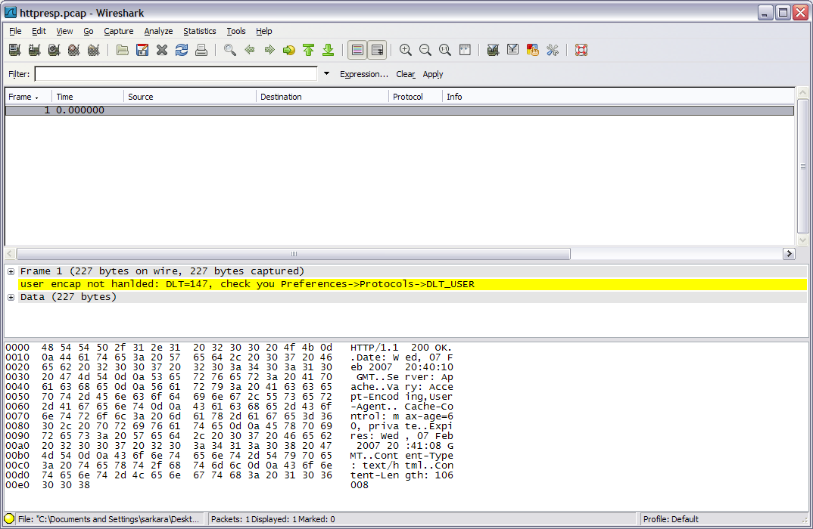
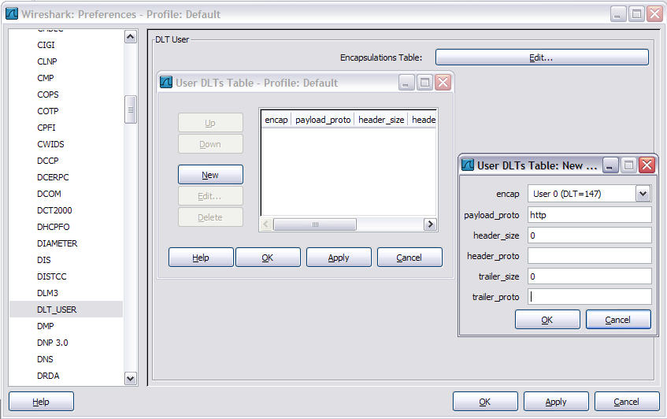
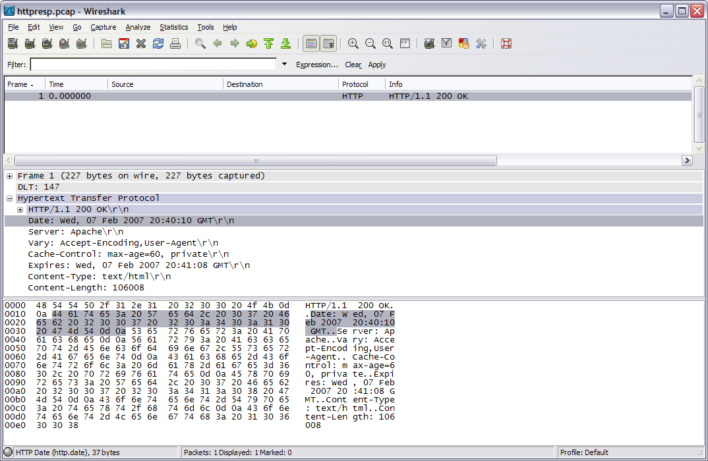
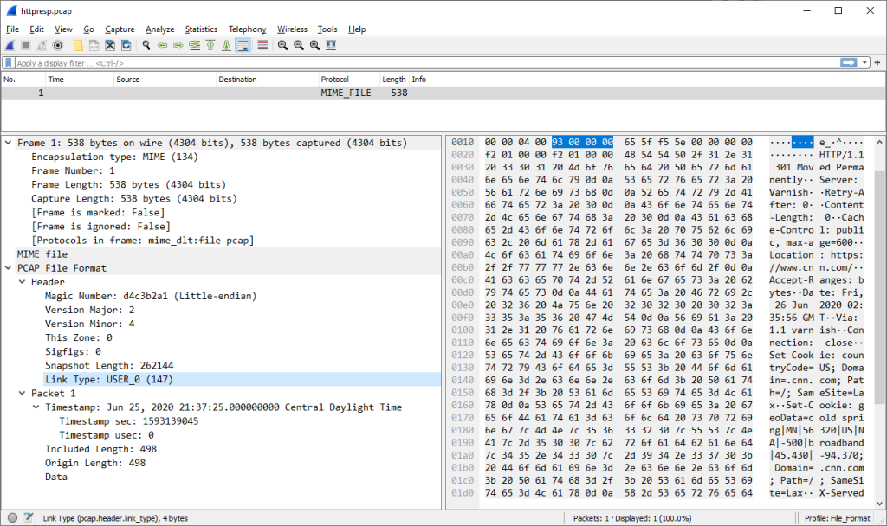

# How to Dissect Anything

Wireshark supports lots of link-layer protocols in lots of file formats, but it doesn't support everything. This [HowTo](/HowTo) shows how to use the **user link-layer type** feature in Wireshark to decode any arbitrary protocol data.

Suppose we've dumped the response headers of an HTTP connection using *curl*:

``` 
    curl --dump-header /tmp/cnnheaders.txt http://www.cnn.com > /dev/null
```

We end up with a header file that looks like this:

    HTTP/1.1 200 OK
    Date: Wed, 07 Feb 2007 20:40:10 GMT
    Server: Apache
    Vary: Accept-Encoding,User-Agent
    Cache-Control: max-age=60, private
    Expires: Wed, 07 Feb 2007 20:41:08 GMT
    Content-Type: text/html
    Content-Length: 106008

Now suppose we want to display the headers in Wireshark. If we try to open the dump file directly we get an error message. How do we dissect this data in Wireshark?

## Link-layer Type Values

When Wireshark reads a capture file, it needs to know the link-layer header type (LINKTYPE\_ value) of the lowest-level protocol for each packet it reads. Otherwise, it won't know if it should start parsing the data as Ethernet, PPP, 802.11, or any of the other supported protocols.

Which link-layer header type corresponds to which protocol is normally determined in advance by the creators of each capture file format. The libpcap file format is one exception to this - it specifies a reserved set of *link-layer header type* that can map to any protocol.

## Creating the Capture File

Before we can dissect our data we need to convert it to a libpcap-formatted file. We can do this using *od* and *text2pcap*:

``` 
    od -Ax -tx1 -v /tmp/cnnheaders.txt | text2pcap -l 147 - httpresp.pcap
```

*od* creates a hex dump of the data, which is the format that *text2pcap* expects. The *-l 147* argument to text2pcap specifies DLT USER0. Valid user link-layer header type values are in the range 147 - 162 (USER0 - USER15).

We can now open the file in Wireshark, but the contents aren't recognized as HTTP if user link-layer header type 147 is not configured:



## User Link-Layer Type Values

We can fix this by telling Wireshark how to decode our user link-layer header type. We do this by selecting *Edit-\>Preferences-\>Protocols\>DLT\_USER-\>Edit Encapsulations Table* and adding an entry to decode link-layer header type value 147 using the *http* dissector:



Now the data is displayed correctly.



This is a very simple example, but these techniques can be applied to dissect any PDU.

## Look inside the capture file

To view the PCAP wrapper that text2pcap placed around the curl data:

*View -\> Reload as File Format/Capture*



---

Imported from https://wiki.wireshark.org/HowToDissectAnything on 2020-08-11 23:14:44 UTC
