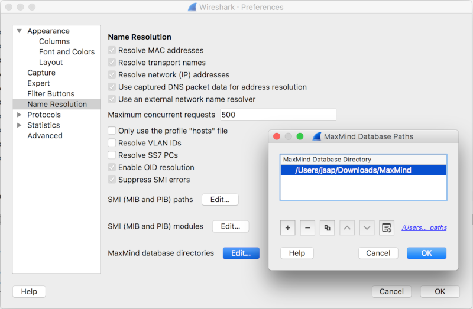

# How To Use GeoIP With Wireshark

[MaxMind](http://www.maxmind.com/) produces databases and software for [geolocation](http://en.wikipedia.org/wiki/Geolocation). Wireshark 2.6 and up can use MaxMind's GeoIP2 (purchase) and GeoLite2 (free) databases to look up the city, country, AS number, and other information for an IP address. The for-purchase GeoIP2 City and GeoIP2 Country databases are more accurate than the free GeoLite2 City and GeoLite2 Country databases; free versions of the GeoIP2 Region, GeoIP2 Organization, and GeoIP2 ISP databases are not available. The GeoLite2 version of the AS number database is the only version of that database; there is no for-purchase GeoIP2 version.

## Getting Started

To see if your copy of Wireshark supports MaxMind's GeoIP2 and GeoLite2, go to *Help→About Wireshark* and look for "MaxMind DB resolver" in the "Compiled with" paragraph.

Wireshark does not ship with any GeoIP2 or GeoLite2 databases, so you have to download them yourself. You can get them at the following locations:

  - GeoLite2 City, Country, and ASNum: <https://dev.maxmind.com/geoip/geoip2/geolite2/> (free download, but you must [sign up for a GeoLite2 account](https://www.maxmind.com/en/geolite2/signup) first)

  - GeoIP2 products: <https://www.maxmind.com/en/geolite2-commercial-redistribution> (purchase required)

Download the databases in binary (mmdb) format, rather than CSV format. To help stay up to date with the latest databases, you may want to install the [GeoIP Update program](https://github.com/maxmind/geoipupdate/releases) provided by MaxMind. Refer to MaxMind's [Automatic Updates](https://dev.maxmind.com/geoip/geoipupdate/) page for more details. Alternatively, on Windows at least, you can download the [update\_geoip.bat](uploads/__moin_import__/attachments/Tools/update_geoip.bat) file from the [Tools](/Tools) wiki page, which works with the MaxMind database Permalinks. You will need to provide your MaxMind license key for the batch file to work though.

It's more convenient if you put all of the databases in the same directory. Once you've downloaded your databases, you must tell Wireshark where they are. Go to *Edit→Preferences→Name Resolution* and select *MaxMind database directories*. Add the full path of each database directory, as shown below:

Now, restart Wireshark. At this point you should be able to load a capture file, select *Statistics→Endpoints*, and see geolocation information in any tab that contains IPv4 addresses (IPv4, TCP, UDP, etc).

You can optionally see geolocation data in the IPv4 packet detail tree. To enable this, go to *Edit→Preferences→Protocols→IPv4* and make sure *Enable IPv4 geolocation* is checked.

## MaxMind's deprecated databases

Wireshark 1.1.2 up to 2.5 can use MaxMind's GeoIP (purchase) and GeoLite (free) databases to look up the city, country, AS number, and other information for an IP address. The for-purchase GeoIP City and GeoIP Country databases are more accurate than the free GeoLite City and GeoLite Country databases; free versions of the GeoIP Region, GeoIP Organization, and GeoIP ISP databases are not available. The GeoLite version of the AS number database is the only version of that database; there is no for-purchase GeoIP version.

## Getting Started

To see if your copy of Wireshark supports GeoIP and GeoLite, go to *Help→About Wireshark* and look for GeoIP in the "Compiled with" paragraph.

Wireshark does not ship with any GeoIP or GeoLite databases, so you have to download them yourself. You can get them at the following locations:

  - GeoLite City, Country, and ASNum: <http://geolite.maxmind.com/download/geoip/database/> (free download)

  - GeoIP products: <http://www.maxmind.com/app/products> (purchase required)

Download the databases in binary format, rather than CSV format.

It's more convenient if you put all of the databases in the same directory. Once you've downloaded your databases, you must tell Wireshark where they are. Go to *Edit→Preferences→Name Resolution* and select *GeoIP database directories*. Add the full path of each database directory, as shown below:

Now, restart Wireshark. At this point you should be able to load a capture file, select *Statistics→Endpoints*, and see GeoIP information in any tab that contains IP addresses (IP, TCP, UDP, etc).

You can optionally see GeoIP data in the IP packet detail tree. To enable this, go to *Edit→Preferences→Protocols→IP* and make sure *Enable GeoIP lookups* is checked.

## Filtering Traffic

You can use the *ip.geoip* display filters to filter traffic.

Exclude U.S.-based traffic:

` ip and not ip.geoip.country == "United States" `

Show address above the arctic circle:

` ip.geoip.lat > "66.5" `

---

Imported from https://wiki.wireshark.org/HowToUseGeoIP on 2020-08-11 23:14:46 UTC
