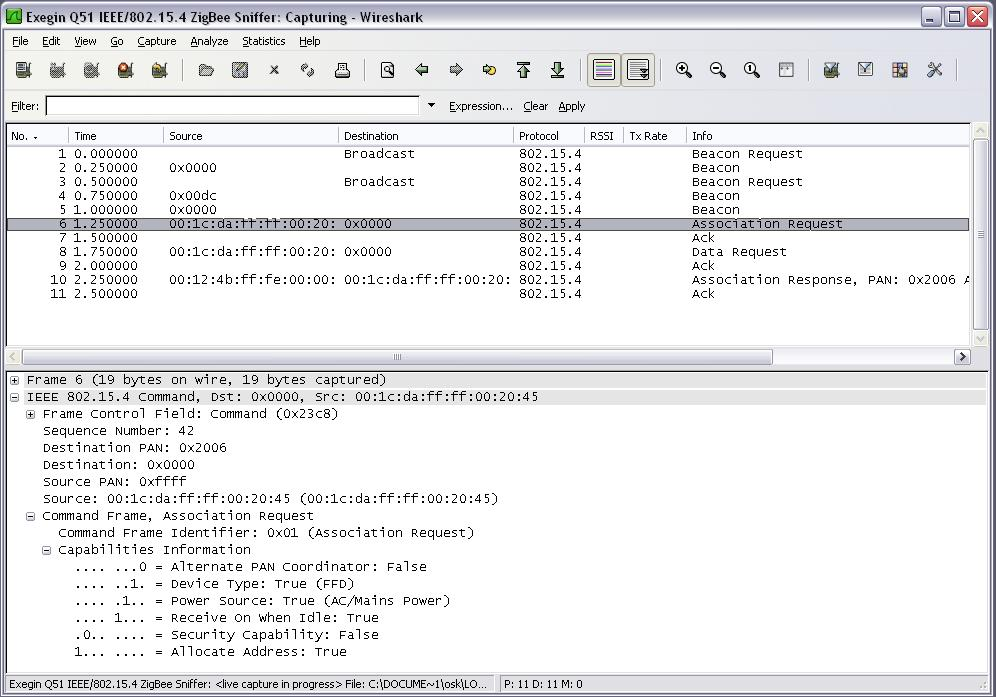

# IEEE 802.15.4

IEEE 802.15.4 is a member of the IEEE 802.15 standards for Wireless Personal Area Networks, which includes protocols such as IEEE 802.15.1 ([Bluetooth](/Bluetooth)), and IEEE 802.15.3 (UWB Wireless). IEEE 802.15.4 specifies the MAC and PHY Layers for Low-Rate Wireless Personal Area Networks (LR-WPAN).

IEEE 802.15.4 is currently used as a medium for a wide variety of network protocols, including [ZigBee](/ZigBee), 6lowPAN and TinyOS.

## History

IEEE 802.15.4 was published by task group 4 (TG4) in 2003, and following the formation of IEEE 802.15 TG4b, has since gone into hibernation. TG4b was formed to revise and improve upon the original IEEE 802.15.4 specification, their enhancements were approved and published in June 2006 as IEEE 802.15.4-2006.

In March 2005, an extension to the IEEE 802.15.4 specification, IEEE 802.15.4a was released, specifying two additional optional PHYs with improved precision in ranging and locating.

## Protocol dependencies

IEEE 802.15.4 is a Layer 1 and 2 protocol, it depends only on hardware.

## Example traffic



## Wireshark

The IEEE 802.15.4 dissector is fully functional, including security (CCM decryption). This is not to be confused with [ZigBee](/ZigBee) NWK and APS security, which is handled by other dissectors.

## Example capture file

  - [SampleCaptures/zigbee-join-authenticate.pcap.gz](uploads/__moin_import__/attachments/SampleCaptures/zigbee-join-authenticate.pcap.gz "SampleCaptures/zigbee-join-authenticate.pcap.gz")

## Display Filter

Show only IEEE 802.15.4 based traffic:

``` 
 wpan
```

## Capture Filter

You cannot directly filter IEEE 802.15.4 frames while capturing.

## External links

  - [IEEE\_802.15.4](http://en.wikipedia.org/wiki/IEEE_802.15.4) on Wikipedia.

  - [IEEE 802.15.4-2006](http://standards.ieee.org/getieee802/download/802.15.4-2006.pdf) *Low-Rate Wireless PAN* - Specification download from IEEE Standards Association.

## Discussion

What capture hardware is being used?

It's an [Exegin Q51 IEEE/802.15.4 ZigBee Transceiver](http://exegin.com/hardware/q51-panalyzer/), which captures and forwards radio traffic over a TCP/IP connection. Exegin's plugins for 802.15.4, 6LoWPAN, [ZigBee](/ZigBee) 2006, [ZigBee](/ZigBee) PRO, and the [ZigBee](/ZigBee) Cluster Library have been donated to the Wireshark project and could be used with any capture device. Interested parties (such as dongle vendors) are encouraged to write a supportive interface.

There is also an [IEEE 802.15.4/ZigBee USB dongle](http://www.ubisys.de/en/engineering/products-wireshark-802.15.4.html) available from ubisys with special firmware. The firmware performs ZEPv2 encapsulation over RNDIS.

For adding support of other Ethernet based hardware to analyze 802.15.4/Zigbee/6LowPan, one way is to use Zigbee Encapsulation Protocol(ZEP) in this format - "|UDP Header| ZEP Header |IEEE 802.15.4 Packet|\[8 bytes | 32 bytes | \<= 127 bytes\]". Length field in ZEPv2 header indicate 802.15.4 packet length. Send this Encapsulated 802.15.4 packet to ZEP default port 17754.

TI also has software and firmware for some devices to do the capture. The software can be configured to relay the traffic via UDP to a loopback and there is an available perl script at <http://e2e.ti.com/support/wireless_connectivity/f/155/t/56980> to convert from the TI capture format to the dissector expected one.

The [nRF 802.15.4 sniffer](https://github.com/NordicPlayground/nRF-802.15.4-sniffer) provides an extcap interface to start capturing directly from Wireshark. It provides out-of-band meta-data for Channel, RSSI and LQI for every packet using the [IEEE 802.15.4 TAP link type](https://github.com/jkcko/ieee802.15.4-tap).

The [Exegin Q59 USB Dual Band Dongle](http://www.exegin.com/hardware/q59-dual-band-dongle/) together with custom firmware and software is capable of capturing packets up to 2047 bytes introduced with IEEE 802.15.4g SUN PHYs. Sniffing of SUN PHY implementations based on [JupiterMesh TSCH](https://zigbeealliance.org/solution/jupitermesh/) and [Wi-SUN](https://wi-sun.org/) networks are supported. The captured packets and meta-data are output using the IEEE 802.15.4 TAP link type in a libpcap or pcapng stream. The output stream may be directed to a file, fifo, or TCP port. Exegin also provides a scalable solution for capturing live data from all the channels specified in channel hopping networks simultaneously.

---

Imported from https://wiki.wireshark.org/IEEE_802.15.4 on 2020-08-11 23:15:03 UTC
