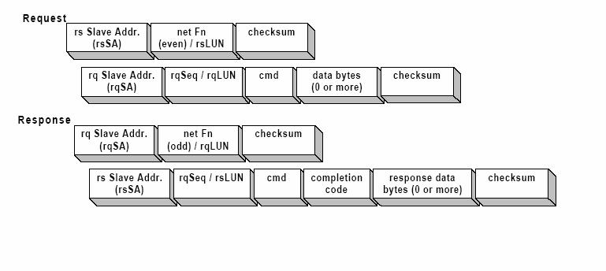
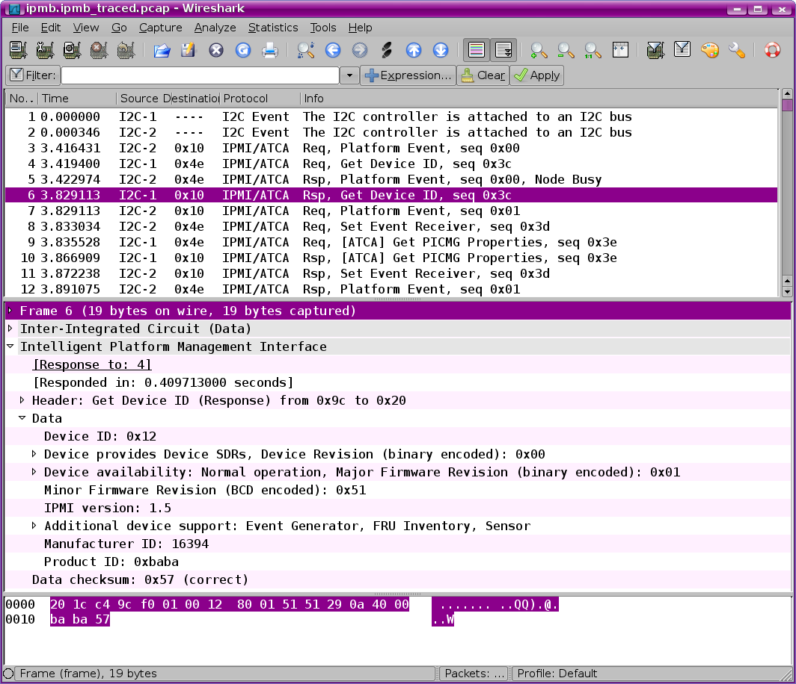

# Intelligent Platform Management Bus (IPMB)

The Intelligent Platform Management Bus Communications Protocol defines a byte-level transport for transferring Intelligent Platform Management Interface Specification ([IPMI](/IPMI)) messages between intelligent [I2C](http://en.wikipedia.org/wiki/I%C2%B2C) devices. This protocol is layered above the bit stream and hardware interface defined by the 100 kbps [I2C](http://en.wikipedia.org/wiki/I%C2%B2C) specification. Together, the protocol and [I2C](http://en.wikipedia.org/wiki/I%C2%B2C) physical interface form the Intelligent Platform Management Bus.

The intelligent devices using the Intelligent Management Bus are typically microcontrollers that perform platform management functions such as servicing the front panel interface, monitoring the baseboard, hotswapping disk drives in the system chassis, etc. Intelligent devices are also referred to in this document as ‘management controllers’ or just ‘controllers’.

Under AdvacedTCA® environment, the Shelf uses an Intelligent Platform Management Bus (IPMB) for managing communications among all Intelligent FRUs. The reliability of the IPMB is improved by the addition of a second IPMB, with the two IPMBs referenced as IPMB-A and IPMB-B. The aggregation of the two IPMBs is IPMB-0. The IPM Controllers aggregate the information received on both IPMBs. An IPM Controller that has a message ready for transmit will use the IPMBs in a round robin fashion. An IPM Controller will try to alternate the transmission of messages between IPMB-A and IPMB-B. If an IPM Controller is unable to transmit on the desired IPMB then it will try to send the message on the alternate IPMB. By using this approach, an IPMB can become unavailable and then available without the IPM Controller needing to take specific action.

The format of IPMB packet depends on its type. The following picture demonstrate formats of IPMB packet as "request" or "response" command.

## History

  - <http://en.wikipedia.org/wiki/IPMB>

## Protocol dependencies

  - N/A

## Example traffic

Here is an example of multi packets IPMB shown in Wireshark

## Wireshark

There are different ways to capture IPMB traffic.

  - Dissection for [Totalphase](http://www.totalphase.com/) Aardvark adapter captures is implemented in context of [bug 1970](http://bugs.wireshark.org/bugzilla/show_bug.cgi?id=1970). The changes in that bug need to be reworked to avoid copying the code from the generic IPMI dissector.

  - Pigeon Point Systems provide a utility, ipmb\_traced, for its shelf managers which generates captures in different format from the above. The main difference is that the utility provides additional information about events noticed by the shelf manager (e.g. bus error). Dissection for these captures is submitted in [bug 2787](http://bugs.wireshark.org/bugzilla/show_bug.cgi?id=2787).

## Example capture files

  - Totalphase Aardvark capture: ipmb.multi.packets.pcap : this is sample capture file using other sniffer device to capture raw packets data.
    
    [SampleCaptures/ipmb.multi.packets.pcap](uploads/__moin_import__/attachments/IPMB_protocol/ipmb.multi.packet.pcap "SampleCaptures/ipmb.multi.packets.pcap")

  - ipmb\_traced capture: ipmb.ipmb\_traced.pcap
    
    [SampleCaptures/ipmb.ipmb\_traced.pcap](uploads/__moin_import__/attachments/IPMB_protocol/ipmb.ipmb_traced.pcap "SampleCaptures/ipmb.ipmb_traced.pcap")

## Display Filter

N/A

## Capture Filter

N/A

## External links

  - <http://www.intel.com/design/servers/ipmi/spec.htm>

  - <http://download.intel.com/design/servers/ipmi/ipmb1010ltd.pdf>

## Discussion

Which SVN revision is this dissector supposed to be in? Thanks.

  - The IPMB dissector is pending review. You can check the status on [bug 1970](http://bugs.wireshark.org/bugzilla/show_bug.cgi?id=1970)

---

Imported from https://wiki.wireshark.org/IPMB_protocol on 2020-08-11 23:15:13 UTC
