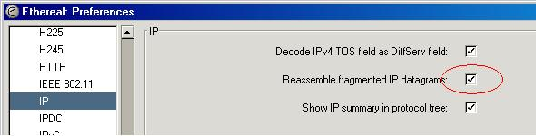

## IP Reassembly

IP Reassembly is a feature in Wireshark and TShark to automatically reassemble all fragmented [IP](/IP) Datagrams into a full [IP](/IP) packet before calling the higher layer dissector.

This feature will require a lot of extra memory to be consumed by wireshark in order to store the reassembly buffers and is disabled by default.

To enable IP Reassembly, go to preferences and tick the box for reassembly 

When you enable IP Reassembly several things in TShark and Wireshark change. First of all, Wireshark will no longer dissect the [UDP](/UDP) or [TCP](/TCP) header (or any protocol above these) in the frame that contained the header of the [IP](/IP) packet any more. Instead, the calling of the [UDP](/UDP) or [TCP](/TCP) protocol dissectors will be deferred until all [IP](/IP) fragments have been received and the full [IP](/IP) datagram has been fully reassembled.

This difference shows up as that without IP Reassembly the upper layer protocol, [UDP](/UDP) or [TCP](/TCP) and whatever sits above it, as much as was present in this frame of the initial fragment (where fragment offset is 0) will be dissected and displayed for that particular frame. This frame will also usually have an information text in the packet summary line along the lines of "\[Short Frame\]". All the other [IP Fragment](/IP-Fragment)s for this [IP](/IP) datagram will be dissected only up to and including the [IP](/IP) layer.

When this feature is enabled, dissection of the [IP](/IP) datagram will be deferred until that packet in the capture where the full [IP](/IP) datagram was completely reassembled.

This means that some packets that are using reassembly, such as [NFS](/NFS)over[UDP](/UDP), will dissect differently, and even in different frames when IP Reassembly is enabled.

IP Reassembly is an all-or-nothing feature. If not every single [IP Fragment](/IP-Fragment) required to complete the reassembly can be found in the capture, then nothing at all will be dissected. Not even the [TCP](/TCP) or [UDP](/UDP) layer.

Common reasons why IP Reassembly fails to reassemble packets:

  - Short packets. You have captured packets with a [SnapLen](/SnapLen) less than the [MTU](/MTU) of the link and thus some of the packet(s) content are missing, then Wireshark will not even try to perform reassembly.

  - IP Header Checksum is invalid. If the IP Header Checksum is invalid, then the IP Reassembly function will ignore the packet.

  - Some of the [IP Fragment](/IP-Fragment)s are just plain missing from the capture. This is a fact of life, you will never have a guarantee that every single packet that went across the wire was actually captured and written to the Capture File. sorry that is just a fact of life :frowning:

### Beware

This feature WILL consume a lot of additional memory at runtime if there are [IP Fragment](/IP-Fragment)s present in the trace. It is a very very bad idea to enable this feature for huge [NFS](/NFS)over[UDP](/UDP) traces since that will eat memory like there is no tomorrow.

### Display

To enable IP Reassembly tick this preference setting 

### Preference String

Reassemble fragmented IP datagrams.

---

Imported from https://wiki.wireshark.org/IP_Reassembly on 2020-08-11 23:15:19 UTC
