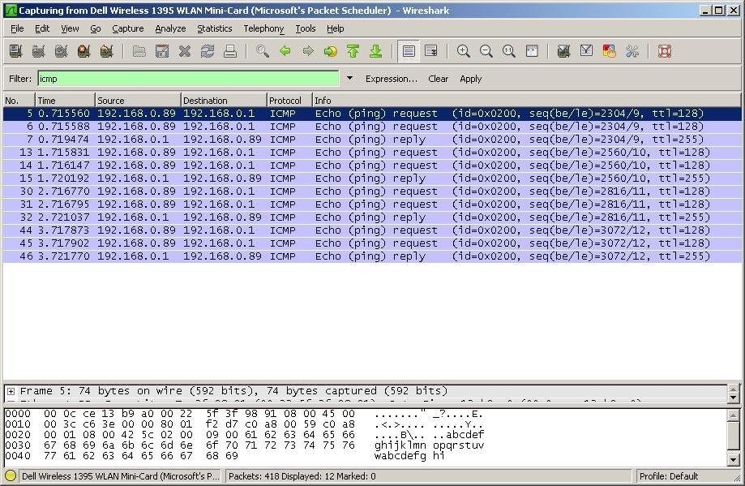

# Internet Control Message Protocol (ICMP)

IP uses ICMP to transfer control messages between IP hosts. ICMP is part of the [InternetProtocolFamily](/InternetProtocolFamily).

## History

The [RFC792](http://www.ietf.org/rfc/rfc792.txt) "INTERNET CONTROL MESSAGE PROTOCOL" was released in September 1981.

## Protocol dependencies

  - [IP](/IP): ICMP is part of IP and uses IP datagrams for transport. The assigned protocol number for ICMP on IP is 1.

## Example traffic



## Wireshark

ICMP dissector is fully functional.

## Preference Settings

There are no preference settings for ICMP.

## Example capture file

[ICMP.pcap](uploads/__moin_import__/attachments/Internet_Control_Message_Protocol/icmp.pcap "ICMP.pcap")

## Display Filter

A complete list of ICMP display filter fields can be found in the [display filter reference](http://www.wireshark.org/docs/dfref/i/icmp.html)

Show only the ICMP based traffic:

``` 
 icmp
```

## Capture Filter

Capture only the ICMP based traffic:

``` 
 icmp
```

## External links

  - [RFC792](http://www.ietf.org/rfc/rfc792.txt) INTERNET CONTROL MESSAGE PROTOCOL

## Discussion

---

Imported from https://wiki.wireshark.org/Internet_Control_Message_Protocol on 2020-08-11 23:15:08 UTC
