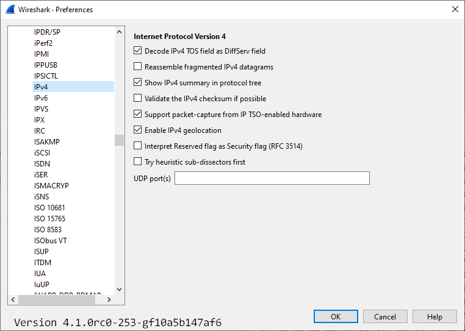

# Internet Protocol version 4 (IP)

The Internet Protocol provides the network layer (layer 3) transport functionality in the [InternetProtocolFamily](/InternetProtocolFamily).

This page describes IP version 4, which is widely used. There's also an [IPv6](/IPv6) protocol page available.

The IP protocol is used to transfer packets from one [IP-address](/IP-address) to another. The user of this layer will give a packet and a remote IP address, and IP is responsible to transfer the packet to that host.

IP will (hopefully) guide the packet the right way to the remote host. The data transfer is independent of the underlying network hardware (e.g. [ATM](/ATM), [Ethernet](/Ethernet), or even a [SerialLine](/SerialLine)). If the underlying hardware is not able to transfer the maximum length required (especially on [SerialLine](/SerialLine)'s or [ATM](/ATM)), IP will split the data into several smaller IP fragments and reassemble it into a complete one at the receiving host.

When IP wants to send a packet on a LAN, it must first translate the [IP-address](/IP-address) given into the underlying hardware address (e.g. an [Ethernet](/Ethernet) address). IP uses [ARP](/ARP) for this translation, which is done dynamically. On a point-to-point line, this is obviously not necessary, as there's only one host to which a given machine can send a packet.

IP doesn't provide any mechanism to detect [PacketLoss](/PacketLoss), [DuplicatePackets](/DuplicatePackets) and alike.

IP uses [ICMP](/ICMP) to transfer control messages to a remote host such as "Please don't send me more IP packets, I'm full". The famous ping tool also use [ICMP](/ICMP).

The typical protocols on top of IP are [TCP](/TCP) and [UDP](/UDP).

Version 4 of the IP protocol is widely used all over the world. As the available [IP-address](/IP-address) range is becoming short, version 6 with a much wider address range is becoming more and more popular these days.

## History

The [RFC791](http://www.ietf.org/rfc/rfc791.txt) "INTERNET PROTOCOL" was released in September 1981.

## Protocol dependencies

  - [Ethernet](/Ethernet): IP can use [Ethernet](/Ethernet) and many other protocols. The assigned Ethernet type for IP is 0x800.

  - [ICMP](/ICMP): IP uses [ICMP](/ICMP) for control messages between hosts.

## Example traffic

XXX - Add example traffic here (as plain text or Wireshark screenshot).

## Wireshark

IP dissector is fully functional. Wireshark provides some advanced features such as IP defragmentation.

## Preference Settings


   - Decode IPv4 TOS field as DiffServ field: Whether the IPv4 type-of-service field should be decoded as a Differentiated Services field (see RFC2474/RFC2475) (ip.decode_tos_as_diffserv)

   - Reassemble fragmented IPv4 datagrams: Whether fragmented IPv4 datagrams should be reassembled (ip.defragment)

   - Show IPv4 summary in protocol tree: Whether the IPv4 summary line should be shown in the protocol tree (ip.summary_in_tree)

   - Validate the IPv4 checksum if possible: Whether to validate the IPv4 checksum (ip.check_checksum)

   - Support packet-capture from IP TSO-enabled hardware: Whether to correct for TSO-enabled (TCP segmentation offload) hardware captures, such as spoofing the IP packet length (ip.tso_support)

   - Enable IPv4 geolocation: Whether to look up IP addresses in each MaxMind database we have loaded (ip.use_geoip)

   - Interpret Reserved flag as Security flag (RFC 3514): Whether to interpret the originally reserved flag as security flag (ip.security_flag)

   - Try heuristic sub-dissectors first: Try to decode a packet using an heuristic sub-dissector before using a sub-dissector registered to a specific port (ip.try_heuristic_first)

   - UDP port(s): IPv4 UDP port(s)  (ip.udp.port)  (See [36833b76](https://gitlab.com/wireshark/wireshark/-/commit/36833b76d8b62c3eac22ef0943b9e553e3518bb9) for uses)


## Example capture file

XXX - Add a simple example capture file. Keep it short, it's also a good idea to gzip it to make it even smaller, as Wireshark can open gzipped files automatically.

## Display Filter

A complete list of IP display filter fields can be found in the [display filter reference](http://www.wireshark.org/docs/dfref/i/ip.html)

Show only IPv4-based traffic (beware: you won't see any ARP packets if you use this filter\!):

``` 
 ip 
```

Show only the IP-based traffic to or from host 192.168.0.10:

``` 
 ip.addr==192.168.0.10 
```

Show only the IP-based traffic to or from the subnet 192.168.43.0/24 (The /24 is CIDR notation for a network address with a mask of 24 one bits, that is, a subnet mask of 255.255.255.0):

``` 
 ip.addr==192.168.43.0/24 
```

Show only the IP-based traffic **not** to or from host 192.168.0.10 (beware: this is not identical to ip.addr\!=192.168.0.10):

``` 
 !(ip.addr==192.168.0.10) 
```

## Capture Filter

Capture IPv4-based traffic only:

``` 
 ip 
```

Capture only the IP-based traffic to or from host 192.168.0.10:

``` 
 host 192.168.0.10 
```

Capture only the IP-based traffic to or from the subnet 192.168.43.0/24 (The /24 is CIDR notation for a network address with a mask of 24 one bits, that is, a subnet mask of 255.255.255.0):

``` 
 ip net 192.168.43.0/24 
```

Capture only the IP-based traffic **not** to or from host 192.168.0.10:

``` 
 not host 192.168.0.10 
```

## External links

  - [RFC791](http://www.ietf.org/rfc/rfc791.txt) *INTERNET PROTOCOL*

  - [RFC894](http://www.ietf.org/rfc/rfc894.txt) *Transmission of IP Datagrams over Ethernet Networks*

  - [RFC950](http://www.ietf.org/rfc/rfc950.txt) *Internet Standard Subnetting Procedure*

  - [RFC1112](http://www.ietf.org/rfc/rfc1112.txt) *Host Extensions for IP Multicasting*

  - [RFC1812](http://www.ietf.org/rfc/rfc1812.txt) *Requirements for IP Version 4 Routers* === Differentiated Services (replaces Type of Service) ===

  - [RFC2474](http://www.ietf.org/rfc/rfc2474.txt) *Definition of the Differentiated Services Field (DS Field) in the IPv4 and IPv6 Headers*

  - [RFC2475](http://www.ietf.org/rfc/rfc2475.txt) *An Architecture for Differentiated Services*

## Discussion

---

Imported from https://wiki.wireshark.org/Internet_Protocol on 2020-08-11 23:15:08 UTC
