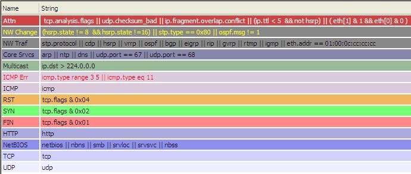

This is a [link to Wireshark entries on my blog](http://blog.tp.org/cgi-bin/mt-search.cgi?blog_id=3&tag=wireshark&limit=20). Included are various coloring rules updates and font/icon size fixes for MacOSX/Linux.

This is a general use set of Coloring Rules. I believe the colors are a little easier to view than some of the other sets here. I have updated these to be compatable with 0.10.13 as everything was being marked as red before.  

**File:** [JaysColorRules.txt](uploads/__moin_import__/attachments/Jay's_Coloring_Rules/JaysColorRules.txt)  
**Updated:** 7/17/06  
**Description:** General use coloring rules. Easy on the eyes colors.  
**Contributor:** [JayMoran](/JayMoran)

-----

---

Imported from https://wiki.wireshark.org/Jay%27s_Coloring_Rules on 2020-08-11 23:15:36 UTC
