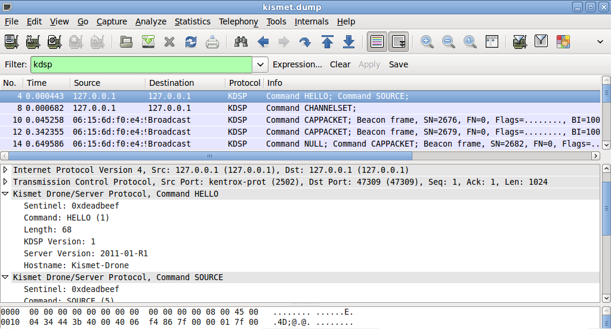

# Kismet Drone/Server Protocol(KDSP)

Kismet is a wireless sniffer (and intrusion detection system) which is widely used to sniff Wireless LAN (e.g 802.11b, 802.11a, and 802.11g traffic). Kismet Drone/Server protocol is used by for communication between a Kismet drone and a Kismet server.

Another protocol ([Kismet Client/Server Protocol](/Kismet_Client/Server_Protocol)) is used by Kismet server for communication with Kismet clients.

## History

KDSPv1 - KDSP is currently at version 1. It is designed to be extendible and backwards compatible.

## Protocol dependencies

  - [TCP](/TCP): Typically, KDSP uses [TCP](/TCP) as its transport protocol. The well known TCP port for KDSP traffic is 2502.

## Example traffic



## Wireshark

The KDSP dissector is partially functional. While most of the communication is correctly dissected, not all bitmaps are translated to a readable format.

## Preference Settings

None

## Example capture file

  - [SampleCaptures/KDSP.pcap.gz](uploads/__moin_import__/attachments/SampleCaptures/KDSP.pcap.gz "Upload new attachment \"KDSP.pcap.gz\"")

## Display Filter

A complete list of KDSP display filter fields can be found in the [display filter reference](http://www.wireshark.org/docs/dfref/k/kdsp.html)

Show only the KDSP based traffic:

``` 
 kdsp 
```

## Capture Filter

You cannot directly filter KDSP protocols while capturing. However, if you know the [TCP](/TCP) port used (see above), you can filter on that one.

Capture only the KDSP traffic over the default port (2502):

``` 
 tcp port 2502 
```

## External links

  - [Kismet Homepage](http://www.kismetwireless.net) - Official Kismet Project Site

## Discussion

---

Imported from https://wiki.wireshark.org/KDSP on 2020-08-11 23:15:45 UTC
