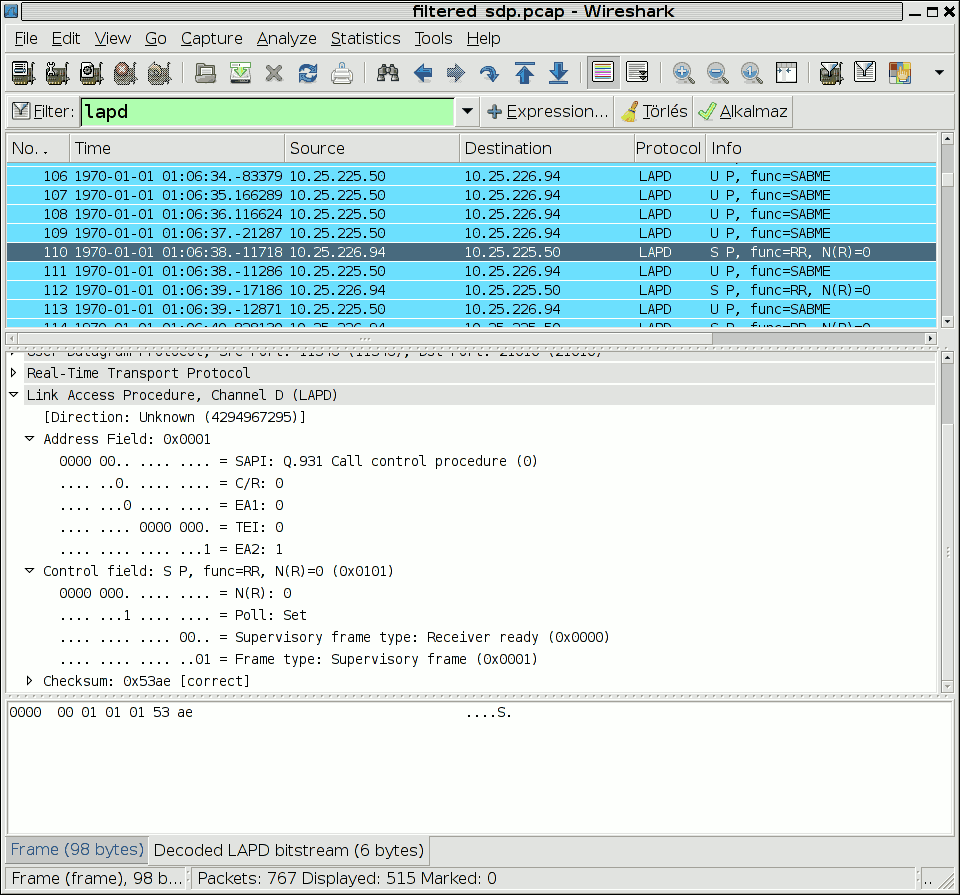

# Link Access Procedure, Channel D (LAPD)

Link Access Procedures on the D channel (LAPD), specified in ITU-T Q.920 and ITU-T Q.921, is the second layer protocol on the ISDN protocol stack in the D channel.

It is heavily based on HDLC.

## History

[History of HDLC and LAP](http://www.ieee802.org/3/ad_hoc/etholaps/email/msg00016.html)

## Protocol dependencies

  - [ISDN](/ISDN): Typically, LAPD uses [ISDN](/ISDN) as its transport mechanism.

  - [RTP](/RTP): Wireshark also supports decoding LAPD frames transported via [RTP](/RTP) payload

## Example traffic



## Wireshark

The LAPD dissector is fully functional.

## Preference Settings

  - Use GSM SAPI values. Default OFF.
  - RTP payload type for embedded LAPD. Default 0, that means LAPD dissection in RTP packets is disabled.

## Example capture file

  - [SampleCaptures/toshiba.general.gz](uploads/__moin_import__/attachments/SampleCaptures/toshiba.general.gz)

## Display Filter

A complete list of LAPD display filter fields can be found in the [display filter reference](http://www.wireshark.org/docs/dfref/l/lapd.html)

Show only the LAPD based traffic:

``` 
 lapd
```

## Capture Filter

You cannot directly filter LAPD protocols while capturing. XXX - is this true?

## External links

  - <http://www.cisco.com/en/US/docs/internetworking/technology/handbook/ISDN.html>

  - <http://www.itu.int/rec/T-REC-Q.921/en>

  - <http://en.wikipedia.org/wiki/Link_Access_Procedures%2C_D_channel>

## Discussion

---

Imported from https://wiki.wireshark.org/LAPD on 2020-08-11 23:15:55 UTC
