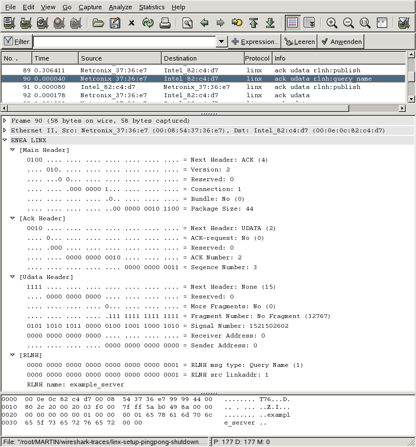

# LINX

LINX is an inter process communication protocol developed by Enea used for local and remote communications in distributed systems.

## History

LINX is based on the IPC method - called LINK - used in Enea's OSE operating system. A Linux kernel module implementing the protocol is released as open source.

## Protocol dependencies

  - [Ethernet](/Ethernet): So far LINX can only use [Ethernet](/Ethernet) as its transport protocol besides shared memory. The ethertype 0x9999 used right now is not assigned by IEEE.

## Example traffic



## Wireshark

The LINX dissector is fully functional but could be improved for sure:

  - Reassembling of fragmented packages
  - Improve RLNH handling
  - Improve info column
  - ...

## Preference Settings

none

## Example capture file

  - [SampleCaptures/linx-setup-pingpong-shutdown.pcap](uploads/__moin_import__/attachments/SampleCaptures/linx-setup-pingpong-shutdown.pcap)

## Display Filter

A complete list of LINX display filter fields can be found in the [display filter reference](http://www.wireshark.org/docs/dfref/l/linx.html)

Show only the LINX based traffic:

``` 
 linx 
```

## Capture Filter

Capture LINX traffic only:

``` 
 ether proto 0x9999 
```

## External links

  - <http://www.enea.com/templates/Extension____12771.aspx> *Enea LINX* - Informations about LINX by Enea.

## Discussion

---

Imported from https://wiki.wireshark.org/LINX on 2020-08-11 23:16:00 UTC
