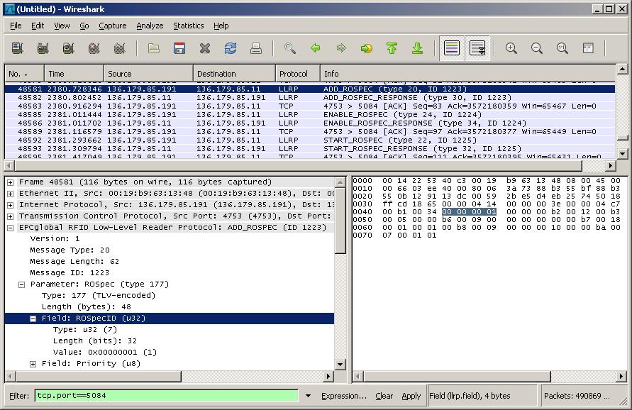

# Low-Level Reader Protocol (LLRP)

The Low-Level Reader Protocol is a standards-based interface for communication between Radio Frequency Identification (RFID) Reader Devices and Client Devices.

# Protocol dependencies

  - TCP: The only transport specified for the EPCglobal Low-Level Reader Protocol is TCP. The IANA assigned TCP port number for LLRP is 5084.

# Example Traffic

The following is an example of LLRP session traffic:



# Wireshark

The LLRP dissector implements support for dissection of messages conforming to the LLRP specification version 1.0. Future enhancements to the LLRP dissector could include:

  - Support for dissection of vendor extensions, loaded at runtime from an XML file conforming to the schema defined by the [LLRP Toolkit](http://llrp.org) project.

  - Validation of the existence of required parameters and their multiplicity.

# Preference Settings

There are no preferences available for the LLRP dissector.

# Example Capture File

A capture file (in pcap format) showing an example session between an LLRP Reader and LLRP Client Application is available on the [SampleCaptures](/SampleCaptures) page:

  - [SampleCaptures/llrp.cap](uploads/__moin_import__/attachments/SampleCaptures/llrp.cap)

# Display Filter

A complete list of LLRP display filter fields is displayed below. For a list of the many LLRP message types, parameter types and field types, obtain a copy of the latest LLRP specification from the [LLRP area](http://www.epcglobalinc.org/standards/llrp) of the [EPCglobal website](http://www.epcglobalinc.org).

## LLRP Display Filter Types

| Filter                  | Description                                                                            |
| ----------------------- | -------------------------------------------------------------------------------------- |
| `llrp`                  | Matches all LLRP traffic                                                               |
| `llrp.version`          | Matches all messages with the specified LLRP version (LLRPv1.0 is "llrp.version == 1") |
| `llrp.type`             | Matches all messages with the specified message type                                   |
| `llrp.length`           | Matches all messages with the specified total message length                           |
| `llrp.id`               | Matches all messages with the specified message ID                                     |
| `llrp.field.type`       | Matches all messages containing the specified field type                               |
| `llrp.field.length`     | Matches all messages containing fields with the specified bitlength                    |
| `llrp.field.value`      | Matches all messages containing fields with the specified value                        |
| `llrp.parameter.type`   | Matches all messages containing parameters with the specified type                     |
| `llrp.parameter.length` | Matches all messages containing parameters with the specified total length             |

Example: Show only `GET_READER_CONFIG` messages:

``` 
 llrp.type == 2
```

# Capture Filter

The following capture filter will produce packets sent and received on the IANA assigned TCP port for the Low-Level Reader Protocol:

``` 
 tcp.port == 5084
```

# External links

  - For detail about the LLRP specification, visit the [LLRP standards page](http://www.epcglobalinc.org/standards/llrp) on the [EPCglobal website](http://www.epcglobalinc.org/).

  - The [LLRP Toolkit Homepage (llrp.org)](http://www.llrp.org) and corresponding [SourceForge project](http://www.soureceforge.net/projects/llrp-toolkit) exists to provide open-source implementations of LLRP libraries.

# Discussion

---

Imported from https://wiki.wireshark.org/LLRP on 2020-08-11 23:16:03 UTC
