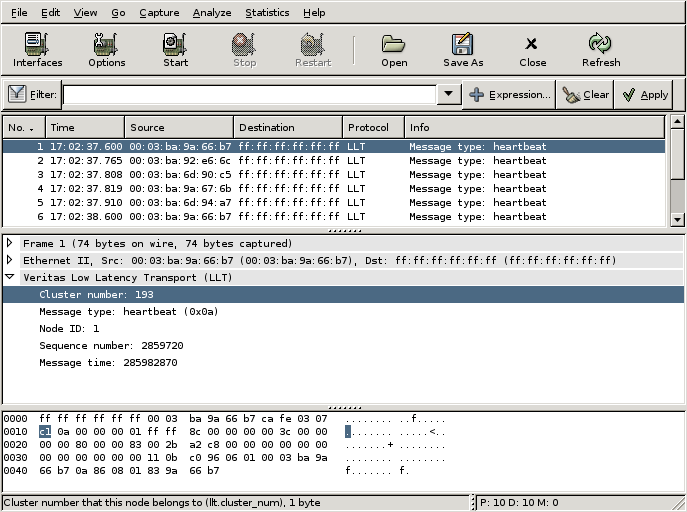

# Veritas Low Latency Transport (LLT)

The LLT protocol is used for communication between servers running the Veritas Cluster Server (VCS) software.

## Example traffic

## Wireshark

The LLT dissector is partially functional as it only understands heartbeat frames that are broadcast by each node. The packets are standard Ethernet II frames with [EtherType](/EtherType) 0xCAFE. There is no known public reference for the protocol format. The fields that are currently understood in the heartbeat frames are the cluster number, message type (heartbeat), node id, sequence number and message time (ticks since reboot). The LLT protocol also uses messages directly between servers that are not dissected at this time.

## Preference Settings

The LLT frames use ethertype 0xCAFE by default. Some installations may have changed this to another value. A second value can be specified in the LLT preferences dialog of Wireshark. If a second value is specified, the default value of 0xCAFE will still be understood.

## Example capture file

  - [SampleCaptures/llt-sample.pcap](uploads/__moin_import__/attachments/SampleCaptures/llt-sample.pcap)

## Display Filter

A complete list of LLT display filter fields can be found in the [display filter reference](http://www.wireshark.org/docs/dfref/l/llt.html)

Show only LLT based traffic:

    llt 

## Capture Filter

You cannot directly filter LLT protocols while capturing. However, you can filter on the ethertype:

Capture only the LLT traffic over the default ethertype (0xCAFE):

    ether proto 0xCAFE 

## External links

  - [Veritas Tech Talk](http://ftp.support.veritas.com/pub/support/products/ClusterServer_UNIX/239442.pdf) - document describing the Veritas Cluster Server (VCS), which uses LLT for communication between nodes.

  - [LLT FAQ](http://seer.support.veritas.com/docs/245518.htm) - Veritas Frequently Asked Questions about Low Latency Transport

## Discussion

---

Imported from https://wiki.wireshark.org/LLT on 2020-08-11 23:16:04 UTC
