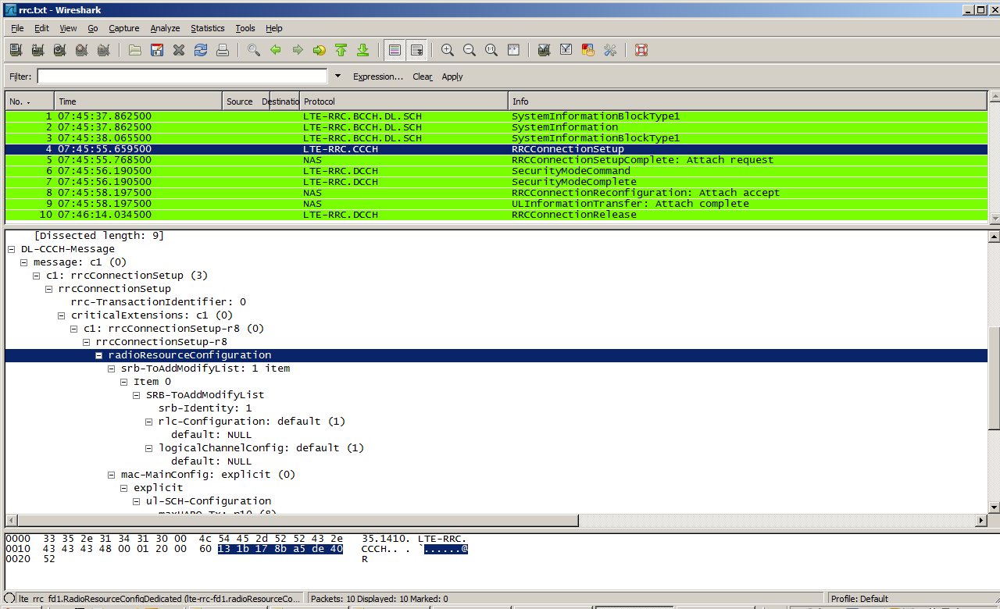
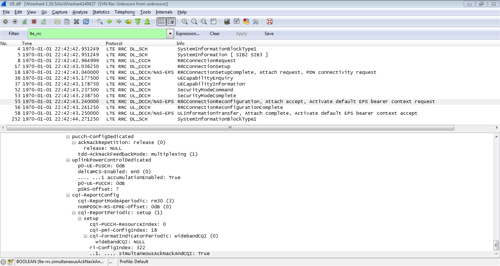

# Radio Resource Control (RRC) for LTE

This protocol controls MAC, RLC and PDCP layers in the LTE air interface (connecting an LTE UE with an eNodeB). It is compliant to Release 8 (V8.4.0 2008-12)(trunk V9.1.0 (2009-12))

## Protocol dependencies

If NAS messages are encapsulted in RRC messages, LTE-RRC calls NAS-EPS dissector. Although LTE RRC has control over [RLC-LTE](/RLC-LTE) and [MAC-LTE](/MAC-LTE), the LTE-RRC dissector does not currently configure these dissectors. When that will be the case, a log at the MAC interface will enable MAC dissector to call RLC and RLC will be able to call PDCP.

## Example traffic

Here are two example of lte\_rrc dissector usage. 



## Wireshark

The LTE-RRC dissector is fully functional. However, at the moment you need to call it through DLC\_USER interface to decode a single packet or create a [wiretap plugin](/wiretap-plugin) to read your data from a file with a specific format. There are some wrappers available to help you use the protocol directly. [3GPP message decoder](http://3gppdecoder.free.fr/?q=node/1) is one of them and is very simple to use.

Alternatively, if you are using Wireshark to decode [MAC-LTE](/MAC-LTE), [RLC-LTE](/RLC-LTE), [PDCP-LTE](/PDCP-LTE) then the RRC dissector will be called appropriately, if enabled by preference settings. The dissector is also called appropriately when "rrc\_r8\_lte" or "rrc\_r9\_lte" primitives are found in [IxCatapult](/IxCatapult) DCT2000 logs.

## Preference Settings

There are currently no preference settings for this protocol.

## Example capture file

XXX - Add a simple example capture file to the [SampleCaptures](/SampleCaptures) page and link from here (see below). Keep this file short, it's also a good idea to gzip it to make it even smaller, as Wireshark can open gzipped files automatically.

  - [SampleCaptures/PROTO.pcap](uploads/__moin_import__/attachments/SampleCaptures/PROTO.pcap)

## Display Filter

A complete list of RLC-LTE display filter fields can be found in the [display filter reference](http://www.wireshark.org/docs/dfref/r/rlc-lte.html)

Show only the LTE-RRC based traffic:

``` 
 lte-rrc
```

## Capture Filter

You cannot directly filter LTE-RRC protocols while capturing.

## External links

  - [3GPP TS 36.331](http://www.3gpp.org/ftp/Specs/html-info/36331.htm) Evolved Universal Terrestrial Radio Access (E-UTRA) Radio Resource Control (RRC) protocol specification

## Discussion

This dissector is generated through asn2wrs script. If modification are to be done, they have to be in the template or in the configuration file.

How to generate a dissector based on a newer release:

\- Download the 36331-xxx specification as Word document, open it and in "View" panel, select "normal" or "web layout" (needed to remove page header and footer) - Save it to asn1\\lte-rrc directory as a text file.

\- Call the asn1 extractor: perl ..\\..\\tools\\extract\_asn1\_from\_spec.pl 36331-xxx.txt It should generate EUTRA-RRC-Definitions.asn, EUTRA-UE-Variables.asn and EUTRA-[InterNodeDefinitions](/InterNodeDefinitions).asn

\- Run asn2wrs:

../../tools/asn2wrs.py -L -p lte-rrc -c lte-rrc.cnf -s packet-lte-rrc-template EUTRA-RRC-Definitions.asn EUTRA-UE-Variables.asn EUTRA-[InterNodeDefinitions](/InterNodeDefinitions).asn

The packet-lte-rrc.c file is generated. Put it into the epan\\dissectors folder and recompile wireshark.

---

Imported from https://wiki.wireshark.org/LTE%20RRC on 2020-08-11 23:16:05 UTC
