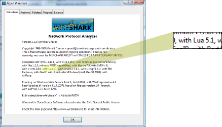

# Lua

<div>

<table>
<tbody>
<tr class="odd">
<td><p></p></td>
<td><p>Lua is a powerful light-weight programming language designed for extending applications. Lua is designed and implemented by a <a href="http://www.lua.org/authors.html" class="http">team</a> at <a href="http://www.puc-rio.br/" class="http">PUC-Rio</a>, the Pontifical Catholic University of Rio de Janeiro in Brazil. Lua was born and raised at <a href="http://www.tecgraf.puc-rio.br/" class="http">Tecgraf</a>, the Computer Graphics Technology Group of PUC-Rio, and is now housed at <a href="http://www.lua.org" class="http">Lua.org</a>. Both Tecgraf and Lua.org are laboratories of the <a href="http://www.inf.puc-rio.br/" class="http">Department of Computer Science</a>.</p></td>
</tr>
</tbody>
</table>

</div>

Lua's been added to Wireshark as a language for prototyping and scripting.

For more information about Lua refer to [Lua's main site](http://www.lua.org), there you can find its [Reference Manual](http://www.lua.org/manual/5.0/manual.html) and a [book](http://www.lua.org/pil) that describes the language. There is also [The lua-users wiki](http://lua-users.org/wiki/).

[[_TOC_]]

## Beware the GPL

Wireshark is released under [GPL](http://www.gnu.org/licenses/gpl.html) so every derivative work based on Wireshark must be released under the terms of the GPL.

:warning: Even if the code you write in Lua does not need to be GPL'ed. The code written in Lua that uses bindings to Wireshark must be distributed under the GPL terms. see the [GPL FAQ](http://www.gnu.org/licenses/gpl-faq.html#TOCIfInterpreterIsGPL) for more info :warning:

There is at least one Wireshark author that will not allow to distribute derivative work under different terms. To distribute Lua code that uses Wireshark's bindings under different terms would be a clear violation of the GPL.

If it isn't clear to you what the GPL is and how it works please consult your lawyer.

## Lua in Wireshark

Lua can be used to write [dissectors](/Lua/Dissectors), post-dissectors and [taps](/Lua/Taps).

Although it's possible to write [dissectors](/Lua/Dissectors) in Lua, Wireshark dissectors are written in C, as C is several times faster than Lua. Lua is ok for prototyping dissectors, during Reverse Engineering you can use your time for finding out how things work instead of compiling and debugging your C dissector.

Post-dissectors are dissectors meant to run after every other dissector has run. They can add items the dissection tree so they can be used to create your own extensions to the filtering mechanism.

[/Taps](/Lua/Taps) are used to collect information after the packet has been dissected.

## Getting Started

Lua has shipped with the Windows version of Wireshark since 0.99.4. Availability on other platforms varies. To see if your version of Wireshark supports Lua, go to *Help→About Wireshark* and look for Lua in the "Compiled with" paragraph.



In some older versions Lua was available as a plugin.

To test Lua on your system, do the following:

1.  Make sure Lua is enabled in the global configuration as described below in **How Lua Fits Into Wireshark**

2.  Create a simple Lua script such as:
    
    ``` 
     -- hello.lua
     -- Lua's implementation of D. Ritchie's hello world program.
        print("hello world!")
    ```

3.  Name this script `hello.lua` and place it in the current directory.

4.  Run `tshark -X lua_script:hello.lua` from the command prompt. You should see something like:
    
    ``` 
     $ tshark -X lua_script:hello.lua
     hello world!
     Capturing on en0
     1   0.000000 111.123.234.55 -> 111.123.234.255 NBNS Name query NB XXX.COM<00>
    ```

If you can read "hello world\!" in the first line after you run tshark Lua is ready to go\!

:warning: Please note: On Windows, you may not see any output when running Lua scripts in Wireshark. If the console window is enabled it will be opened **after** the Lua engine is loaded. This does not affect TShark, since it is a console program.

## How Lua fits into Wireshark

Every time wireshark starts it will search for a script called `init.lua` located in the global configuration directory of Wireshark. If Wireshark finds this file it will run the script.

Once *\<global configuration directory\>*`/init.lua` has run that there are two variables that tell wireshark whether to continue looking for scripts.

If the first init script sets the variable `disable_lua` to `true` Wireshark will stop reading scripts and shut down the Lua engine right after the script was run.

Once this first script was run Wireshark will search the global plugin directory directory for files ending in `.lua` and run them as scripts.

If Wireshark is running suexec (i.e. as **root** but launched by another user) it will check if the variable `run_user_scripts_when_superuser` is set to `true` before loading any further scripts. Otherwise, after that, it will run the `init.lua` script in your personal configuration directory, if it exists, and then search your personal plugin directory for files ending in `.lua` and run them as scripts, and then will run all scripts passed with the **-X lua\_script:***xxx.lua* command line option in the given order.

All these scripts will be run **before** packets are read, at the end of the dissector registration process. So, what you have to do is to register a series of functions that will be called while processing packets.

The location of the directories containing these scripts are different on different platforms. See [Appendix B, "Files and Folders"](https://www.wireshark.org/docs/wsug_html/#AppFiles) of the Wireshark User's Guide for the location of those directories.

## Wireshark's Lua API

Wireshark’s Lua API Reference Manual can be found [here](https://www.wireshark.org/docs/wsdg_html_chunked/wsluarm_modules.html). Changes to the API can be found [here](/Lua/ApiChanges).

## Examples

Examples of generic Lua code can be found in [The Sample Code](http://lua-users.org/wiki/SampleCode) page of Lua-Users wiki.

Examples of wireshark and tshark specific scripts can be found in [the Lua examples wiki page](/Lua/Examples), as well as on the [Contrib repository wiki page](/Contrib) and the Wireshark Developer’s Guide [Lua Support in Wireshark](https://www.wireshark.org/docs/wsdg_html_chunked/wsluarm.html).

## External Links

  - [Introducing Lua](http://www.onlamp.com/pub/a/onlamp/2006/02/16/introducing-lua.html) at O'Reilly (onlamp.com)

  - [ZeroBrane Studio](https://studio.zerobrane.com/) Lightweight IDE for your Lua needs

  - [WireBait](https://github.com/MarkoPaul0/WireBait) Lua library to facilitate the development of Wireshark dissectors by enabling users to run them against packet data without Wireshark. The packet data can come from hexadecimal string or a .pcap file. The goal here is to provide a tool reducing development time when creating a new dissector.

---

Imported from https://wiki.wireshark.org/Lua on 2020-08-11 23:16:06 UTC
